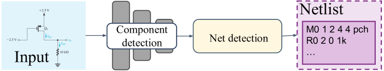
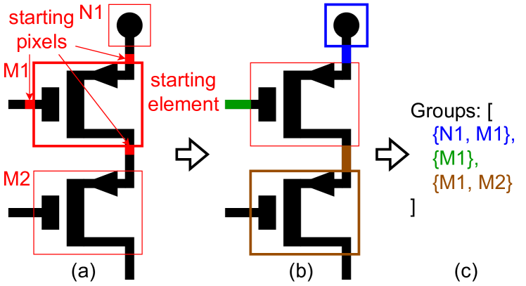
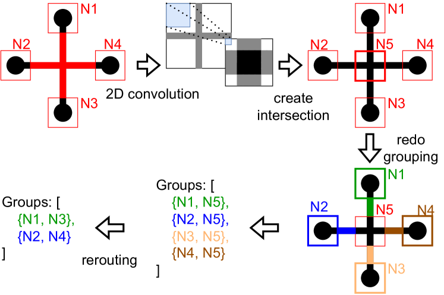
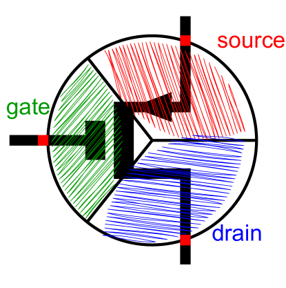
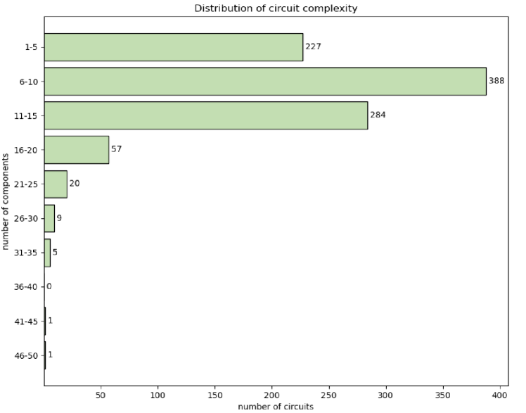
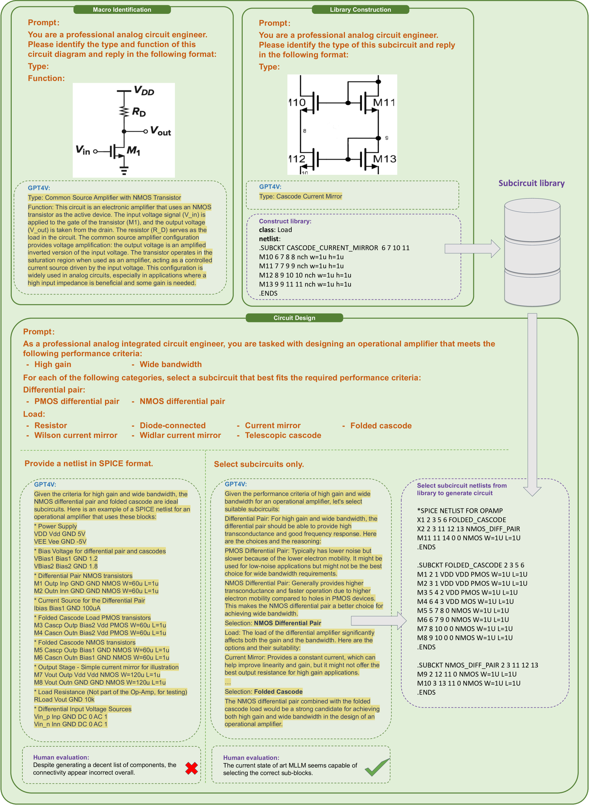

# AMSNet：模拟电路网表数据集，专为探索模拟电路设计与分析的深度学习应用而精心打造。

发布时间：2024年05月14日

`Agent

这篇论文主要讨论了在模拟/混合信号集成电路设计领域中，如何利用多模态大型语言模型（MLLM）来简化设计过程。它提出了一种自动转换技术，并构建了一个包含晶体管级原理图及其对应SPICE网表的数据集AMSNet。这个数据集的目的是为了推动MLLM在AMS电路设计中的应用研究。因此，这篇论文更符合Agent分类，因为它描述了一个具体的应用场景，其中Agent（在这里是MLLM）被用来辅助和自动化一个特定的任务（AMS IC设计）。` `集成电路设计` `模拟/混合信号

根据论文摘要内容` `该研究主要集中在模拟/混合信号集成电路设计领域` `并提出了相关的数据集和转换技术` `以促进多模态大型语言模型在该领域的应用。因此` `标签选择了集成电路设计和模拟/混合信号这两个与论文内容紧密相关的行业领域名词。`

> AMSNet: Netlist Dataset for AMS Circuits

# 摘要

> 在模拟/混合信号集成电路设计领域，手动干预仍是不可或缺的。多模态大型语言模型的兴起，为简化大规模AMS IC设计提供了新的可能。然而，自动生成AMS电路的挑战在于缺乏描述原理图与网表之间关系的全面数据集。为此，我们开发了一种自动转换技术，并构建了AMSNet数据集，其中包含了晶体管级原理图及其对应的SPICE网表。随着AMSNet的不断扩充，它将极大地推动MLLM在AMS电路设计中的应用研究。我们已公开部分网表，并计划在论文发表后，将生成工具及完整数据集公之于众。

> Today's analog/mixed-signal (AMS) integrated circuit (IC) designs demand substantial manual intervention. The advent of multimodal large language models (MLLMs) has unveiled significant potential across various fields, suggesting their applicability in streamlining large-scale AMS IC design as well. A bottleneck in employing MLLMs for automatic AMS circuit generation is the absence of a comprehensive dataset delineating the schematic-netlist relationship. We therefore design an automatic technique for converting schematics into netlists, and create dataset AMSNet, encompassing transistor-level schematics and corresponding SPICE format netlists. With a growing size, AMSNet can significantly facilitate exploration of MLLM applications in AMS circuit design. We have made an initial set of netlists public, and will make both our netlist generation tool and the full dataset available upon publishing of this paper.

[Arxiv](https://arxiv.org/abs/2405.09045)