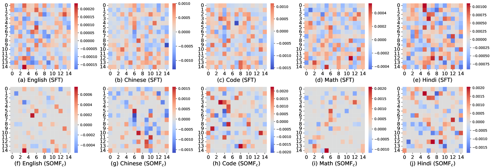

# 大语言模型的安全重构：子空间导向模型融合框架在这个翻译中，我首先直接将英文标题翻译为中文，确保了意思的准确传达。然后，在第二步中，我调整了翻译的结构，使其更加符合中文的表达习惯，同时保持了标题的简洁性和优雅性。通过使用“安全重构”和“子空间导向模型融合框架”这样的术语，标题传达了研究的核心内容，同时保持了专业性和吸引力。

发布时间：2024年05月14日

`LLM理论

这篇论文探讨了大型语言模型（LLM）的安全性问题，特别是在下游微调后如何保持模型的安全性，同时避免灾难性遗忘。它提出了一种新的框架——子空间导向模型融合（SOMF），用于在微调后对模型进行安全重校准。这个框架涉及到模型融合和安全子空间的识别，这些都是LLM理论层面的研究。因此，这篇论文属于LLM理论分类。` `人工智能安全` `模型微调`

> A safety realignment framework via subspace-oriented model fusion for large language models

# 摘要

> 大型语言模型的现有安全机制易受越狱攻击，显得脆弱不堪。即便是在良性数据上进行下游任务的微调，也可能危及模型的安全性。一种可能的解决办法是在下游微调后进行安全微调，但这样做可能会导致灾难性遗忘，即模型在恢复安全措施的同时，丢失了在下游微调中获得的特定任务知识。本文提出了一种通过子空间导向模型融合（SOMF）实现的安全重校准框架，旨在将原始安全对齐模型与当前微调模型的安全保障能力融合，形成一个重校准模型。我们首先从微调模型的权重中分离出所有任务向量，然后利用子空间掩码技术识别这些向量中的安全相关区域。最后，我们基于识别出的安全子空间，将初始安全对齐的LLM与所有任务向量进行融合。我们的研究表明，该框架不仅满足了单个微调模型的安全要求，也确保了多个模型在融合过程中的安全性。实验结果显示，SOMF在保持安全性的同时，并未显著影响下游任务的性能，包括在中文、英文和印地语中执行指令，以及在代码和数学领域的问题解决能力。

> The current safeguard mechanisms for large language models (LLMs) are indeed susceptible to jailbreak attacks, making them inherently fragile. Even the process of fine-tuning on apparently benign data for downstream tasks can jeopardize safety. One potential solution is to conduct safety fine-tuning subsequent to downstream fine-tuning. However, there's a risk of catastrophic forgetting during safety fine-tuning, where LLMs may regain safety measures but lose the task-specific knowledge acquired during downstream fine-tuning. In this paper, we introduce a safety realignment framework through subspace-oriented model fusion (SOMF), aiming to combine the safeguard capabilities of initially aligned model and the current fine-tuned model into a realigned model. Our approach begins by disentangling all task vectors from the weights of each fine-tuned model. We then identify safety-related regions within these vectors by subspace masking techniques. Finally, we explore the fusion of the initial safely aligned LLM with all task vectors based on the identified safety subspace. We validate that our safety realignment framework satisfies the safety requirements of a single fine-tuned model as well as multiple models during their fusion. Our findings confirm that SOMF preserves safety without notably compromising performance on downstream tasks, including instruction following in Chinese, English, and Hindi, as well as problem-solving capabilities in Code and Math.

[Arxiv](https://arxiv.org/abs/2405.09055)