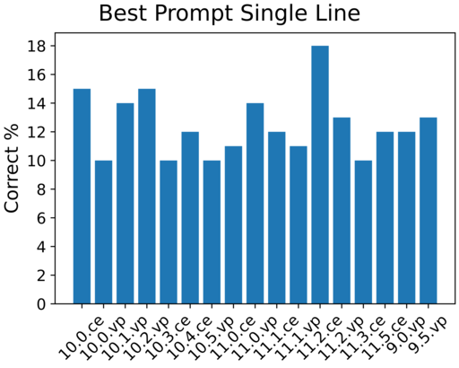
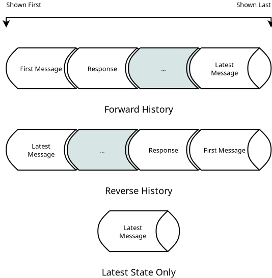
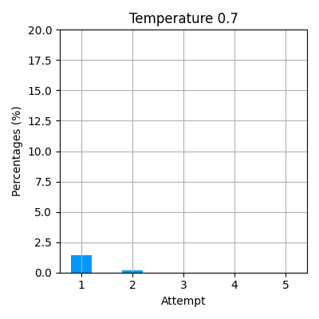

# 大型语言模型与形式验证联手，智能修复AI代码，开启自动化编程新篇章。

发布时间：2024年05月14日

`LLM应用

这篇论文主要探讨了如何利用大型语言模型（LLM）来修复神经网络软件实现中的内存安全问题。它涉及了LLM在实际应用中的使用，即通过LLM进行代码修复，以确保AI系统的安全性。因此，这篇论文属于LLM应用分类。` `人工智能安全` `软件工程`

> Automated Repair of AI Code with Large Language Models and Formal Verification

# 摘要

> 为了确保下一代AI系统的安全，我们深入研究了神经网络的软件实现，特别关注内存安全问题，如空指针、越界访问、内存泄漏等。我们的目标是发现并自动修复这些隐患。为此，我们扩大了NeuroCodeBench数据集，通过自动化变异程序，将其扩展至81,000个神经网络程序。接着，我们利用顶尖的软件验证器ESBMC来检查这些程序的内存安全性。一旦发现问题，我们便借助大型语言模型进行代码修复。在最新的研究中，我们对比了多种提示工程技术与迭代调用大型语言模型的方法，以评估它们在修复任务中的表现。

> The next generation of AI systems requires strong safety guarantees. This report looks at the software implementation of neural networks and related memory safety properties, including NULL pointer deference, out-of-bound access, double-free, and memory leaks. Our goal is to detect these vulnerabilities, and automatically repair them with the help of large language models. To this end, we first expand the size of NeuroCodeBench, an existing dataset of neural network code, to about 81k programs via an automated process of program mutation. Then, we verify the memory safety of the mutated neural network implementations with ESBMC, a state-of-the-art software verifier. Whenever ESBMC spots a vulnerability, we invoke a large language model to repair the source code. For the latest task, we compare the performance of various state-of-the-art prompt engineering techniques, and an iterative approach that repeatedly calls the large language model.

[Arxiv](https://arxiv.org/abs/2405.08848)