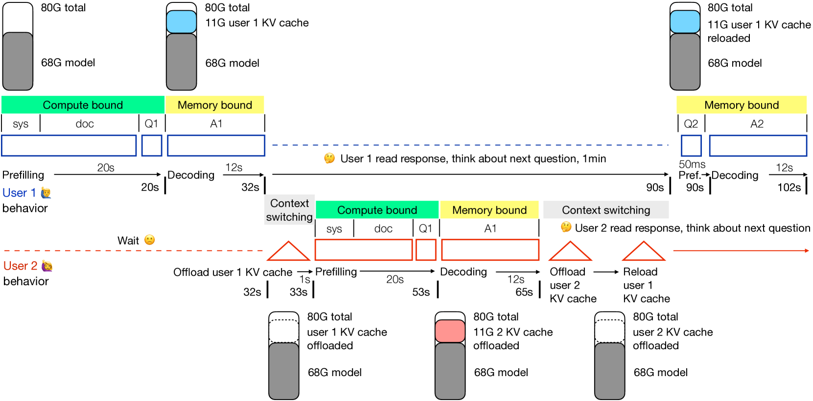
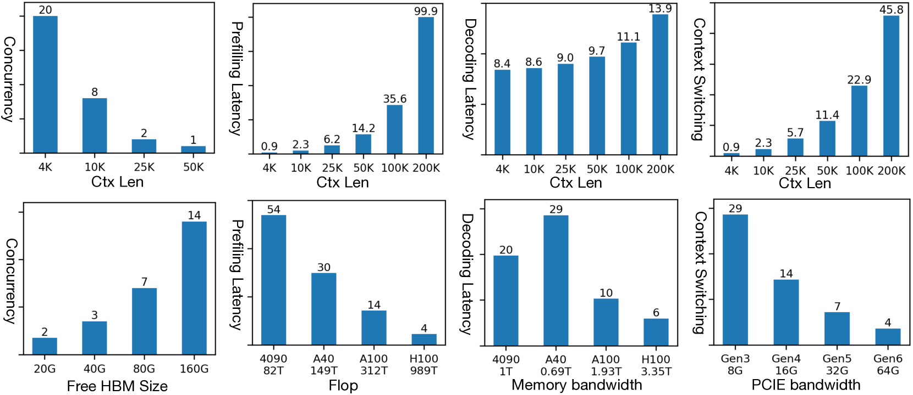

# 长上下文Transformer部署之难：理论峰值性能的深度剖析

发布时间：2024年05月14日

`LLM理论

这篇论文聚焦于大型语言模型（LLM）在处理长上下文时的性能和成本问题，特别是针对基于Transformer的模型在GPU高带宽内存（HBM）有限条件下的效率分析。它探讨了长上下文模型部署中的挑战，包括计算时间和内存需求的增长，以及KV缓存大小对并发用户数和系统延迟的影响。这些内容属于LLM的理论研究范畴，因为它关注的是模型的内部机制和性能优化，而不是特定的应用场景或Agent的设计。因此，它被归类为LLM理论研究。` `人工智能` `高性能计算`

> Challenges in Deploying Long-Context Transformers: A Theoretical Peak Performance Analysis

# 摘要

> 基于Transformer的长上下文生成模型正推动着AI应用的新浪潮，如长时间视频理解和项目级编码助手。然而，部署这些长上下文模型（从100K到10M令牌）的成本远高于短上下文（4K令牌）模型。自2024年起，降低这些模型的成本已成为研究和工程领域的一项紧迫任务。本文提出了一种并发编程框架，旨在量化分析在GPU高带宽内存（HBM）有限的情况下，处理多个长上下文请求的效率问题。我们深入探讨了所有额外计算成本的根源——KV缓存的大尺寸，并以一个34B GPT-3.5级别的50K上下文模型在A100 NVLink上为例，揭示了其大KV缓存带来的四大挑战：填充长输入的计算时间和内存需求激增；GPU HBM上的大KV缓存限制了并发用户数；解码时的KV缓存读取延迟大幅增加；以及KV缓存溢出时的上下文切换延迟。我们利用这一框架评估现有解决方案，并探索构建高效端到端系统的途径。总之，这项研究为长上下文Transformer的部署分析奠定了基础，并指出了将1M上下文的推理成本降至与4K同等水平的未来方向。

> Transformer-based long context generative models power emerging AI applications like hour-long video understanding and project-level coding agent. Deploying long context transformers (e.g., 100K to 10M tokens) is prohibitively expensive compared to short context (e.g., 4K tokens) model variants. Reducing the cost of long-context transformers is becoming a pressing research and engineering challenge starting from the year of 2024. This work describes a concurrent programming framework for quantitatively analyzing the efficiency challenges in serving multiple long-context requests under limited size of GPU high-bandwidth memory (HBM) regime. We give a detailed analysis of how all additional computational costs, compared to 4K context, trace back to \textit{one single source: the large size of the KV cache}. We use a 34B GPT-3.5 level model of 50K context on A100 NVLink as a running example, and describe how its large KV cache causes four types of deployment challenges: (1) prefilling long inputs takes much longer compute time and GPU memory than short inputs; (2) after prefilling, the large KV cache residing on the GPU HBM substantially restricts the number of concurrent users being served; (3) during decoding, repeatedly reading the KV cache from HBM to SM largely increases latency; (4) when KV cache memory overflows, swapping it from HBM to DDR causes significant context switching latency. We use this framework to analyze existing works and identify possibilities of combining them to build end-to-end systems. Overall, this work offers a foundational framework for analyzing long context transformer deployment and identifies directions towards reducing the inference cost of 1M context to be as cheap as 4K.

[Arxiv](https://arxiv.org/abs/2405.08944)