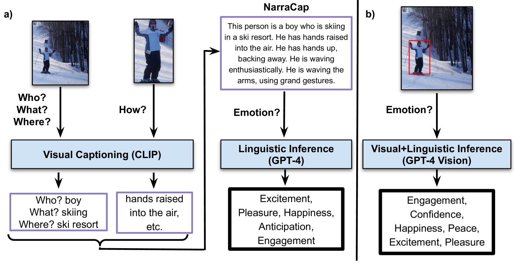

# 大型视觉语言模型在上下文情感识别中的应用

发布时间：2024年05月14日

`Agent

这篇论文探讨了如何使用大型视觉语言模型来识别现实世界中人物的情感，这是一个涉及计算机视觉和自然语言处理的跨学科问题。论文中提到的两种方法，即通过图像描述结合语言模型和视觉语言模型在零-shot和微调条件下的应用，都是为了提高机器或智能代理在情感识别方面的能力。这些方法的应用场景包括机器人和智能代理在情感敏感场景中的决策和互动，这些都是Agent（智能代理）领域的研究内容。因此，这篇论文应归类于Agent分类。` `计算机视觉` `情感识别`

> Contextual Emotion Recognition using Large Vision Language Models

# 摘要

> “边界框中的人情感如何？”计算机视觉领域仍在探索如何准确识别现实世界中人物的情感。面部表情只是冰山一角，身体姿态、上下文知识和常识推理共同构成了人类情感识别的复杂网络。本文深入分析了两种基于大型视觉语言模型的方法：一是通过图像描述结合语言模型，二是视觉语言模型在零-shot和微调条件下的应用。我们在EMOTIC数据集上验证了这些方法，并发现微调后的视觉语言模型在小数据集上也能大幅超越传统方法。这项研究成果有望助力未来机器人和智能代理在情感敏感场景中做出更为细腻的决策和互动。

> "How does the person in the bounding box feel?" Achieving human-level recognition of the apparent emotion of a person in real world situations remains an unsolved task in computer vision. Facial expressions are not enough: body pose, contextual knowledge, and commonsense reasoning all contribute to how humans perform this emotional theory of mind task. In this paper, we examine two major approaches enabled by recent large vision language models: 1) image captioning followed by a language-only LLM, and 2) vision language models, under zero-shot and fine-tuned setups. We evaluate the methods on the Emotions in Context (EMOTIC) dataset and demonstrate that a vision language model, fine-tuned even on a small dataset, can significantly outperform traditional baselines. The results of this work aim to help robots and agents perform emotionally sensitive decision-making and interaction in the future.

[Arxiv](https://arxiv.org/abs/2405.08992)