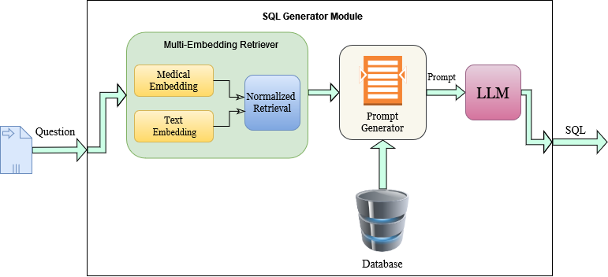
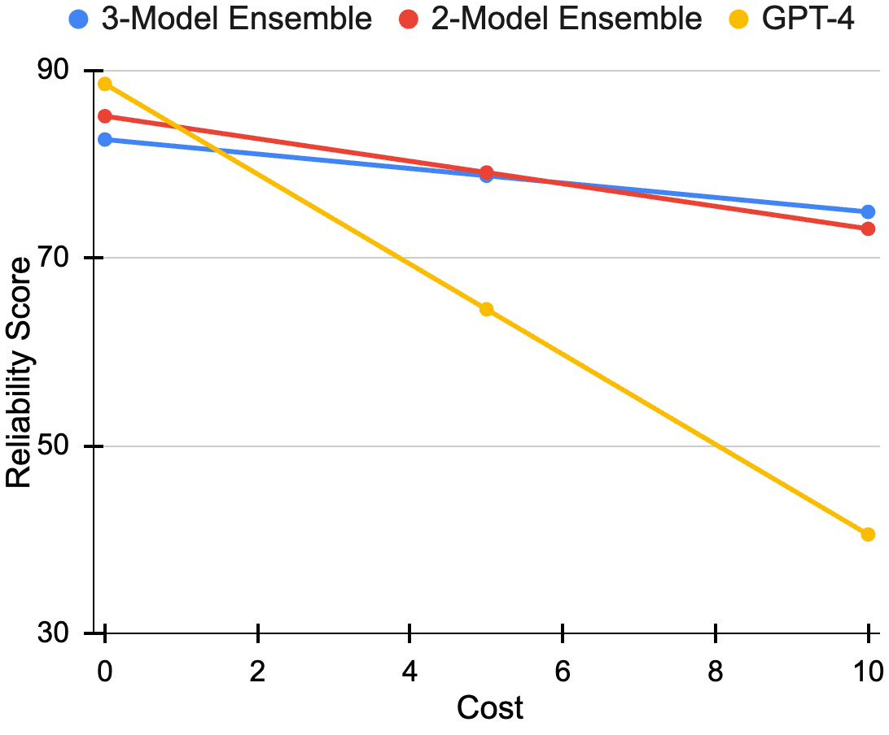

# PromptMind团队在EHRSQL-2024大会上展示了他们如何利用集成大型语言模型（LLMs）来提升SQL生成任务的可靠性。这一创新方法旨在通过结合多个模型的优势，增强生成SQL查询的准确性和稳定性。

发布时间：2024年05月14日

`Agent

这篇论文主要描述了参与EHRSQL-2024共享任务的策略，特别是基于大型语言模型（LLMs）的提示和微调方法，以及它们的集成，用于构建电子健康记录的文本到SQL系统。这些策略旨在结合LLMs的广泛知识和特定任务的领域知识，以提高查询生成的准确性和系统的可靠性。因此，这篇论文更符合Agent分类，因为它涉及使用LLMs作为智能代理来解决特定领域的任务。` `电子健康记录` `医疗信息技术`

> PromptMind Team at EHRSQL-2024: Improving Reliability of SQL Generation using Ensemble LLMs

# 摘要

> 本文详述了我们参与EHRSQL-2024共享任务的策略，目标是为电子健康记录构建一个精准的文本到SQL系统。我们提出了两种基于大型语言模型（LLMs）的策略：提示和微调，以生成EHRSQL查询。这两种方法都致力于连接LLMs所基于的广泛知识与特定任务所需的领域知识。我们分别展示了每种方法的成果，它们均达到了高准确率。此外，集成方法通过减少错误，进一步提升了系统的可靠性，使我们在竞赛中荣获第二名。本文所阐述的方法适用于那些既追求准确性又注重可靠性的特定领域文本到SQL问题。

> This paper presents our approach to the EHRSQL-2024 shared task, which aims to develop a reliable Text-to-SQL system for electronic health records. We propose two approaches that leverage large language models (LLMs) for prompting and fine-tuning to generate EHRSQL queries. In both techniques, we concentrate on bridging the gap between the real-world knowledge on which LLMs are trained and the domain specific knowledge required for the task. The paper provides the results of each approach individually, demonstrating that they achieve high execution accuracy. Additionally, we show that an ensemble approach further enhances generation reliability by reducing errors. This approach secured us 2nd place in the shared task competition. The methodologies outlined in this paper are designed to be transferable to domain-specific Text-to-SQL problems that emphasize both accuracy and reliability.

[Arxiv](https://arxiv.org/abs/2405.08839)