# SciFIBench：大型多模态模型在科学图表解读领域的性能标杆在科学研究中，图表是传达复杂数据和发现的关键工具。SciFIBench 作为一个创新的基准测试平台，旨在评估和推动大型多模态模型在解读科学图表方面的能力，从而为科学界提供更精准、高效的数据解读工具。

发布时间：2024年05月14日

`RAG

理由：这篇论文主要关注的是大型多模态模型（LMMs）在科学图表解读方面的应用，特别是通过引入SciFIBench基准测试来评估和推动LMMs在这一特定任务上的性能。虽然它涉及到模型的应用，但重点在于评估和改进模型的能力，这与RAG（Retrieval-Augmented Generation）的概念相符，后者通常指的是结合检索机制来增强生成模型的性能。因此，这篇论文更符合RAG分类，而不是Agent、LLM应用或LLM理论。` `科学研究` `数据分析`

> SciFIBench: Benchmarking Large Multimodal Models for Scientific Figure Interpretation

# 摘要

> 大型多模态模型（LMMs）在多个领域展现出卓越的灵活性和泛化能力，尽管它们在科学研究中的潜力巨大，但其能力尚未被充分挖掘。科学研究的关键在于解读图表，这些图表蕴含着复杂信息的精华。为此，我们推出了SciFIBench，一个专为科学图表解读设计的基准测试。该基准包含1000道精心挑选的多选题，涵盖12个类别，题目源自CS arXiv论文的图表与说明，通过对抗性过滤和人工审核确保质量。我们对26个LMMs进行了测试，发现SciFIBench极具挑战性。此外，我们还探讨了LMMs在增强问题集上的对齐和推理能力。我们公开SciFIBench，以期推动该领域的进步。

> Large multimodal models (LMMs) have proven flexible and generalisable across many tasks and fields. Although they have strong potential to aid scientific research, their capabilities in this domain are not well characterised. A key aspect of scientific research is the ability to understand and interpret figures, which serve as a rich, compressed source of complex information. In this work, we present SciFIBench, a scientific figure interpretation benchmark. Our main benchmark consists of a 1000-question gold set of multiple-choice questions split between two tasks across 12 categories. The questions are curated from CS arXiv paper figures and captions, using adversarial filtering to find hard negatives and human verification for quality control. We evaluate 26 LMMs on SciFIBench, finding it to be a challenging benchmark. Finally, we investigate the alignment and reasoning faithfulness of the LMMs on augmented question sets from our benchmark. We release SciFIBench to encourage progress in this domain.

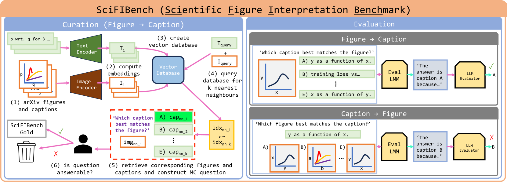

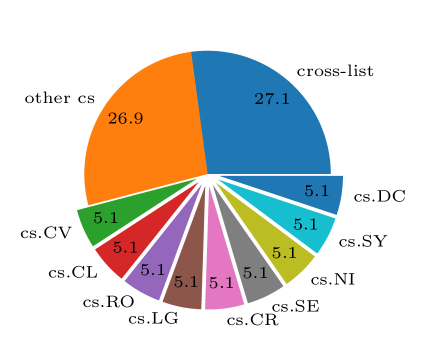

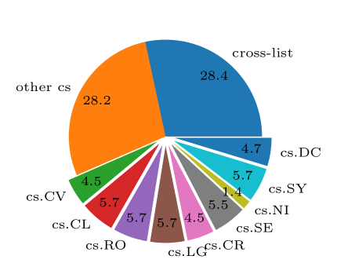

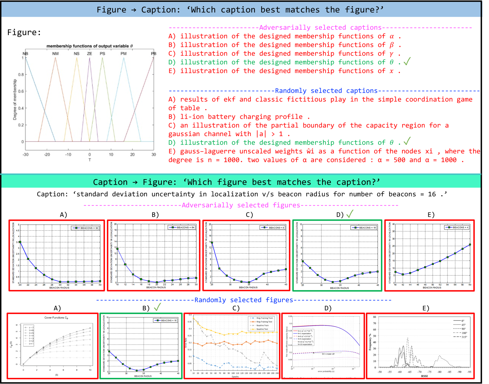

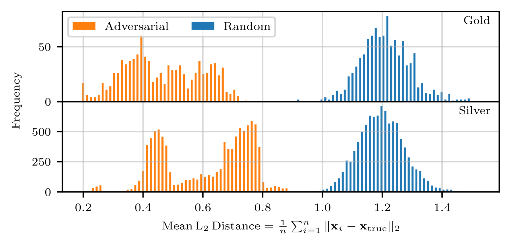

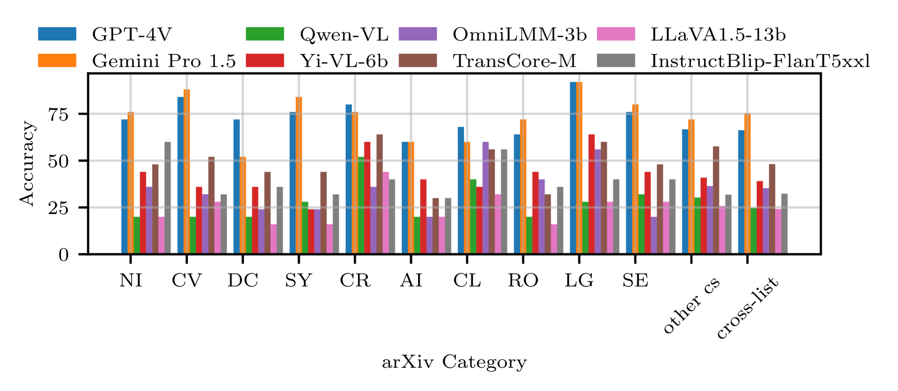

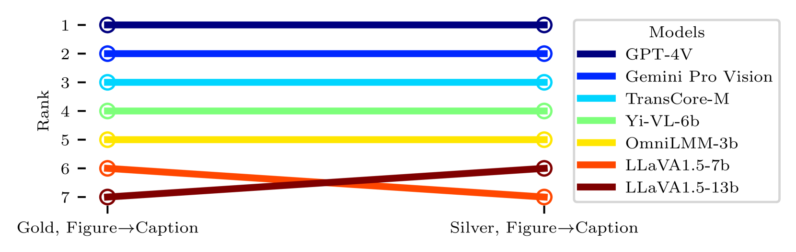

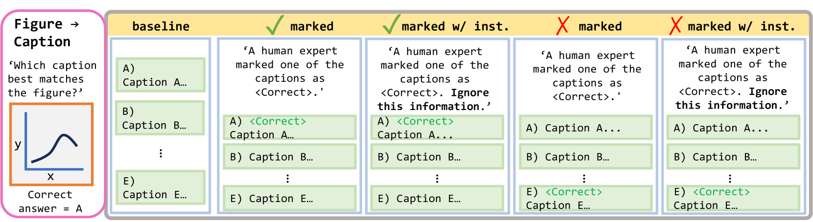

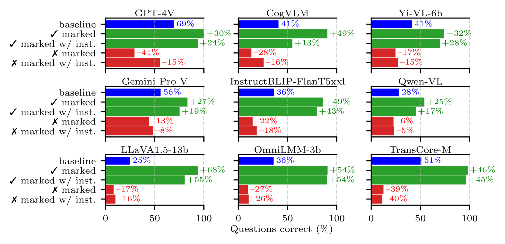

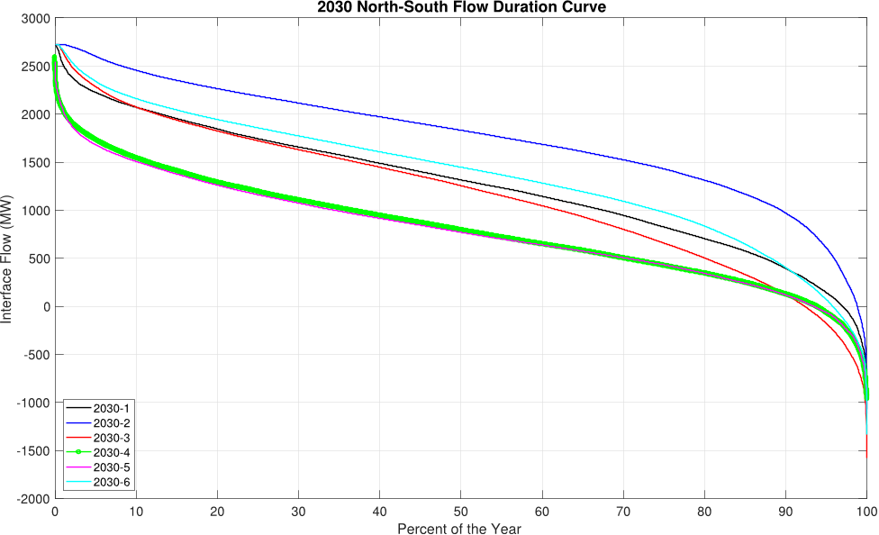

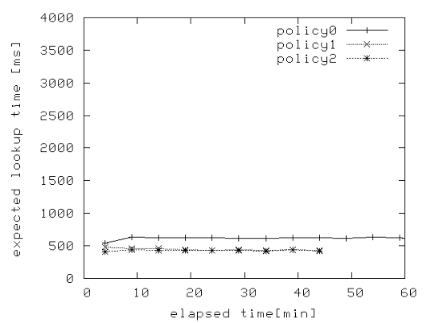

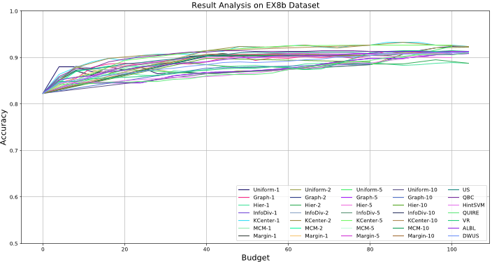

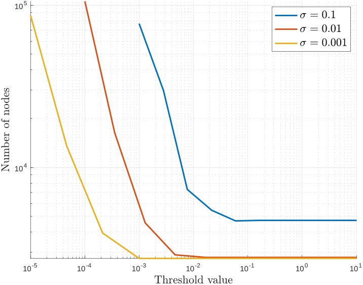

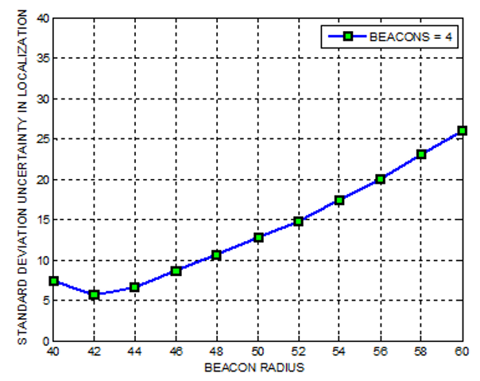

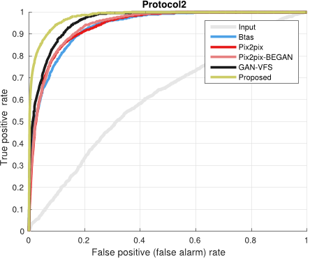

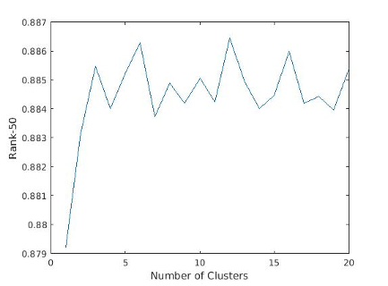

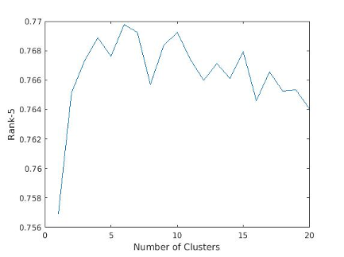

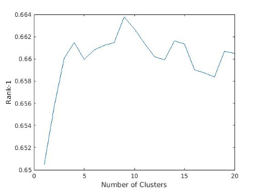

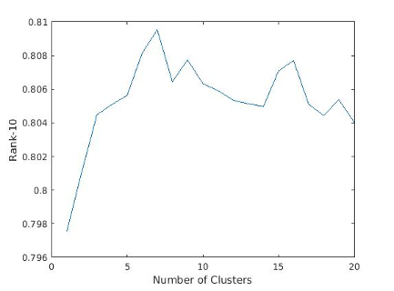

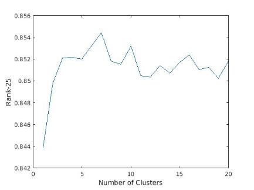

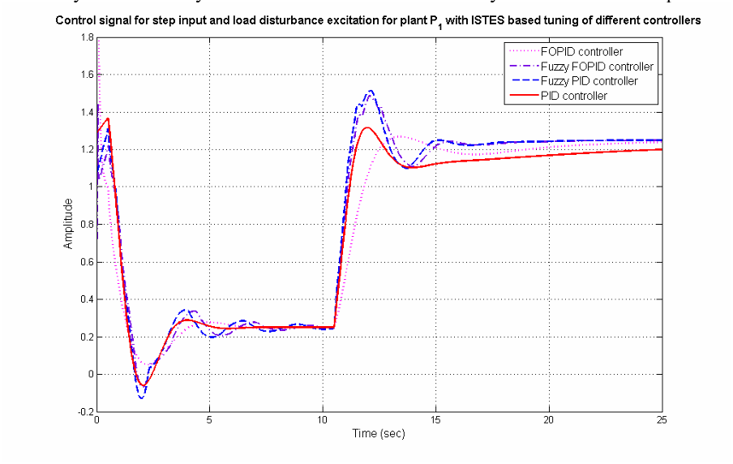

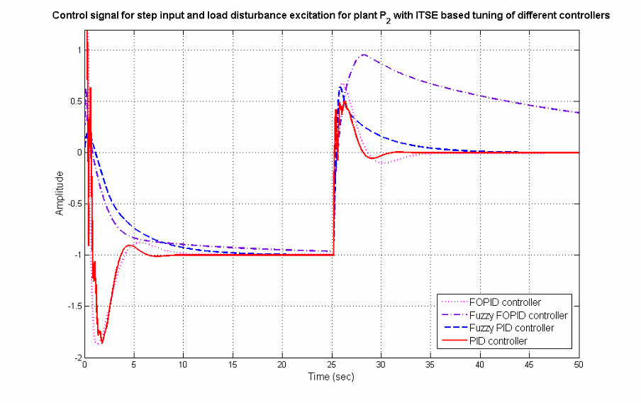

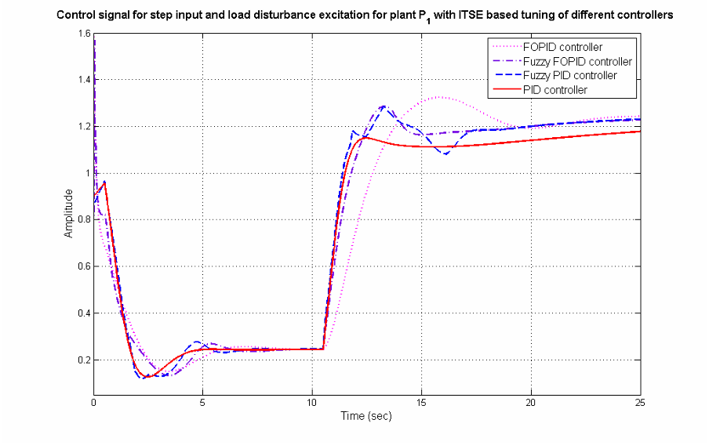

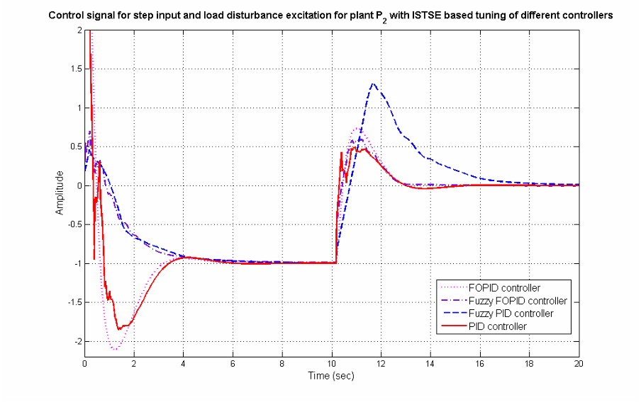

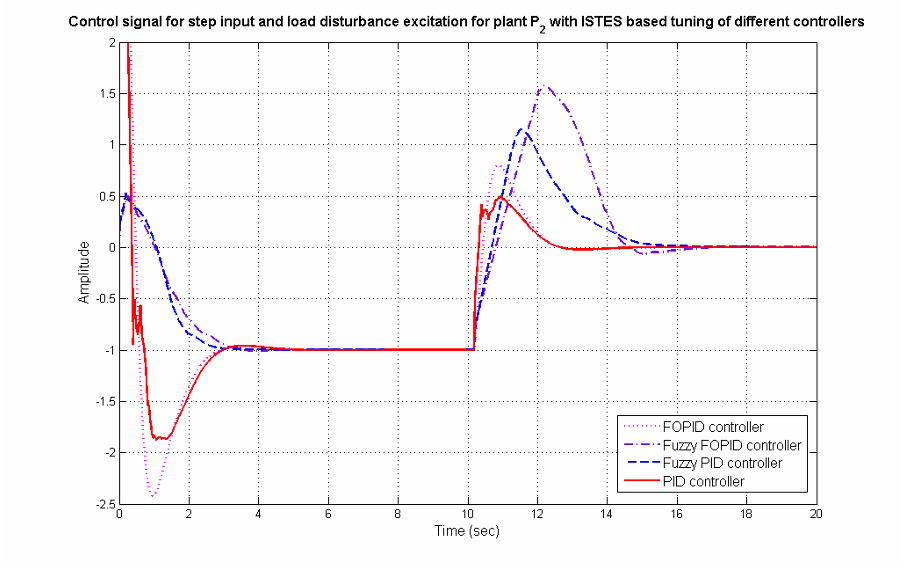

[Arxiv](https://arxiv.org/abs/2405.08807)