# 利用自我监督学习，深度学习模型在视觉与语言层面实现了对骨骼X射线图像的精准对齐，为医学影像分析开辟了新途径。

发布时间：2024年05月14日

`Agent

这篇论文介绍了一种结合骨X光片与法语医疗报告进行视觉-语言预训练的新方法，旨在解决骨放射学中的关键下游任务。这种方法可以被视为一个智能Agent，因为它通过自监督学习将视觉和文本信息对齐，并能够处理多项任务，如骨关节炎的量化、儿童骨龄评估、骨折及异常检测。该Agent利用了医院内丰富的配对图像和报告数据，并在特定语言环境下应用了通用的视觉-语言深度模型。因此，这篇论文更符合Agent分类，因为它描述了一个能够执行特定任务的智能系统。` `医疗影像`

> Self-supervised vision-langage alignment of deep learning representations for bone X-rays analysis

# 摘要

> 本文提出了一种新颖的方法，通过结合骨X光片与法语医疗报告进行视觉-语言预训练，以解决骨放射学中的关键下游任务。我们设计了一个实用的处理流程，用于匿名化和处理这些报告。预训练阶段通过自监督学习，将视觉和文本信息在深度学习模型的编码空间中对齐。由此得到的图像编码器能够处理多项任务，如骨关节炎的量化、儿童骨龄评估、骨折及异常检测。我们的方法在性能上与依赖大量专家注释的方案相媲美。这项研究首次将法语报告融入骨X光片的嵌入空间构建中，充分利用了医院内丰富的配对图像和报告数据。通过在特定语言环境下应用通用视觉-语言深度模型，我们的工作为视觉模型在医疗领域的广泛应用铺平了道路。

> This paper proposes leveraging vision-language pretraining on bone X-rays paired with French reports to address downstream tasks of interest on bone radiography. A practical processing pipeline is introduced to anonymize and process French medical reports. Pretraining then consists in the self-supervised alignment of visual and textual embedding spaces derived from deep model encoders. The resulting image encoder is then used to handle various downstream tasks, including quantification of osteoarthritis, estimation of bone age on pediatric wrists, bone fracture and anomaly detection. Our approach demonstrates competitive performance on downstream tasks, compared to alternatives requiring a significantly larger amount of human expert annotations. Our work stands as the first study to integrate French reports to shape the embedding space devoted to bone X-Rays representations, capitalizing on the large quantity of paired images and reports data available in an hospital. By relying on generic vision-laguage deep models in a language-specific scenario, it contributes to the deployement of vision models for wider healthcare applications.

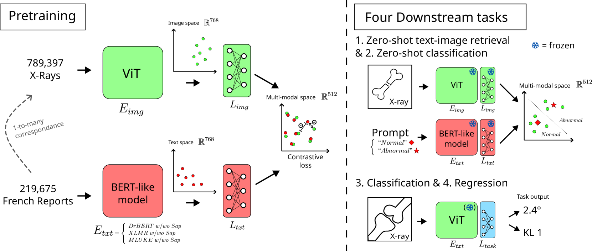

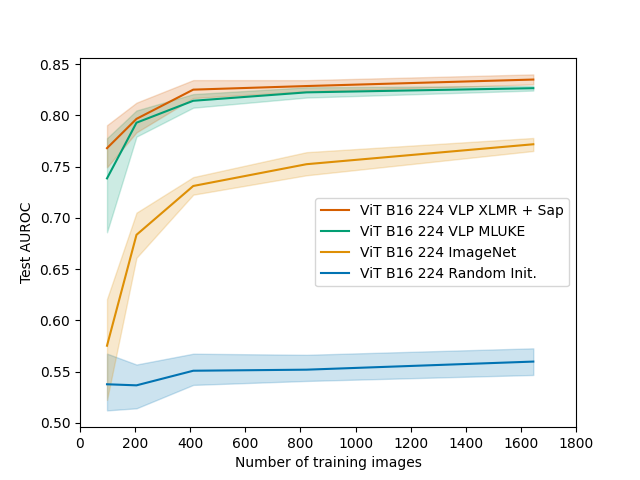

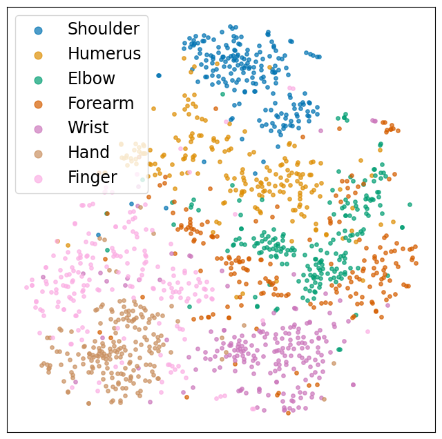

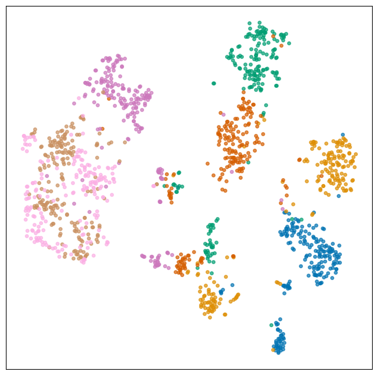

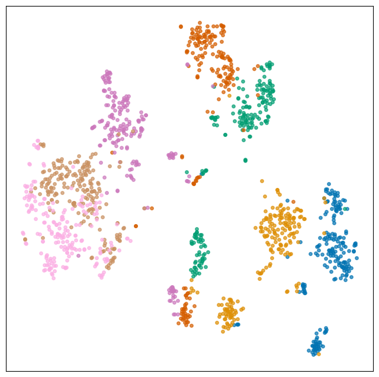

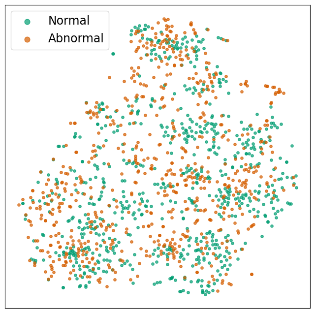

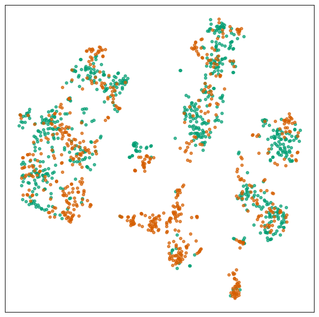

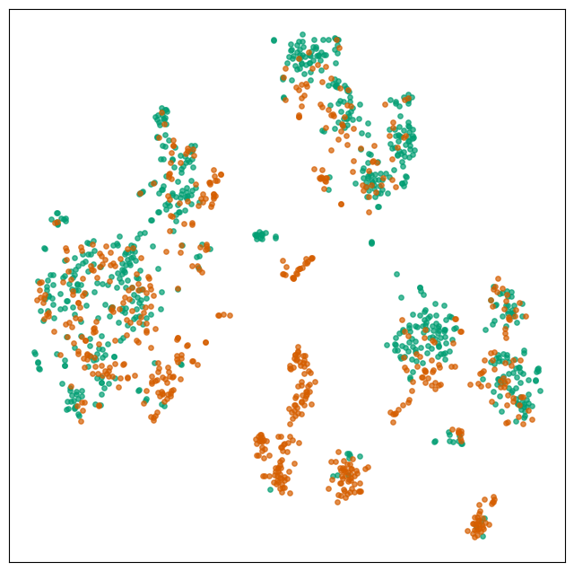

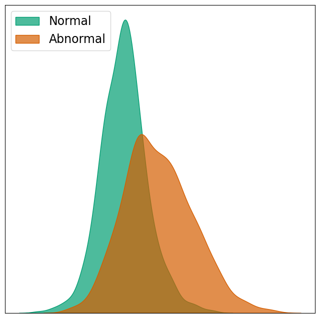

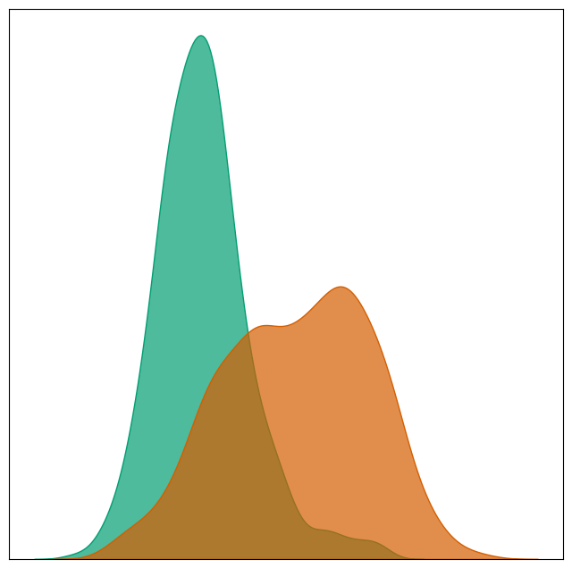

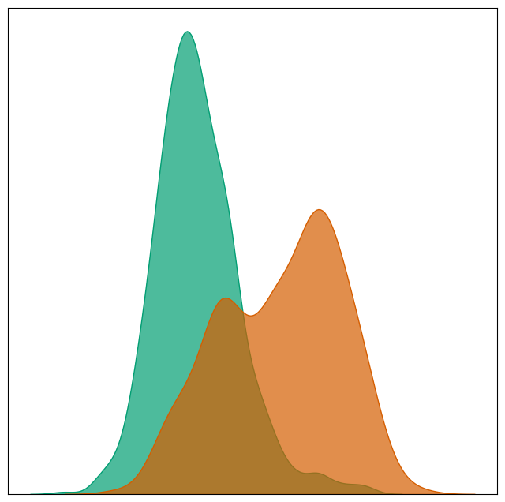

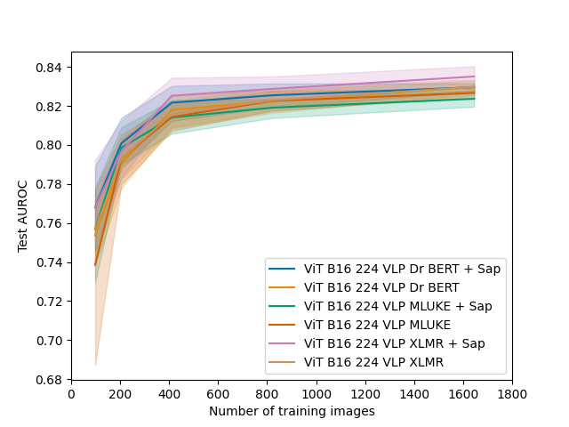

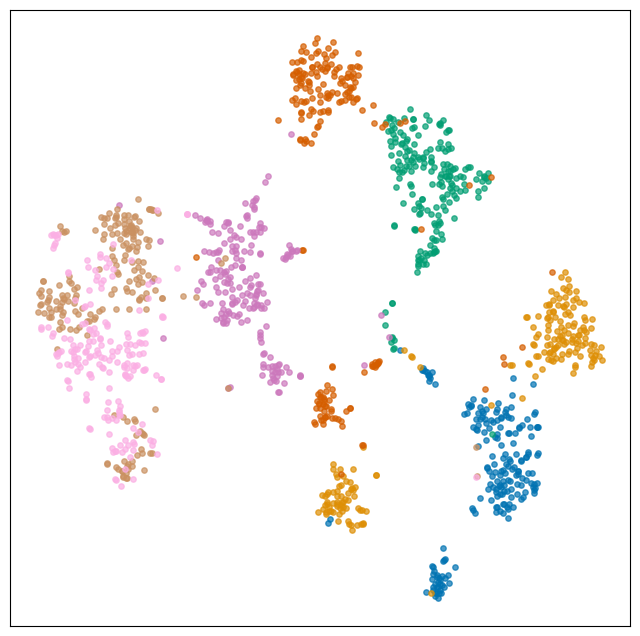

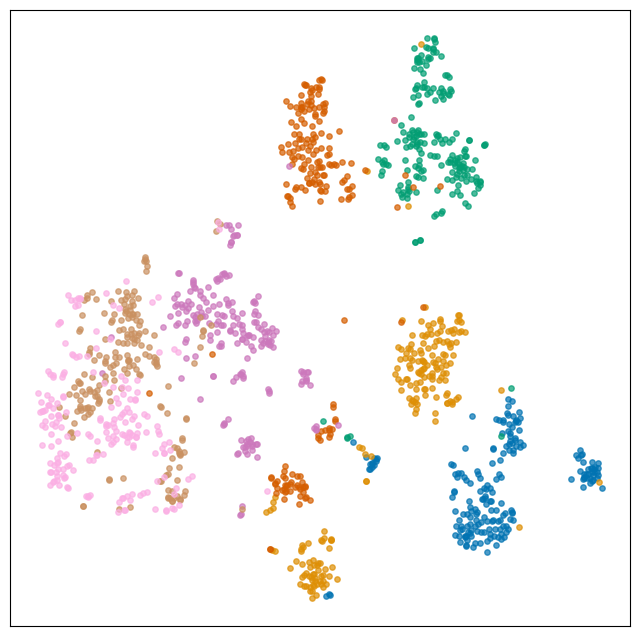

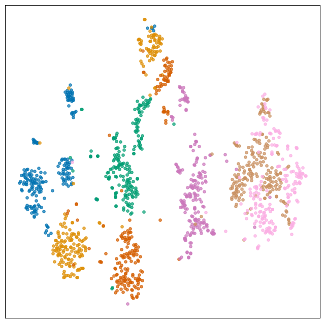

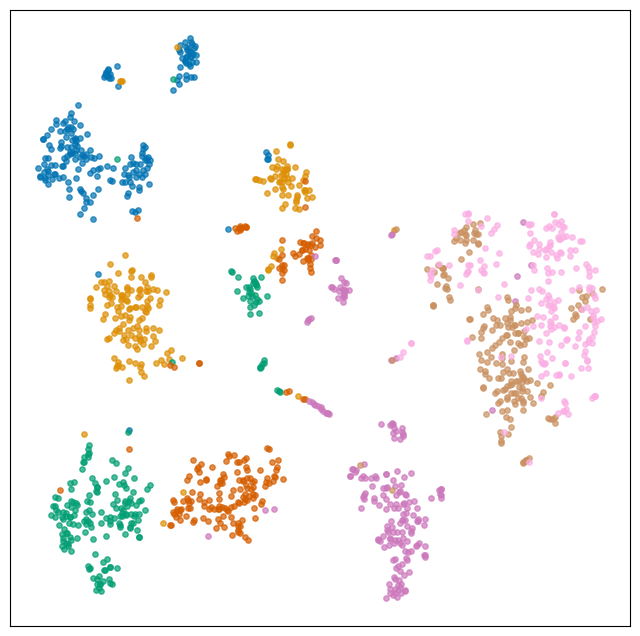

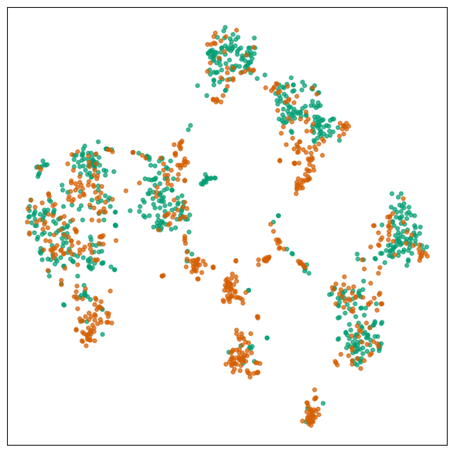

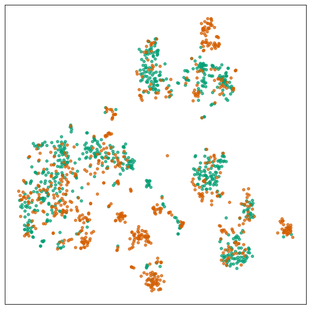

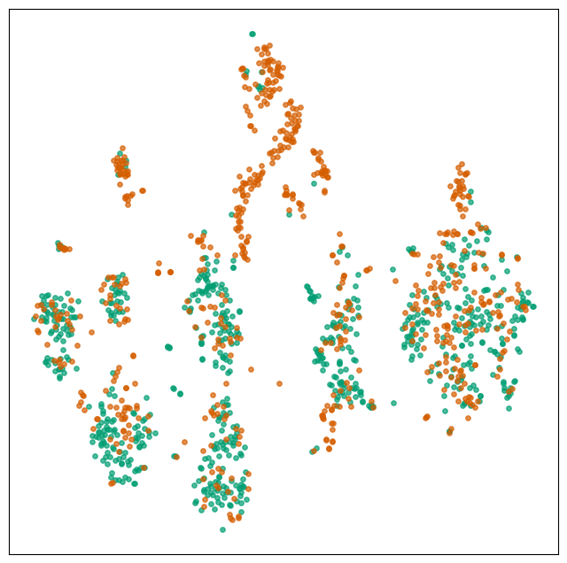

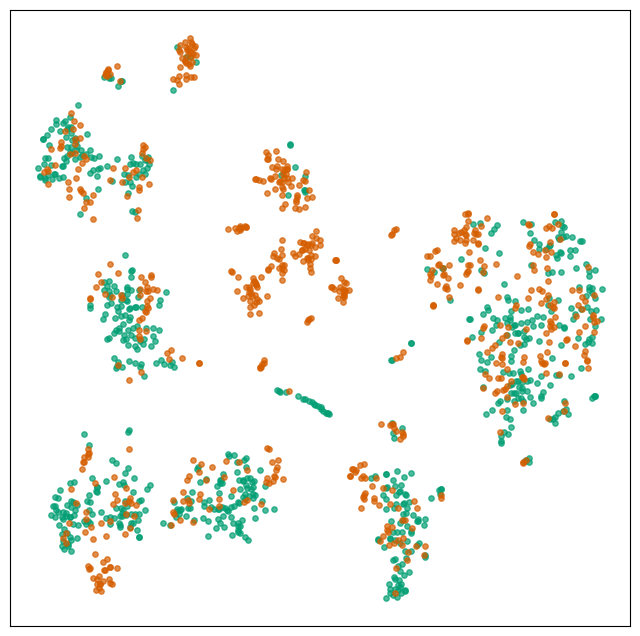

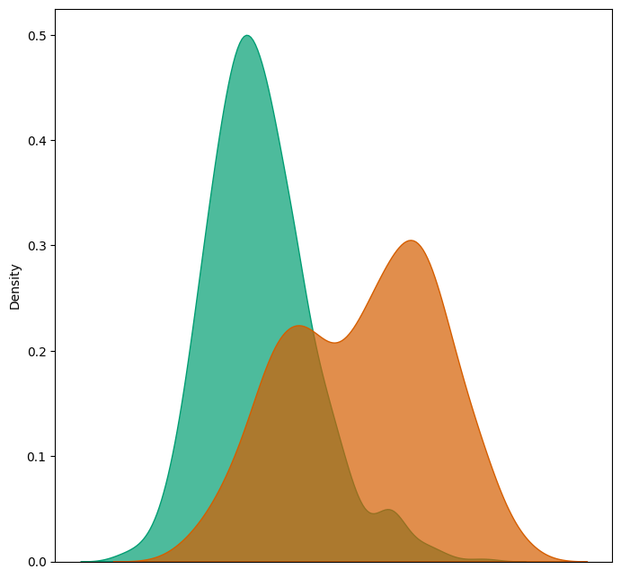

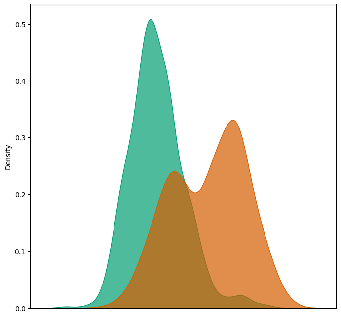

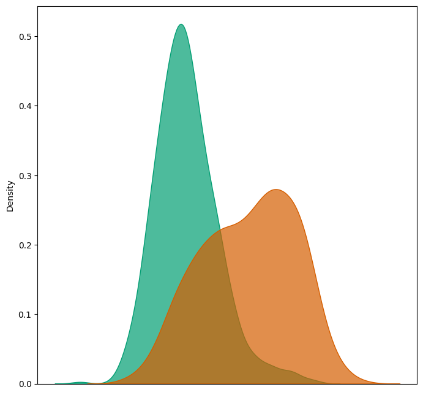

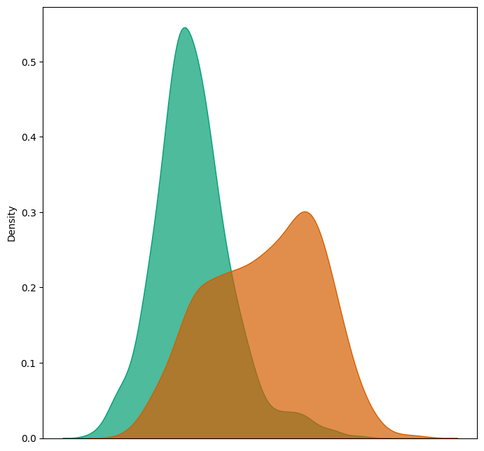

[Arxiv](https://arxiv.org/abs/2405.08932)