# 探究在线与离线对齐算法性能差异之谜

发布时间：2024年05月14日

`LLM理论

这篇论文探讨了大型语言模型（LLM）中从人类反馈中进行强化学习（RLHF）的对齐问题，特别是在离线对齐算法兴起的情况下，策略采样所面临的挑战。它通过实验研究了在线和离线方法之间的性能差异，并探讨了这种差异的原因。论文关注的是LLM的理论层面，即如何通过不同的学习方法来优化模型的性能，特别是在对齐和生成任务上的表现。因此，它属于LLM理论分类。` `人工智能对齐`

> Understanding the performance gap between online and offline alignment algorithms

# 摘要

> 从人类反馈中进行强化学习（RLHF）是大型语言模型对齐的标准框架。然而，离线对齐算法的兴起对RLHF中的策略采样提出了挑战。在奖励过度优化的情况下，我们的初步实验清楚地展示了在线方法的优势。通过一系列精心设计的实验，我们探究了性能差异的原因，发现离线数据覆盖率和数据质量等假设并不能完全解释这一差异。我们还发现，离线算法训练的策略在成对分类上表现出色，但在生成上表现不佳；相反，在线算法训练的策略在生成上表现出色，但在成对分类上表现不佳。这表明区分性和生成能力之间存在独特的相互作用，这种相互作用受到采样过程的极大影响。我们的研究揭示了策略采样在AI对齐中的关键作用，并指出了离线对齐算法面临的一些基本挑战。

> Reinforcement learning from human feedback (RLHF) is the canonical framework for large language model alignment. However, rising popularity in offline alignment algorithms challenge the need for on-policy sampling in RLHF. Within the context of reward over-optimization, we start with an opening set of experiments that demonstrate the clear advantage of online methods over offline methods. This prompts us to investigate the causes to the performance discrepancy through a series of carefully designed experimental ablations. We show empirically that hypotheses such as offline data coverage and data quality by itself cannot convincingly explain the performance difference. We also find that while offline algorithms train policy to become good at pairwise classification, it is worse at generations; in the meantime the policies trained by online algorithms are good at generations while worse at pairwise classification. This hints at a unique interplay between discriminative and generative capabilities, which is greatly impacted by the sampling process. Lastly, we observe that the performance discrepancy persists for both contrastive and non-contrastive loss functions, and appears not to be addressed by simply scaling up policy networks. Taken together, our study sheds light on the pivotal role of on-policy sampling in AI alignment, and hints at certain fundamental challenges of offline alignment algorithms.

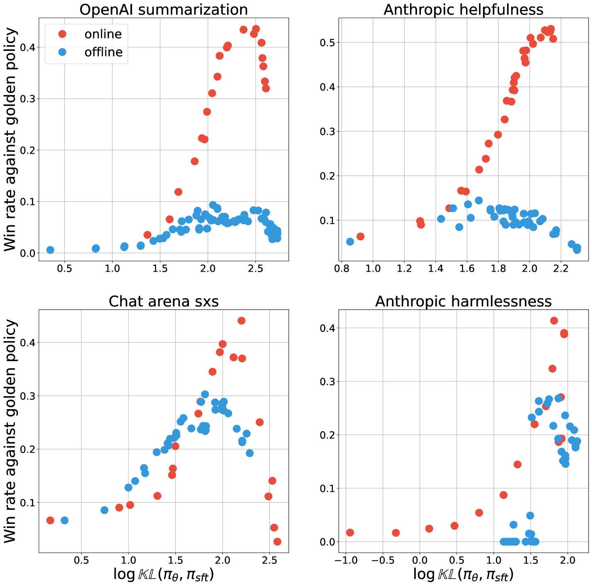

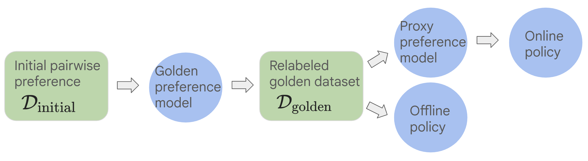

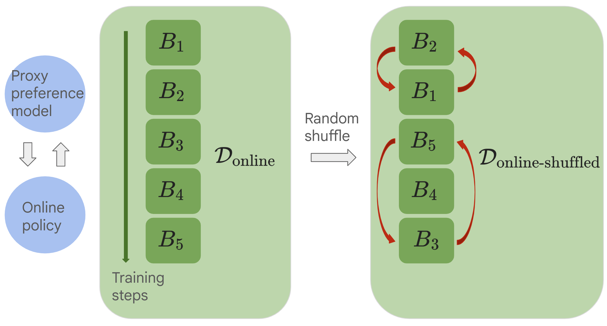

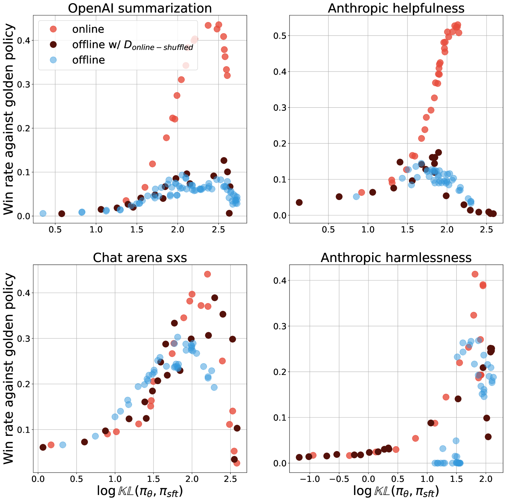

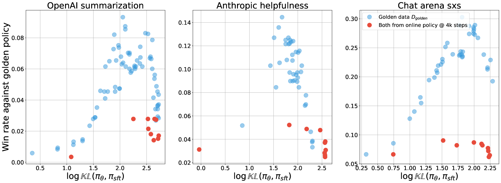

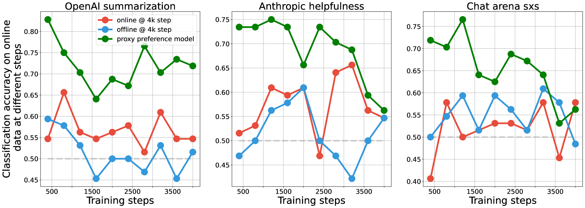

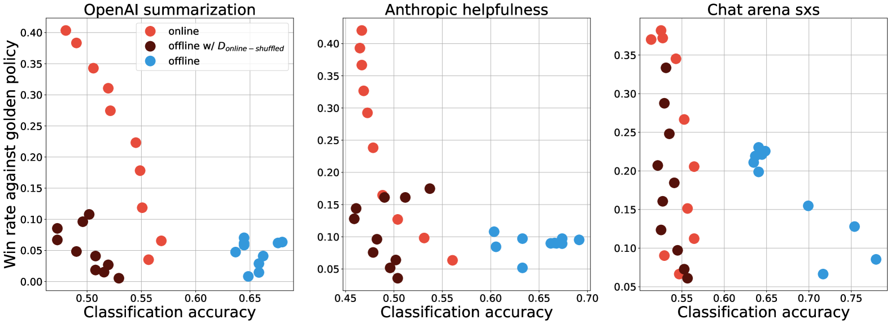

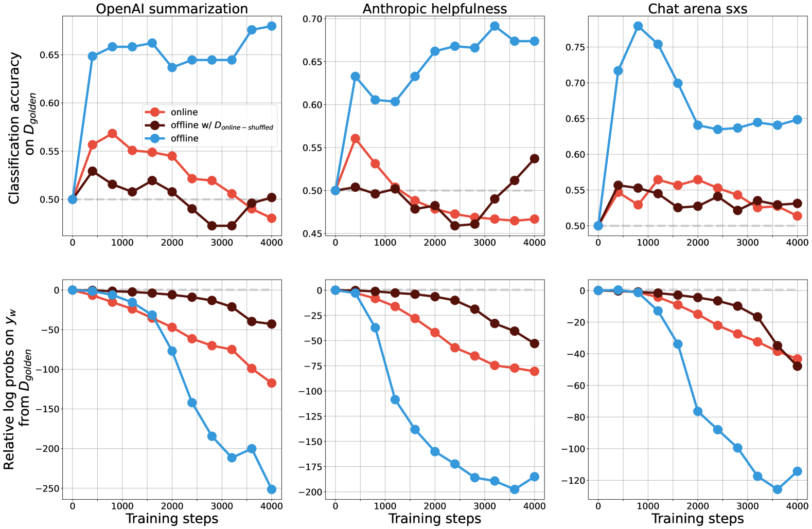

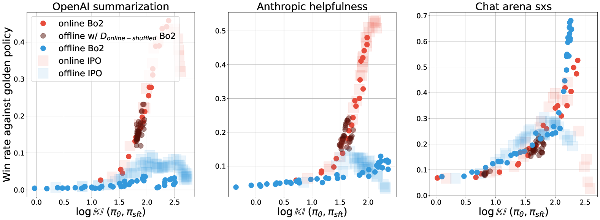

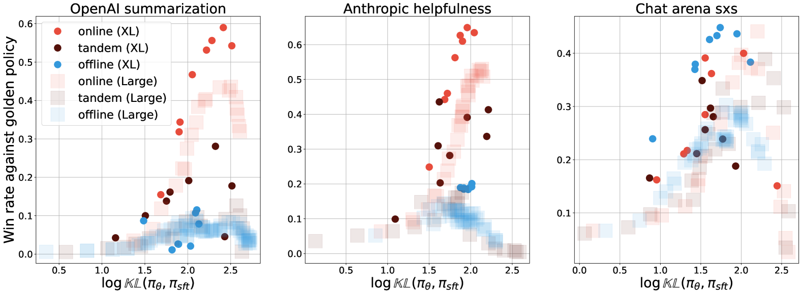

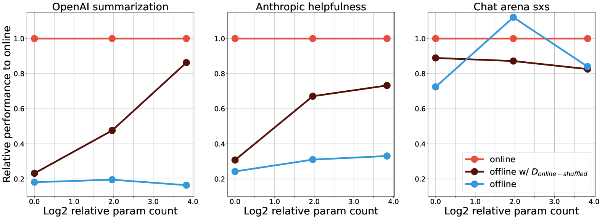

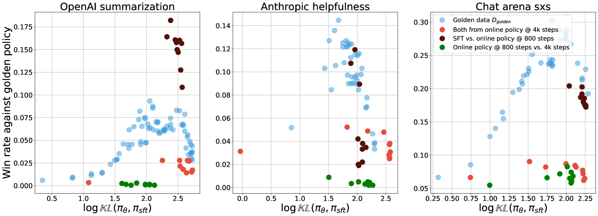

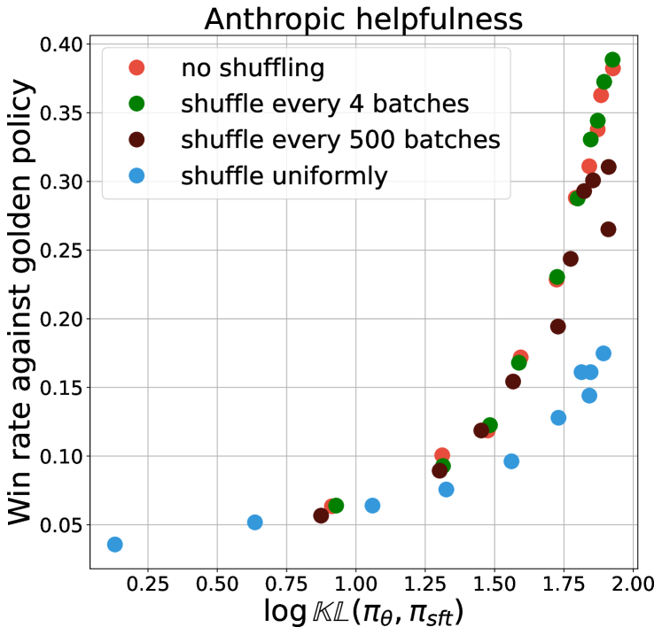

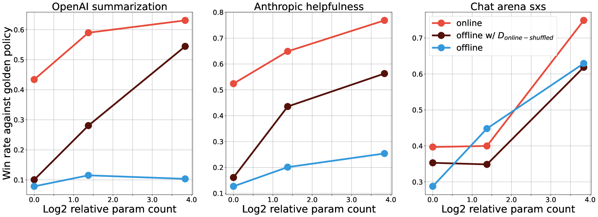

[Arxiv](https://arxiv.org/abs/2405.08448)