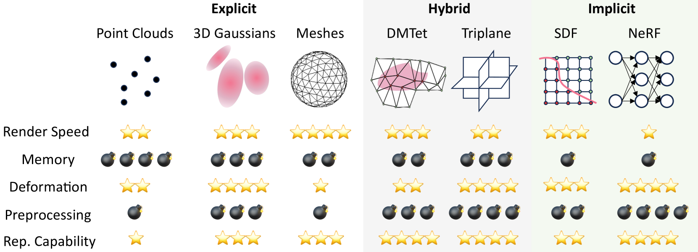

# 《自然环境下文本至三维内容生成技术综述》

发布时间：2024年05月15日

`LLM应用

这篇论文摘要讨论了利用大型视觉语言模型（LLM）进行文本到3D内容生成的技术，这是LLM在特定应用领域（即3D内容创作）的实际应用。它探讨了现有技术的局限性，并提出了未来研究的方向，这些都是LLM应用领域的典型研究内容。因此，将其归类为LLM应用是恰当的。` `游戏开发` `虚拟现实`

> A Survey On Text-to-3D Contents Generation In The Wild

# 摘要

> 3D内容创作在游戏、机器人模拟和虚拟现实等领域至关重要，但这一过程耗时费力，需要专业设计师投入大量精力。文本到3D生成技术应运而生，旨在利用大型视觉语言模型，根据文本描述自动化生成3D内容。尽管有所进步，但现有技术在质量和效率上仍有局限。本综述深入探讨了最新的文本到3D创作方法，提供了全面的背景知识，包括数据集和评价指标的讨论，以及3D表示和生成管道的详细比较。我们分析了各种方法的优劣，并指出了未来研究的方向，旨在激发对开放词汇文本条件3D内容创作潜力的进一步探索。

> 3D content creation plays a vital role in various applications, such as gaming, robotics simulation, and virtual reality. However, the process is labor-intensive and time-consuming, requiring skilled designers to invest considerable effort in creating a single 3D asset. To address this challenge, text-to-3D generation technologies have emerged as a promising solution for automating 3D creation. Leveraging the success of large vision language models, these techniques aim to generate 3D content based on textual descriptions. Despite recent advancements in this area, existing solutions still face significant limitations in terms of generation quality and efficiency. In this survey, we conduct an in-depth investigation of the latest text-to-3D creation methods. We provide a comprehensive background on text-to-3D creation, including discussions on datasets employed in training and evaluation metrics used to assess the quality of generated 3D models. Then, we delve into the various 3D representations that serve as the foundation for the 3D generation process. Furthermore, we present a thorough comparison of the rapidly growing literature on generative pipelines, categorizing them into feedforward generators, optimization-based generation, and view reconstruction approaches. By examining the strengths and weaknesses of these methods, we aim to shed light on their respective capabilities and limitations. Lastly, we point out several promising avenues for future research. With this survey, we hope to inspire researchers further to explore the potential of open-vocabulary text-conditioned 3D content creation.

[Arxiv](https://arxiv.org/abs/2405.09431)