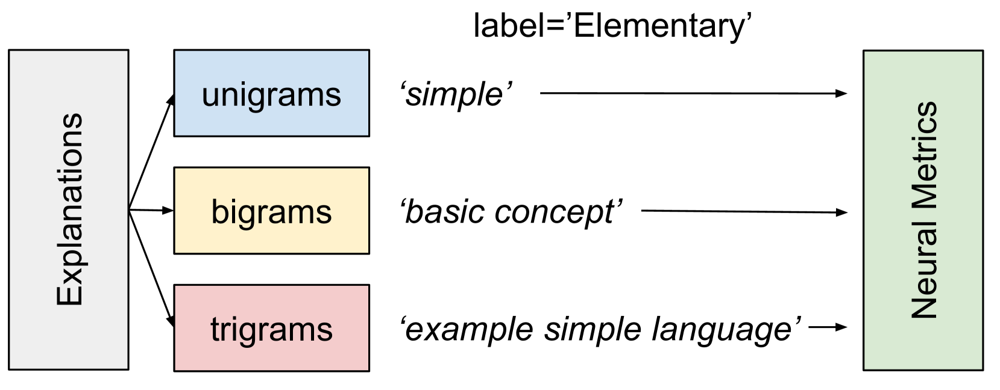

# 突破弗莱什-金凯德的局限：采用基于提示的评估指标，我们显著提升了教育文本难度分类的精准度。

发布时间：2024年05月15日

`LLM理论

这篇论文探讨了大型语言模型（LLMs）在教育领域的应用，特别是在对话式教学中如何根据学生的学习水平调整教学内容和解释的难度。论文提出了一套新的基于提示的文本难度指标，并验证了其有效性。这些指标利用了LLMs的深度语言理解能力，旨在提高文本难度分类的准确性。虽然这项工作与LLM的应用有关，但其核心贡献在于理论层面的创新，即提出并验证了一种新的文本难度评估方法，这更多地属于LLM理论研究的范畴，因为它推动了对LLMs理解语言复杂性和适应性的理论认识。因此，将其归类为LLM理论更为合适。` `语言模型评估`

> Beyond Flesch-Kincaid: Prompt-based Metrics Improve Difficulty Classification of Educational Texts

# 摘要

> 在教育领域，利用大型语言模型（LLMs）进行对话式教学备受瞩目。然而，要实现有效教学，教师必须根据学生的学习水平调整教学内容和解释的难度。当前的LLMs在这方面仍显不足。为了提升LLMs的适应性，我们需要一套可靠的评估标准。现有的静态文本难度指标，如Flesch-Kincaid阅读易度分数，已被证实过于简单且不稳定。为此，我们推出了一套基于提示的文本难度新指标，并通过用户研究验证了其有效性。这些指标利用LLMs的深度语言理解能力，捕捉到更为抽象和复杂的文本特征。实验结果显示，结合我们的基于提示的指标，文本难度分类的准确性大幅提升，超越了传统静态指标。这表明，LLMs在评估文本适应不同教育水平方面具有巨大潜力。

> Using large language models (LLMs) for educational applications like dialogue-based teaching is a hot topic. Effective teaching, however, requires teachers to adapt the difficulty of content and explanations to the education level of their students. Even the best LLMs today struggle to do this well. If we want to improve LLMs on this adaptation task, we need to be able to measure adaptation success reliably. However, current Static metrics for text difficulty, like the Flesch-Kincaid Reading Ease score, are known to be crude and brittle. We, therefore, introduce and evaluate a new set of Prompt-based metrics for text difficulty. Based on a user study, we create Prompt-based metrics as inputs for LLMs. They leverage LLM's general language understanding capabilities to capture more abstract and complex features than Static metrics. Regression experiments show that adding our Prompt-based metrics significantly improves text difficulty classification over Static metrics alone. Our results demonstrate the promise of using LLMs to evaluate text adaptation to different education levels.

[Arxiv](https://arxiv.org/abs/2405.09482)