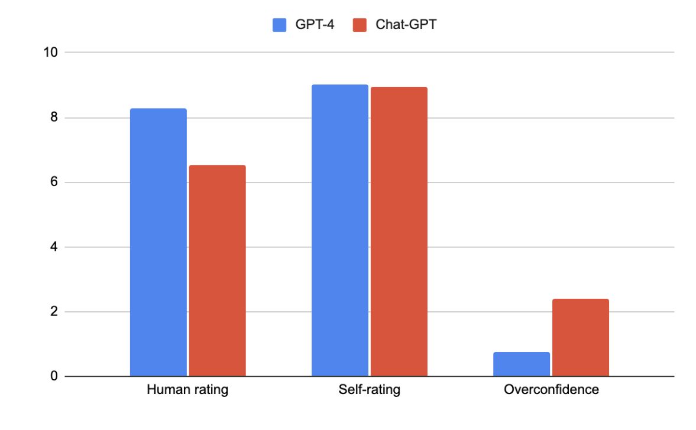

# GPT-4与Chat-GPT在心理健康领域的较量：一场关于大型语言模型心理支持能力的盲测评估

发布时间：2024年05月15日

`LLM应用

这篇论文探讨了大型语言模型（LLM）在心理健康领域的应用，具体比较了GPT-4和Chat-GPT在应对心理挑战时的表现。研究通过临床心理学家的盲评法评估了两个模型在提供心理健康支持方面的能力，并发现了它们之间的性能差异。这表明了LLM在心理健康护理中的潜在应用，并强调了进一步研究和优化这些模型以适应临床环境的重要性。因此，这篇论文属于LLM应用分类。` `心理健康` `临床辅助`

> Comparing the Efficacy of GPT-4 and Chat-GPT in Mental Health Care: A Blind Assessment of Large Language Models for Psychological Support

# 摘要

> 背景：自然语言处理的飞速进步，催生了能够革新心理健康护理的大型语言模型。这些模型在辅助临床医生和支持心理挑战者方面展现出潜力。目标：本研究旨在比较GPT-4与Chat-GPT在应对18项心理挑战时的表现，以探索它们在心理健康领域的应用前景。方法：采用盲评法，临床心理学家在不知模型身份的情况下，对模型的回应进行评估。评估涵盖了抑郁、焦虑、创伤等多样心理健康议题，力求全面。结果：研究揭示了两个模型间的显著性能差异（p > 0.05）。GPT-4平均得分8.29，Chat-GPT则为6.52。评估显示，GPT-4在提供临床相关且富有同情心的回应上更为出色，为潜在用户提供了更佳的支持与指引。结论：本研究为大型语言模型在心理健康领域的应用研究添砖加瓦。研究强调了持续研发以优化临床应用的重要性，并呼吁进一步探究模型性能差异的根本原因，以及它们在不同人群和心理健康状况下的适用性。

> Background: Rapid advancements in natural language processing have led to the development of large language models with the potential to revolutionize mental health care. These models have shown promise in assisting clinicians and providing support to individuals experiencing various psychological challenges.
  Objective: This study aims to compare the performance of two large language models, GPT-4 and Chat-GPT, in responding to a set of 18 psychological prompts, to assess their potential applicability in mental health care settings.
  Methods: A blind methodology was employed, with a clinical psychologist evaluating the models' responses without knowledge of their origins. The prompts encompassed a diverse range of mental health topics, including depression, anxiety, and trauma, to ensure a comprehensive assessment.
  Results: The results demonstrated a significant difference in performance between the two models (p > 0.05). GPT-4 achieved an average rating of 8.29 out of 10, while Chat-GPT received an average rating of 6.52. The clinical psychologist's evaluation suggested that GPT-4 was more effective at generating clinically relevant and empathetic responses, thereby providing better support and guidance to potential users.
  Conclusions: This study contributes to the growing body of literature on the applicability of large language models in mental health care settings. The findings underscore the importance of continued research and development in the field to optimize these models for clinical use. Further investigation is necessary to understand the specific factors underlying the performance differences between the two models and to explore their generalizability across various populations and mental health conditions.

[Arxiv](https://arxiv.org/abs/2405.09300)