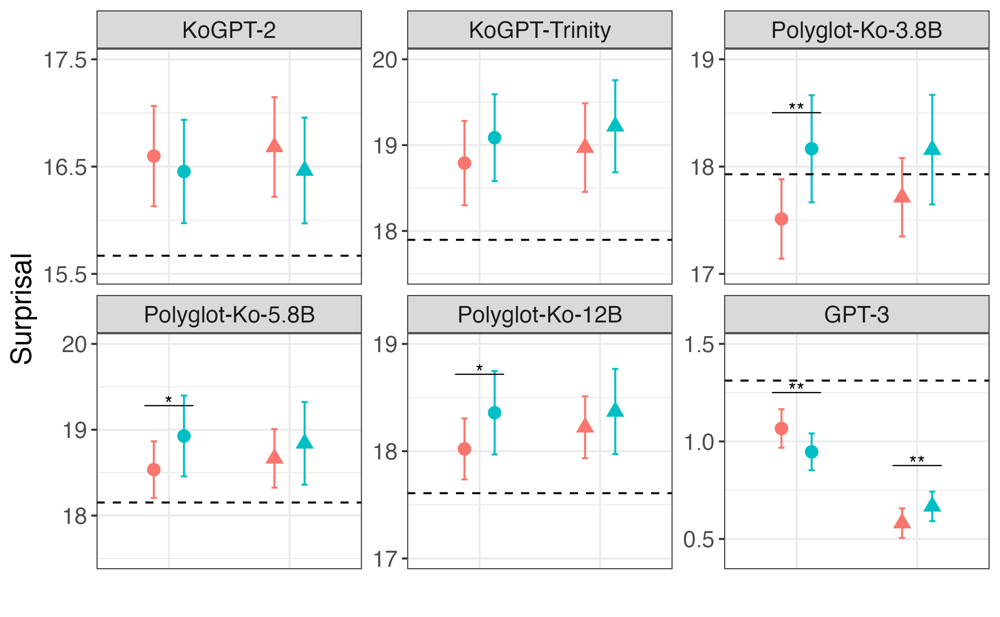
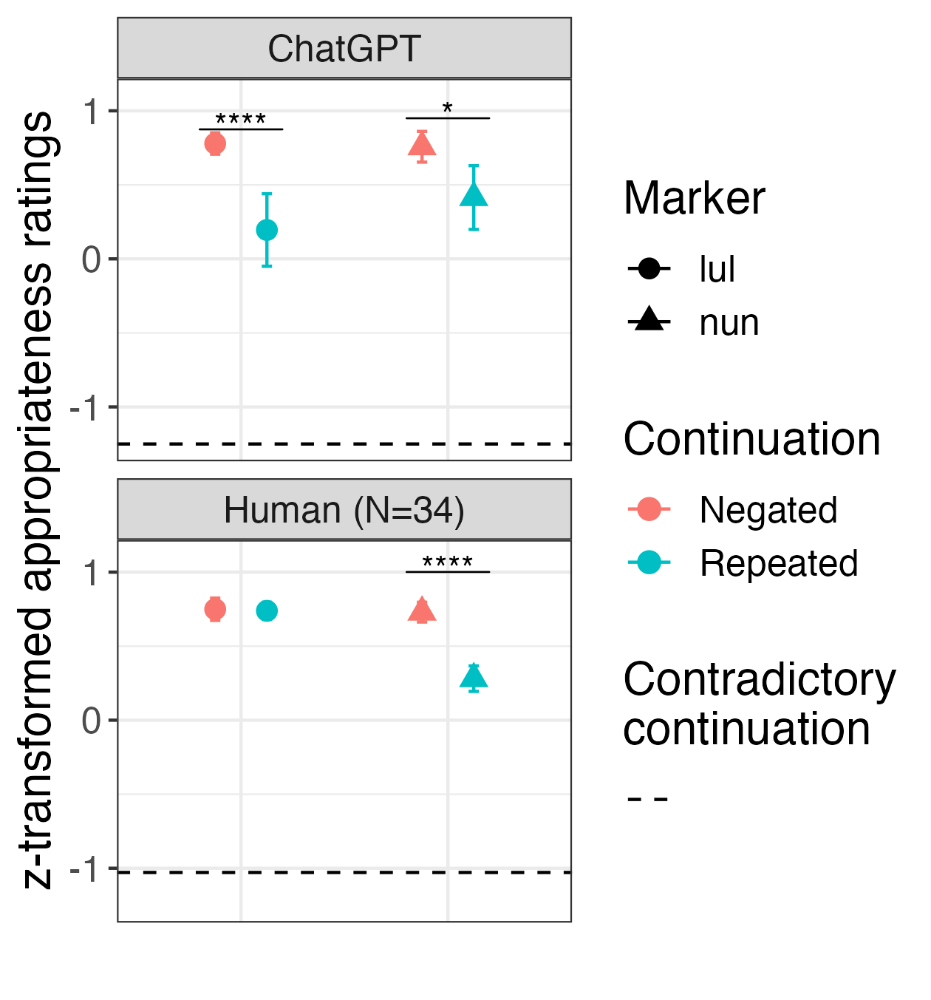
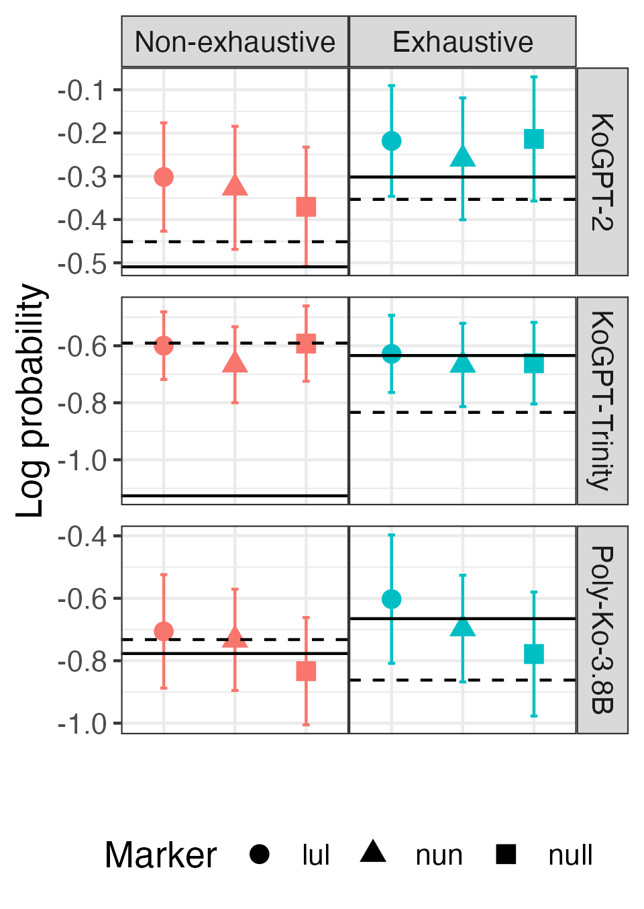
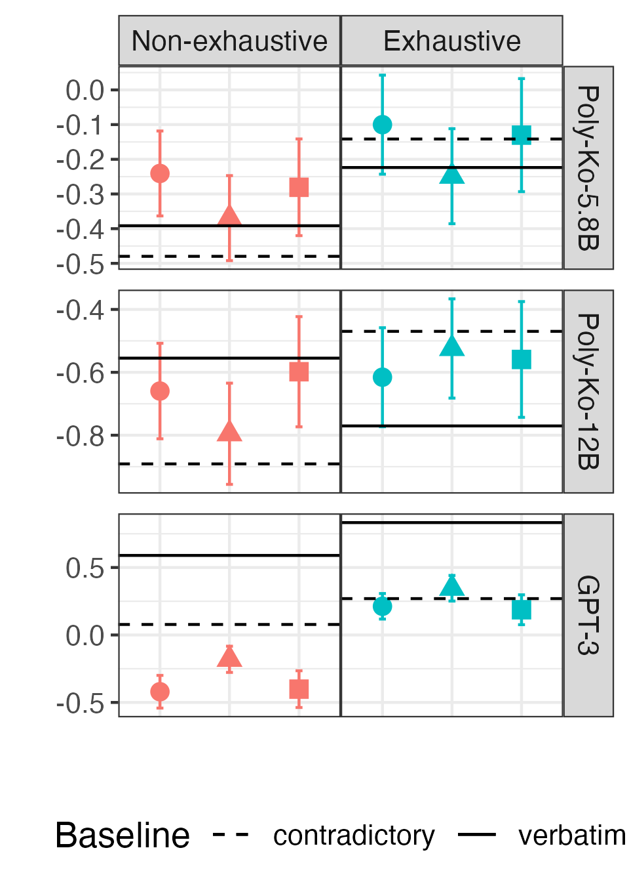
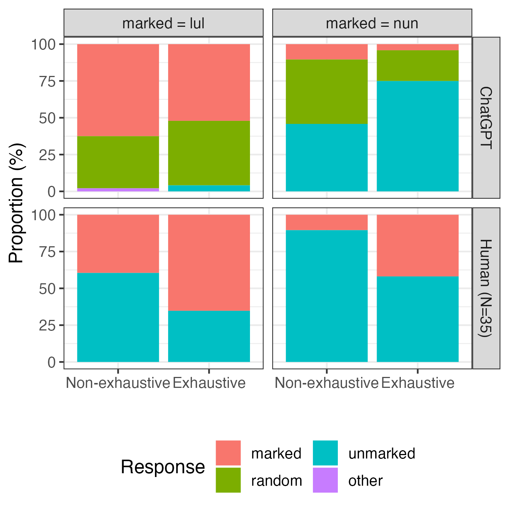
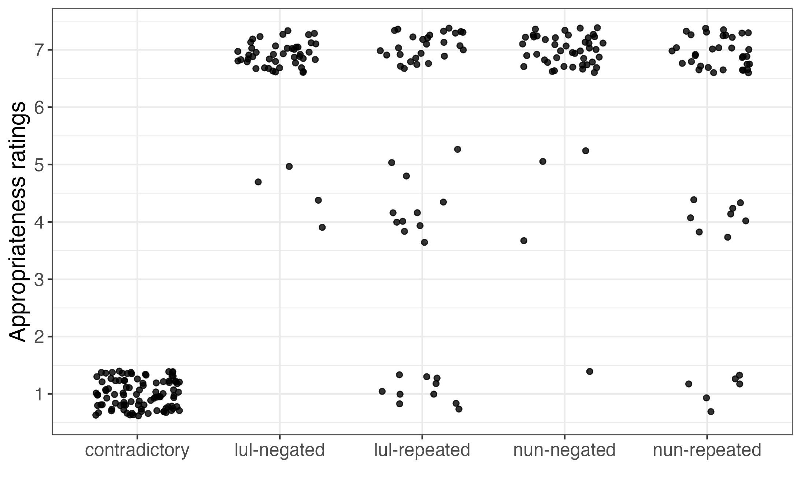
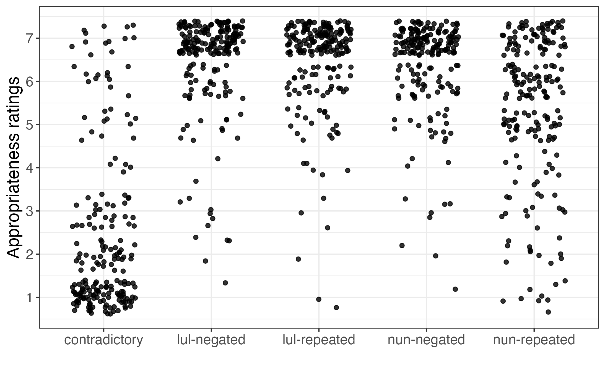

# 语言模型能否洞察言外之意？本研究深入探讨韩语形态学中的排他性含意，揭示语言模型在理解隐含语篇意义方面的能力。

发布时间：2024年05月15日

`LLM理论

这篇论文探讨了大型语言模型（LLM）在处理韩语中的差异性宾语标记（DOM）现象时的能力，特别是模型是否能够捕捉到话语层面的隐含意义。这个问题涉及到语言模型的理论理解，即模型如何理解和处理语言中的语义和语用层面。因此，这篇论文更倾向于LLM理论的范畴，因为它关注的是模型如何理解和处理语言的深层结构，而不是直接的应用场景或特定的代理（Agent）或检索增强生成（RAG）技术。` `语言学`

> Do language models capture implied discourse meanings? An investigation with exhaustivity implicatures of Korean morphology

# 摘要

> 在自然语言中，标记性往往与话语中的隐含意义相联系。韩语中的差异性宾语标记（DOM）现象即是一例，它根据名词短语的语义特征和与之独立的话语特征来选择后置标记。以往的研究揭示了分布式语言模型能够揭示单词的某些语义特征，但它们是否也能捕捉到话语层面的隐含意义呢？我们测试了大型语言模型是否能将韩语中的宾语标记与话语意义相联系。研究结果显示，语法标记所蕴含的话语意义可能比话语标记更难以捕捉。

> Markedness in natural language is often associated with non-literal meanings in discourse. Differential Object Marking (DOM) in Korean is one instance of this phenomenon, where post-positional markers are selected based on both the semantic features of the noun phrases and the discourse features that are orthogonal to the semantic features. Previous work has shown that distributional models of language recover certain semantic features of words -- do these models capture implied discourse-level meanings as well? We evaluate whether a set of large language models are capable of associating discourse meanings with different object markings in Korean. Results suggest that discourse meanings of a grammatical marker can be more challenging to encode than that of a discourse marker.

[Arxiv](https://arxiv.org/abs/2405.09293)