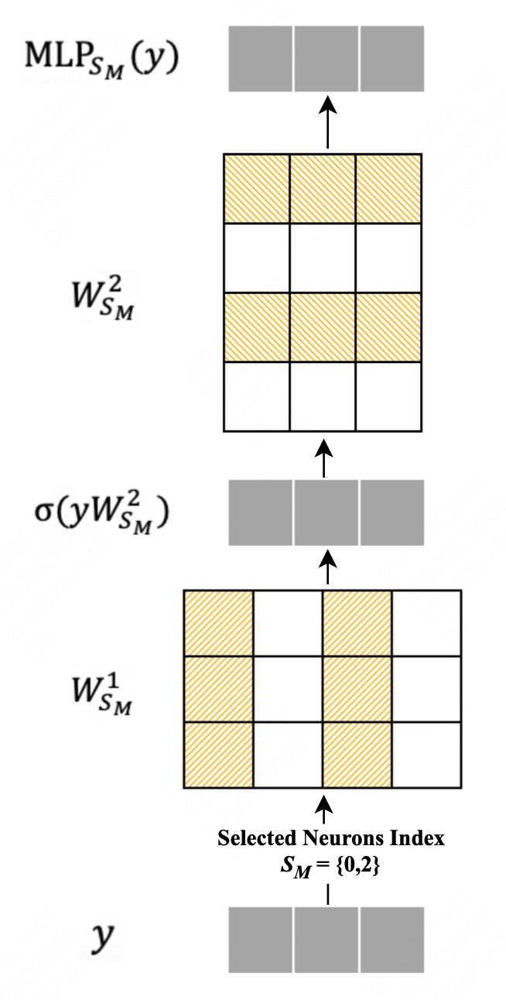

# LLaMA模型中的动态激活挑战：一项实证探索在这项研究中，我们深入探讨了LLaMA模型中动态激活机制的潜在问题，并通过一系列实验来揭示这些机制如何影响模型的性能。我们的发现不仅为理解这些复杂模型的内部工作原理提供了新的视角，也为优化和改进这些模型提供了实用的指导。

发布时间：2024年05月15日

`LLM理论

这篇论文聚焦于LLaMA语言模型中的动态激活机制，分析了其在高稀疏性要求场景下的效能问题，并指出了现有方案的缺陷。研究内容涉及模型的内部机制和性能优化，属于对大型语言模型（LLM）理论层面的探讨和分析。因此，它被归类为LLM理论。` `模型优化`

> Dynamic Activation Pitfalls in LLaMA Models: An Empirical Study

# 摘要

> 本研究深入探讨了LLaMA语言模型中动态激活机制的效能。虽然动态激活有望减少计算负担并加速ReLU模型，但我们的实验揭示了现有方案的若干内在缺陷。实验表明，LLaMA模型在高稀疏性要求的场景中往往不如ReLU模型。我们认为，这源于动态激活的复杂性、稀疏性不足以及信息保存不充分。我们的研究不仅指出了LLaMA模型中动态激活的局限，还为未来稀疏性策略的优化提供了方向。

> In this work, we systematically investigate the efficacy of dynamic activation mechanisms within the LLaMA family of language models. Despite the potential of dynamic activation methods to reduce computation and increase speed in models using the ReLU activation function, our empirical findings have uncovered several inherent pitfalls in the current dynamic activation schemes. Through extensive experiments across various dynamic activation strategies, we demonstrate that LLaMA models usually underperform when compared to their ReLU counterparts, particularly in scenarios demanding high sparsity ratio. We attribute these deficiencies to a combination of factors: 1) the inherent complexity of dynamically predicting activation heads and neurons; 2) the inadequate sparsity resulting from activation functions; 3) the insufficient preservation of information resulting from KV cache skipping. Our analysis not only sheds light on the limitations of dynamic activation in the context of large-scale LLaMA models but also proposes roadmaps for enhancing the design of future sparsity schemes.

[Arxiv](https://arxiv.org/abs/2405.09274)