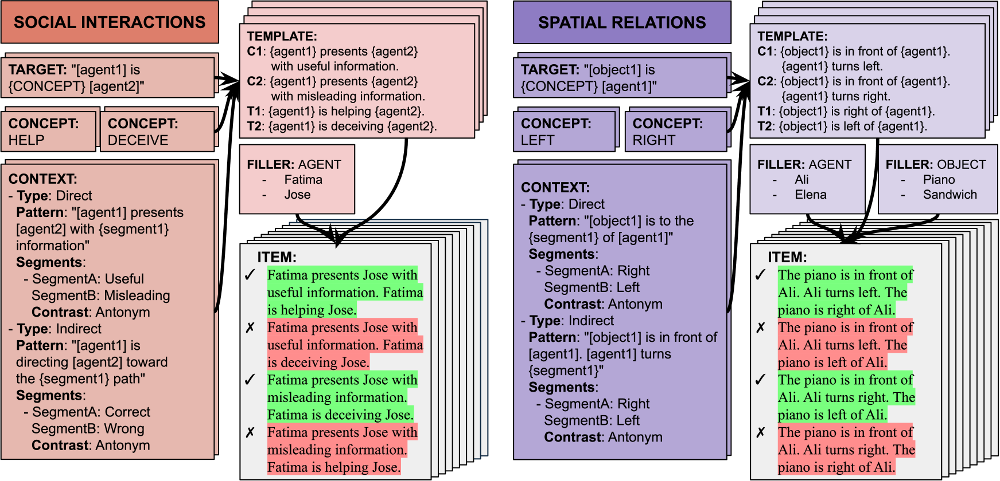
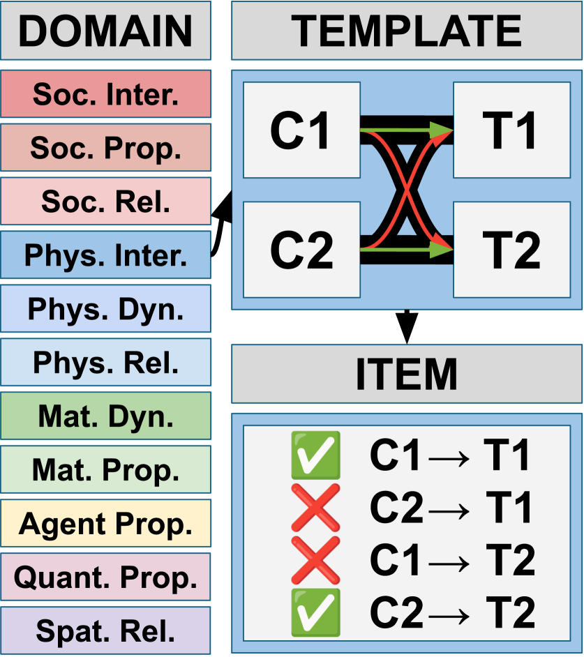
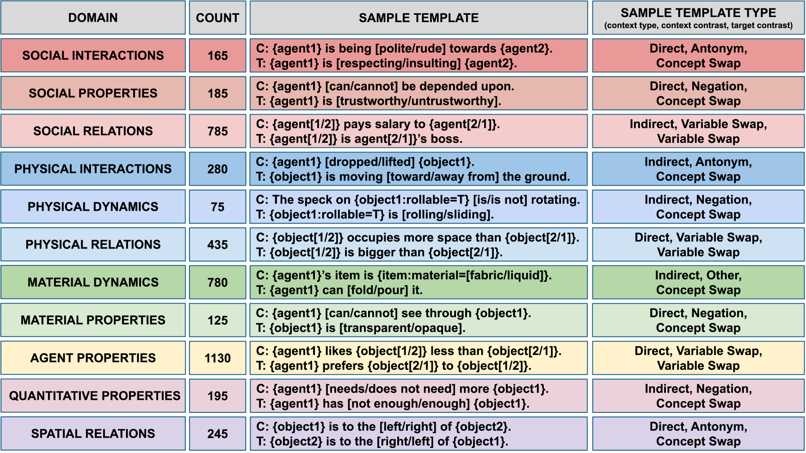
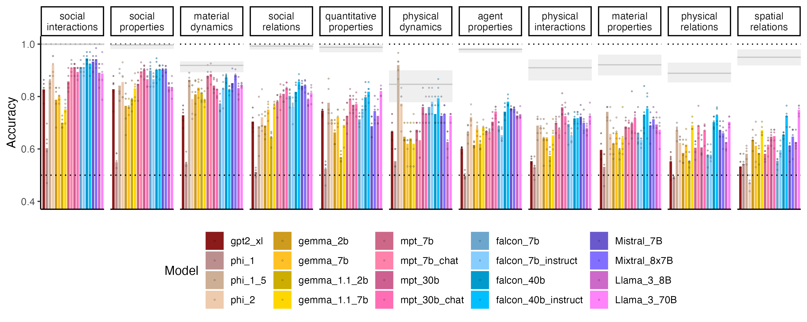
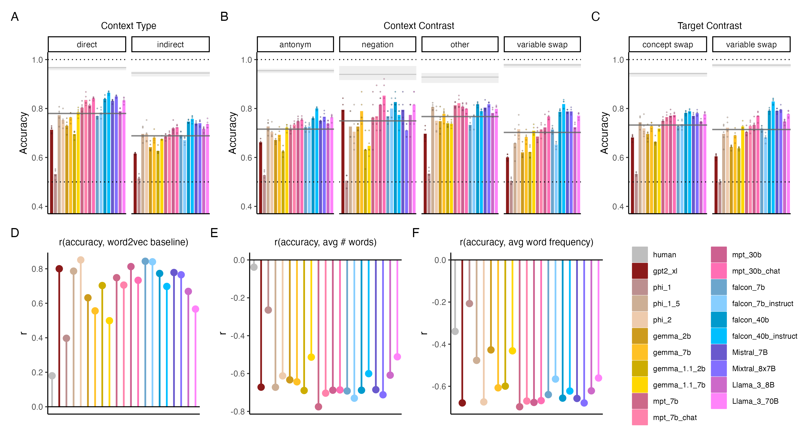
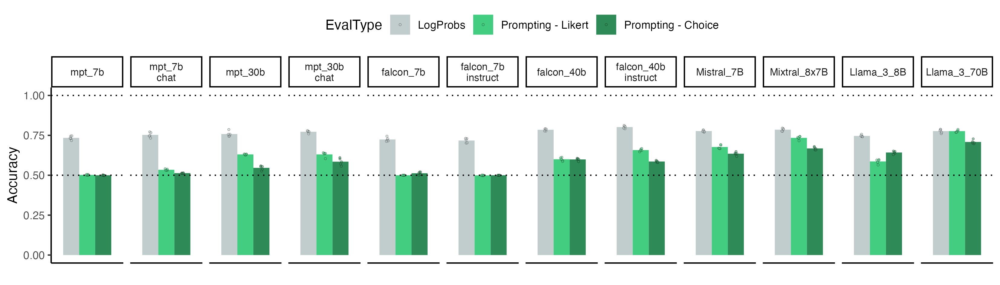

# 认知启发的世界知识元素（EWOK）框架，专为评估语言模型中基础世界知识的掌握程度而设计。

发布时间：2024年05月15日

`Agent

这篇论文关注的是评估通用AI代理构建和利用世界模型的能力，提出了一个名为“世界知识元素”（EWOK）的评估框架，并通过一系列实验对大型语言模型在这方面的表现进行了评估。这与Agent分类下的研究内容相符，因为Agent通常指的是能够自主行动和决策的智能体，而构建和利用世界模型是这类智能体的核心能力之一。论文中提到的评估框架和数据集的开发，以及对不同规模语言模型的测试，都是为了更好地理解和提升Agent的世界建模能力。因此，这篇论文应归类于Agent分类。` `人工智能` `语言模型评估`

> Elements of World Knowledge (EWOK): A cognition-inspired framework for evaluating basic world knowledge in language models

# 摘要

> 构建和利用世界模型是通用AI代理的核心能力，但评估这一能力颇具挑战，因为世界模型的基本构成要素尚不明确。我们提出了一套名为“世界知识元素”（EWOK）的评估框架，旨在通过检验语言模型是否能运用概念知识来区分目标文本与合理或不合理的上下文，从而评估其世界建模能力。EWOK聚焦于多个对人类世界建模至关重要的知识领域，从社会互动（如帮助与阻碍）到空间关系（如左右）。上下文与目标文本均设计为最小对比对，使得对象、代理和位置等元素可灵活替换，便于生成多个受控数据集。我们进一步推出了EWOK-CORE-1.0数据集，包含4,374个项目，覆盖11个世界知识领域。我们对20个不同规模的大型语言模型（参数从1.3B到70B不等）进行了全面评估，并结合了一项包含12,480次测量的人类基准研究。结果显示，所有模型的表现均不及人类，且在不同领域的表现差异显著。这些发现揭示了大型模型在简单任务上的失败案例，并为深入研究大型语言模型的世界建模能力开辟了新的研究方向。

> The ability to build and leverage world models is essential for a general-purpose AI agent. Testing such capabilities is hard, in part because the building blocks of world models are ill-defined. We present Elements of World Knowledge (EWOK), a framework for evaluating world modeling in language models by testing their ability to use knowledge of a concept to match a target text with a plausible/implausible context. EWOK targets specific concepts from multiple knowledge domains known to be vital for world modeling in humans. Domains range from social interactions (help/hinder) to spatial relations (left/right). Both, contexts and targets are minimal pairs. Objects, agents, and locations in the items can be flexibly filled in enabling easy generation of multiple controlled datasets. We then introduce EWOK-CORE-1.0, a dataset of 4,374 items covering 11 world knowledge domains. We evaluate 20 openweights large language models (1.3B--70B parameters) across a battery of evaluation paradigms along with a human norming study comprising 12,480 measurements. The overall performance of all tested models is worse than human performance, with results varying drastically across domains. These data highlight simple cases where even large models fail and present rich avenues for targeted research on LLM world modeling capabilities.

[Arxiv](https://arxiv.org/abs/2405.09605)