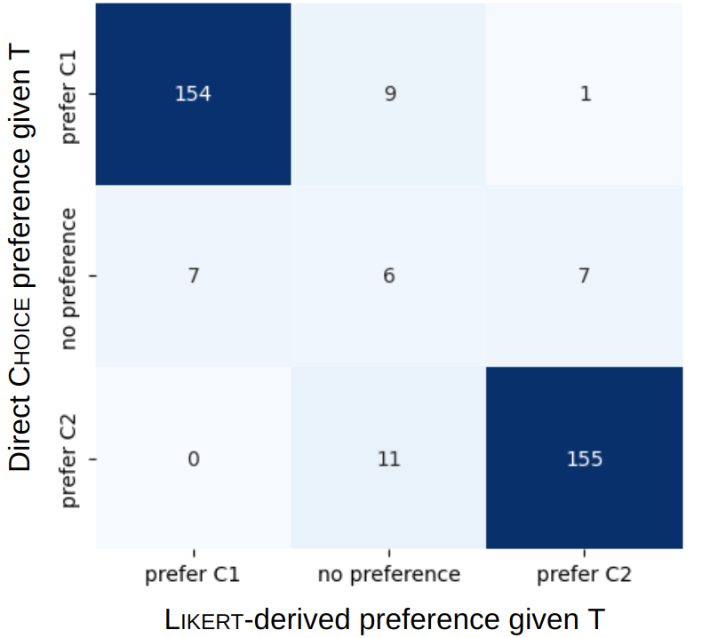

# 认知启发的世界知识元素（EWOK）框架，专为评估语言模型中的基础世界知识而设计。

发布时间：2024年05月15日

`Agent

这篇论文探讨了构建和利用世界模型的能力，这是通用人工智能代理的核心要素。它提出了一个名为世界知识元素（EWOK）的框架，并通过创建EWOK-CORE-1.0数据集来评估语言模型在多个知识领域中的表现。论文的研究重点在于评估语言模型如何运用概念知识来匹配文本与上下文，这直接关联到Agent的能力，即理解和处理世界知识以执行任务。因此，这篇论文属于Agent分类。` `人工智能` `语言模型评估`

> Elements of World Knowledge (EWOK): A cognition-inspired framework for evaluating basic world knowledge in language models

# 摘要

> 构建和利用世界模型的能力是通用人工智能代理的核心。然而，由于世界模型的基本构成模糊不清，评估这些能力颇具挑战。我们提出的世界知识元素（EWOK）框架，通过检验语言模型如何运用概念知识来匹配目标文本与合理或不合理的上下文，以此来评估世界建模能力。EWOK聚焦于多个关键知识领域中的特定概念，这些领域从社会互动到空间关系，无所不包。我们创造的EWOK-CORE-1.0数据集，包含4,374个项目，覆盖11个世界知识领域。我们对20个大型语言模型进行了全面评估，并结合人类规范研究，共计12,480次测量。尽管所有模型的表现均不及人类，但各领域间的差异显著。这些发现揭示了大型模型在简单任务上的失败案例，并为深入研究大型语言模型的世界建模能力开辟了新的研究方向。

> The ability to build and leverage world models is essential for a general-purpose AI agent. Testing such capabilities is hard, in part because the building blocks of world models are ill-defined. We present Elements of World Knowledge (EWOK), a framework for evaluating world modeling in language models by testing their ability to use knowledge of a concept to match a target text with a plausible/implausible context. EWOK targets specific concepts from multiple knowledge domains known to be vital for world modeling in humans. Domains range from social interactions (help/hinder) to spatial relations (left/right). Both, contexts and targets are minimal pairs. Objects, agents, and locations in the items can be flexibly filled in enabling easy generation of multiple controlled datasets. We then introduce EWOK-CORE-1.0, a dataset of 4,374 items covering 11 world knowledge domains. We evaluate 20 openweights large language models (1.3B--70B parameters) across a battery of evaluation paradigms along with a human norming study comprising 12,480 measurements. The overall performance of all tested models is worse than human performance, with results varying drastically across domains. These data highlight simple cases where even large models fail and present rich avenues for targeted research on LLM world modeling capabilities.

[Arxiv](https://arxiv.org/abs/2405.09605)