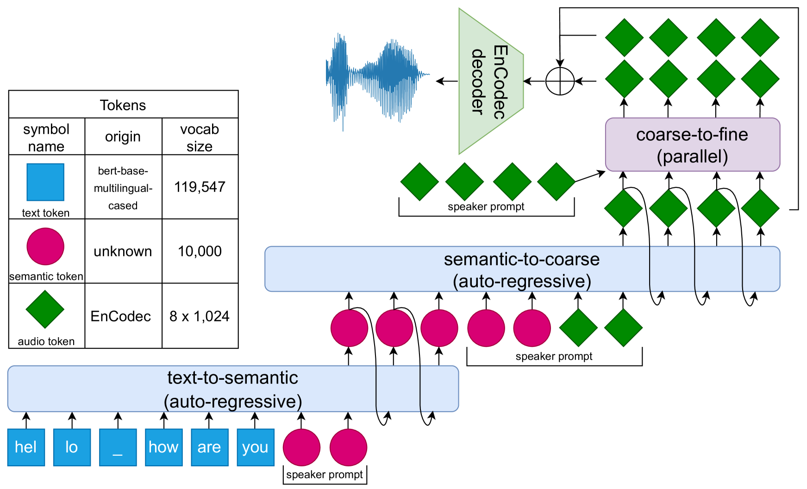
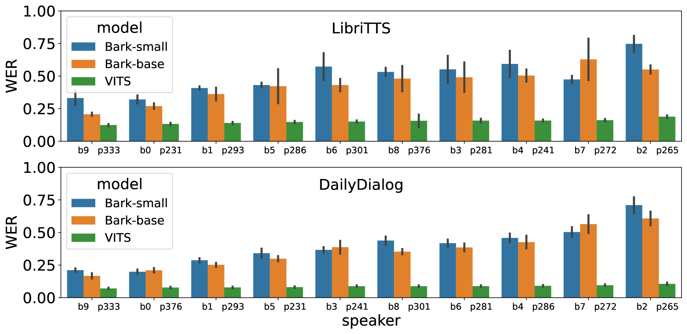
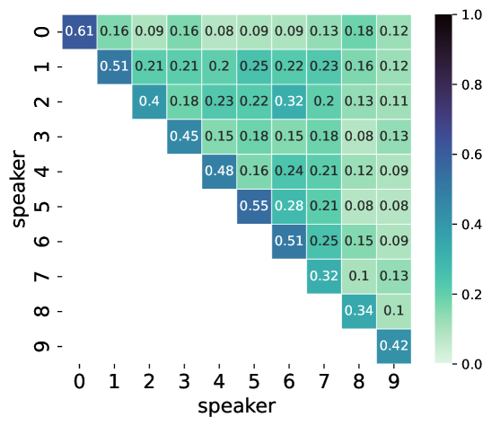
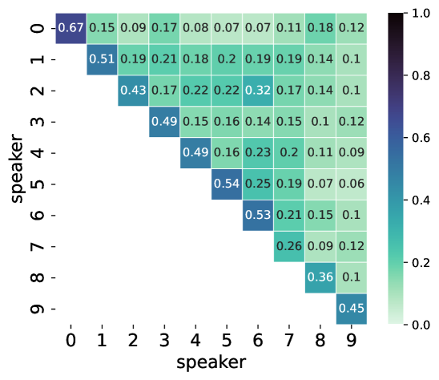
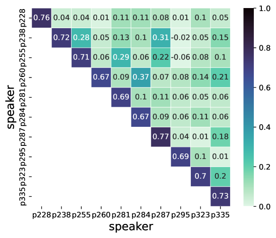
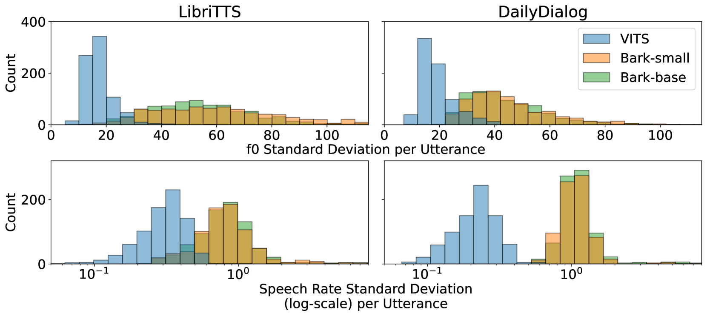

# 评测大型离散令牌语音模型下的文本转语音合成技术

发布时间：2024年05月15日

`LLM应用

这篇论文主要探讨了语音语言模型（SLM）在文本到语音合成（TTS）中的应用，包括其性能、局限性以及与传统TTS系统的比较。它通过自动评估和听觉测试分析了SLM在多个维度上的表现，如说话风格、可理解性、说话者一致性、韵律变化和自发行为。虽然论文涉及了SLM的性能评估，但重点在于其在实际应用中的表现和改进方向，因此属于大型语言模型（LLM）的应用范畴。` `语音合成`

> Evaluating Text-to-Speech Synthesis from a Large Discrete Token-based Speech Language Model

# 摘要

> 生成式语言建模在离散语音令牌上的最新进展，为文本到语音合成开辟了新天地。语音语言模型（SLM）与文本模型类似，具有可扩展性、概率性和上下文感知能力。尽管它们能产生自然多样的语音，但有时也会出现不可理解或包含非语音噪声的问题。随着SLM在语音合成中的应用日益广泛，对其性能和局限性的深入评估变得尤为重要。本文通过自动评估和听觉测试，对基于离散令牌的SLM的TTS进行了全面分析，重点关注说话风格、可理解性、说话者一致性、韵律变化和自发行为五个维度。结果显示，SLM在生成韵律多样和自发语音方面表现出色，且在自然性和上下文适应性方面优于传统TTS。然而，在可理解性和说话者一致性方面，SLM仍需追赶传统TTS。此外，扩大SLM规模可小幅提升其鲁棒性。我们的研究成果旨在为未来生成式SLM在语音合成领域的进步做出了基准。

> Recent advances in generative language modeling applied to discrete speech tokens presented a new avenue for text-to-speech (TTS) synthesis. These speech language models (SLMs), similarly to their textual counterparts, are scalable, probabilistic, and context-aware. While they can produce diverse and natural outputs, they sometimes face issues such as unintelligibility and the inclusion of non-speech noises or hallucination. As the adoption of this innovative paradigm in speech synthesis increases, there is a clear need for an in-depth evaluation of its capabilities and limitations. In this paper, we evaluate TTS from a discrete token-based SLM, through both automatic metrics and listening tests. We examine five key dimensions: speaking style, intelligibility, speaker consistency, prosodic variation, spontaneous behaviour. Our results highlight the model's strength in generating varied prosody and spontaneous outputs. It is also rated higher in naturalness and context appropriateness in listening tests compared to a conventional TTS. However, the model's performance in intelligibility and speaker consistency lags behind traditional TTS. Additionally, we show that increasing the scale of SLMs offers a modest boost in robustness. Our findings aim to serve as a benchmark for future advancements in generative SLMs for speech synthesis.

[Arxiv](https://arxiv.org/abs/2405.09768)