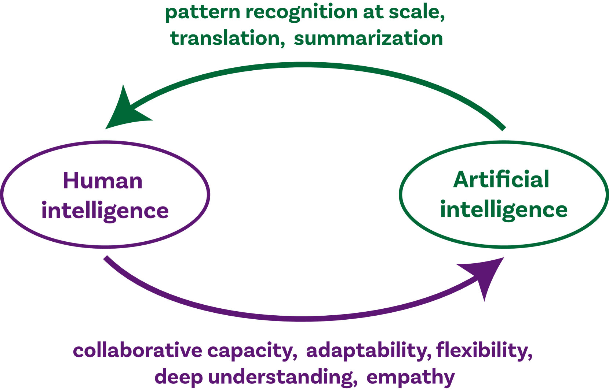
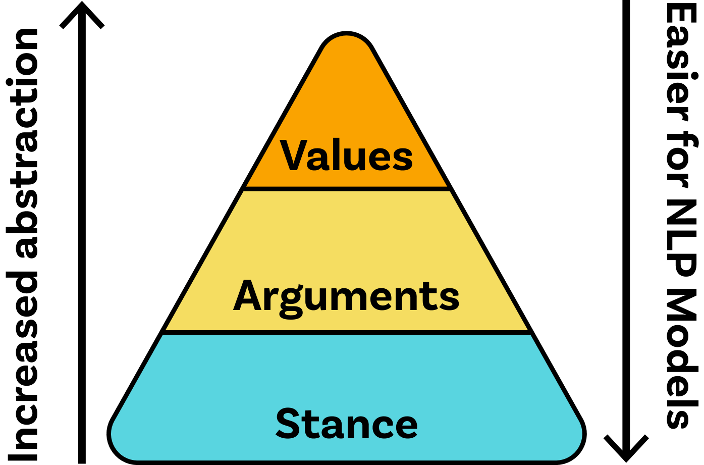

# 借助混合 NLP 策略，我们致力于激发多元观点的交流与碰撞。

发布时间：2024年05月15日

`Agent

这篇论文摘要讨论了如何利用自然语言处理（NLP）和人机混合智能技术来提升在线讨论论坛中的公民参与度。它提出了一种结合人类智慧和大型语言模型（LLM）的三层级视角模型，以分析和理解在线讨论中的个体观点和互动交流。这种工作涉及到构建和部署智能代理（Agent）来促进和增强在线讨论，因此属于Agent分类。虽然它涉及到了LLM的应用，但主要关注点在于如何通过智能代理来增强公民参与，而不是LLM的理论研究或特定应用，因此不属于LLM应用或LLM理论分类。同时，它也不涉及RAG（Retrieval-Augmented Generation）的相关内容，因此不归类于RAG。` `民主参与` `在线讨论平台`

> Facilitating Opinion Diversity through Hybrid NLP Approaches

# 摘要

> 现代民主国家正面临公民决策参与度下降的严峻挑战。在线讨论论坛成为提升公民参与的关键平台。本论文提案首先揭示了在自然语言处理（NLP）助力下推动大规模在线讨论的难题，随后提出结合人机混合智能技术的创新解决方案，并深入探讨这些技术如何洞察在线讨论中的个体观点。我们构建了一个三层级的视角模型，融合了人类智慧与大型语言模型的力量，以此展现观点的多元性，并深入分析在线讨论中的互动交流。

> Modern democracies face a critical issue of declining citizen participation in decision-making. Online discussion forums are an important avenue for enhancing citizen participation. This thesis proposal 1) identifies the challenges involved in facilitating large-scale online discussions with Natural Language Processing (NLP), 2) suggests solutions to these challenges by incorporating hybrid human-AI technologies, and 3) investigates what these technologies can reveal about individual perspectives in online discussions. We propose a three-layered hierarchy for representing perspectives that can be obtained by a mixture of human intelligence and large language models. We illustrate how these representations can draw insights into the diversity of perspectives and allow us to investigate interactions in online discussions.

[Arxiv](https://arxiv.org/abs/2405.09439)