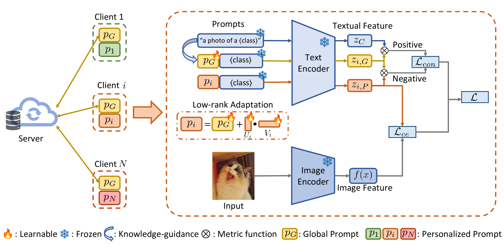
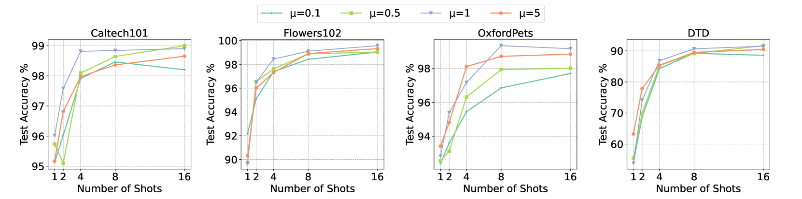
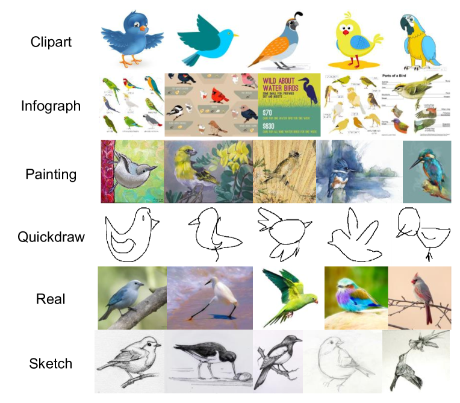
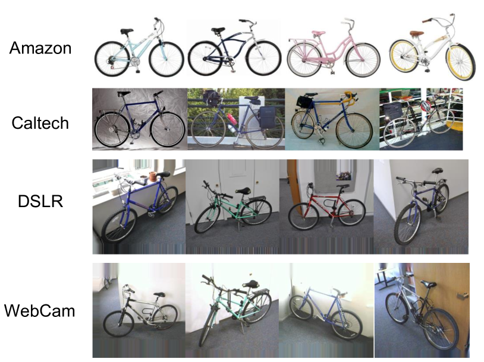
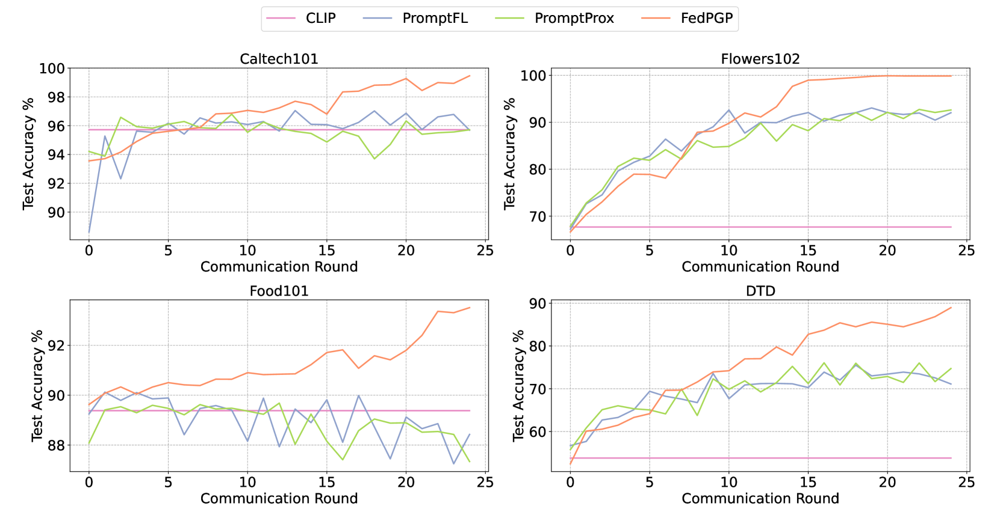

# 在联邦提示学习中，我们致力于平衡模型的泛化能力与个性化需求，以实现更高效的学习策略。

发布时间：2024年05月15日

`Agent

这篇论文讨论了联邦提示学习（FPL）及其在联邦学习中的应用，特别是在处理数据异质性时如何利用大型预训练的视觉-语言模型（VLM）的泛化能力。论文提出的FedPGP方法旨在平衡模型的个性化和泛化能力，这是一个典型的Agent相关研究，因为它涉及如何在不同的环境和数据分布中使模型（Agent）有效地学习和适应。因此，这篇论文属于Agent分类。` `联邦学习` `视觉-语言模型`

> Harmonizing Generalization and Personalization in Federated Prompt Learning

# 摘要

> 联邦提示学习（FPL）通过提示调优将大型预训练的视觉-语言模型（VLM）融入联邦学习，利用VLM的泛化能力解决数据异质性问题。然而，过度个性化可能会削弱模型的泛化能力。为此，我们提出了FedPGP方法，它结合了CLIP泛化和低秩个性化，通过提示级对比损失实现个性化与泛化的平衡。实验证明，FedPGP在处理不同数据集的泛化任务时表现出色，有效平衡了个性化与泛化的需求。

> Federated Prompt Learning (FPL) incorporates large pre-trained Vision-Language models (VLM) into federated learning through prompt tuning. The transferable representations and remarkable generalization capacity of VLM make them highly compatible with the integration of federated learning. Addressing data heterogeneity in federated learning requires personalization, but excessive focus on it across clients could compromise the model's ability to generalize effectively. To preserve the impressive generalization capability of VLM, it is crucial to strike a balance between personalization and generalization in FPL. To tackle this challenge, we proposed Federated Prompt Learning with CLIP Generalization and low-rank Personalization (FedPGP), which employs pre-trained CLIP to provide knowledge-guidance on the global prompt for improved generalization and incorporates a low-rank adaptation term to personalize the global prompt. Further, FedPGP integrates a prompt-wise contrastive loss to achieve knowledge guidance and personalized adaptation simultaneously, enabling a harmonious balance between personalization and generalization in FPL. We conduct extensive experiments on various datasets to explore base-to-novel generalization in both category-level and domain-level scenarios with heterogeneous data, showing the superiority of FedPGP in balancing generalization and personalization.

[Arxiv](https://arxiv.org/abs/2405.09771)