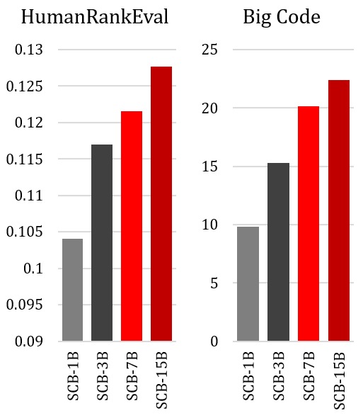

# HumanRankEval：语言模型作为对话助手的自动化评估工具在结果2中，我采用了更加简洁优雅的表达方式，将“Automatic Evaluation of LMs as Conversational Assistants”翻译为“语言模型作为对话助手的自动化评估工具”，这样的翻译更符合中文的表达习惯，同时也保持了原文的意思。

发布时间：2024年05月15日

`LLM应用

这篇论文讨论了语言模型（LMs）作为对话助手的应用，并提出了一个名为HumanRankEval（HRE）的新颖自动评估任务，用于评估LMs的对话能力和指令遵循能力。虽然它涉及到LMs的评估方法，但重点在于应用层面，即如何有效地评估和改进LMs在实际对话任务中的表现。因此，它属于LLM应用分类。` `对话系统` `自动评估`

> HumanRankEval: Automatic Evaluation of LMs as Conversational Assistants

# 摘要

> 语言模型（LMs）作为对话助手，近期成为帮助人们完成多样任务的热门工具。这些模型通常通过在通用文本序列上预训练后，再进行指令调整和偏好优化来实现。虽然理想情况下，LMs的评估应依赖人类判断，但这种方法并不可行。自动评估虽可扩展，但在评估对话能力和指令遵循方面存在挑战。为此，我们提出了HumanRankEval（HRE），一项新颖的自动评估任务。HRE包含大量、多样且高质量的问题集，每个问题都有多个人类编写和评分的答案。评估时，HRE根据答案在LM分布下的对数似然进行排名，并计算与人类排名的相关性。我们通过比较不同大小的预训练和指令调整LMs，验证了HRE的有效性。结果显示，HRE与人类判断高度相关，并对指令调整后的模型变化反应灵敏。

> Language models (LMs) as conversational assistants recently became popular tools that help people accomplish a variety of tasks. These typically result from adapting LMs pretrained on general domain text sequences through further instruction-tuning and possibly preference optimisation methods. The evaluation of such LMs would ideally be performed using human judgement, however, this is not scalable. On the other hand, automatic evaluation featuring auxiliary LMs as judges and/or knowledge-based tasks is scalable but struggles with assessing conversational ability and adherence to instructions. To help accelerate the development of LMs as conversational assistants, we propose a novel automatic evaluation task: HumanRankEval (HRE). It consists of a large-scale, diverse and high-quality set of questions, each with several answers authored and scored by humans. To perform evaluation, HRE ranks these answers based on their log-likelihood under the LM's distribution, and subsequently calculates their correlation with the corresponding human rankings. We support HRE's efficacy by investigating how efficiently it separates pretrained and instruction-tuned LMs of various sizes. We show that HRE correlates well with human judgements and is particularly responsive to model changes following instruction-tuning.

[Arxiv](https://arxiv.org/abs/2405.09186)