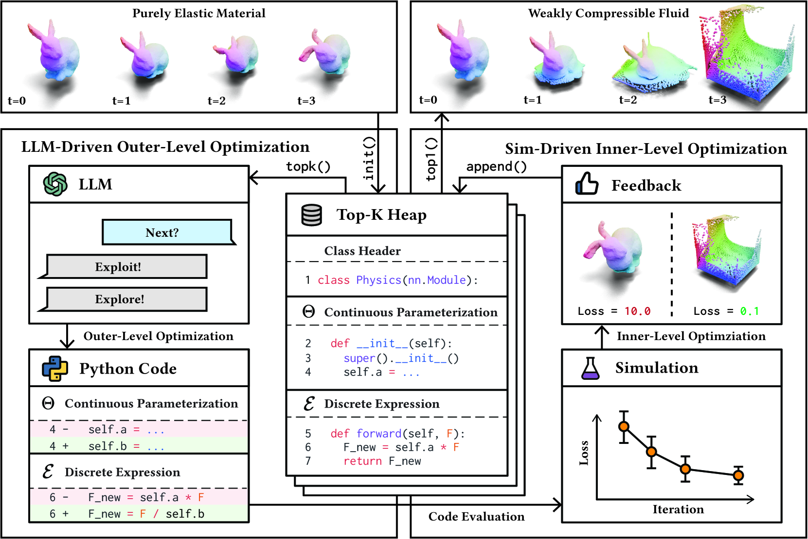
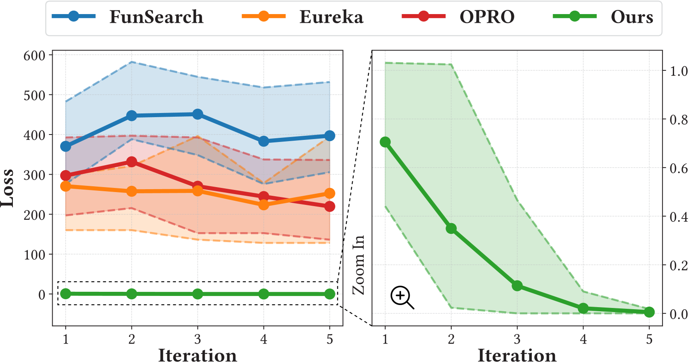
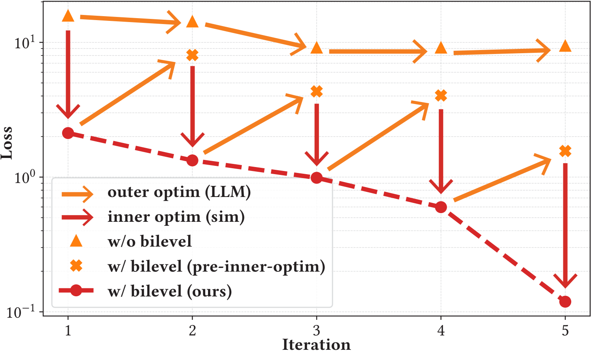
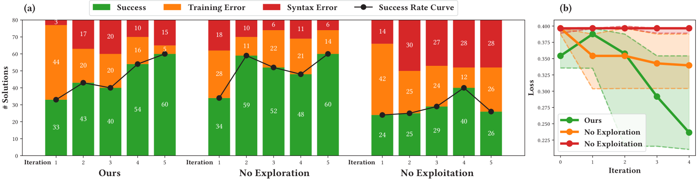
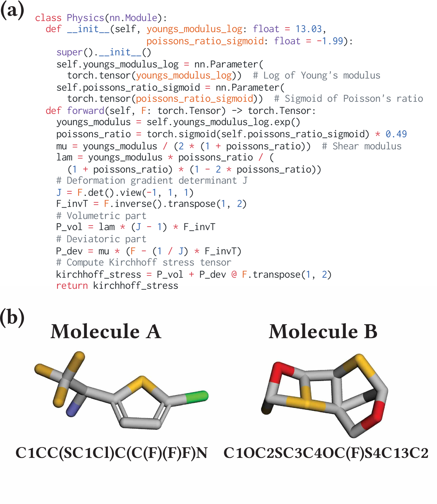

# 大型语言模型与模拟技术联手，成为双层优化的新引擎，引领物理科学探索迈入创新纪元。

发布时间：2024年05月15日

`Agent

这篇论文介绍了一个名为科学生成代理（SGA）的框架，它利用大型语言模型（LLMs）的推理能力和模拟技术的计算力量来增强抽象推理能力，并在科学探索领域进行应用。SGA框架通过双层优化，让LLMs提出科学假设并对离散元素进行推理，同时模拟提供观测反馈以优化连续参数。这种结合了LLMs和模拟技术的代理框架，旨在推动物理科学的进步，因此属于Agent分类。` `科学研究` `物理学`

> LLM and Simulation as Bilevel Optimizers: A New Paradigm to Advance Physical Scientific Discovery

# 摘要

> 大型语言模型因其深厚的知识储备和卓越的推理能力，在科学探索领域备受瞩目。然而，它们在模拟观测数据并与语言结合以推动物理科学进步，面临挑战。借鉴人类科学家的探索方式，我们提出增强LLMs的抽象推理能力，借助模拟技术的计算力量。我们提出了科学生成代理（SGA），一个双层优化框架：LLMs扮演智慧的思想家，提出科学假设，对物理方程或分子结构等离散元素进行推理；模拟则作为实验平台，提供观测反馈，优化连续参数。我们的实验证明，SGA在发现构成定律和设计分子方面表现出色，揭示了与传统预期不同但逻辑一致的新颖解决方案。

> Large Language Models have recently gained significant attention in scientific discovery for their extensive knowledge and advanced reasoning capabilities. However, they encounter challenges in effectively simulating observational feedback and grounding it with language to propel advancements in physical scientific discovery. Conversely, human scientists undertake scientific discovery by formulating hypotheses, conducting experiments, and revising theories through observational analysis. Inspired by this, we propose to enhance the knowledge-driven, abstract reasoning abilities of LLMs with the computational strength of simulations. We introduce Scientific Generative Agent (SGA), a bilevel optimization framework: LLMs act as knowledgeable and versatile thinkers, proposing scientific hypotheses and reason about discrete components, such as physics equations or molecule structures; meanwhile, simulations function as experimental platforms, providing observational feedback and optimizing via differentiability for continuous parts, such as physical parameters. We conduct extensive experiments to demonstrate our framework's efficacy in constitutive law discovery and molecular design, unveiling novel solutions that differ from conventional human expectations yet remain coherent upon analysis.

[Arxiv](https://arxiv.org/abs/2405.09783)