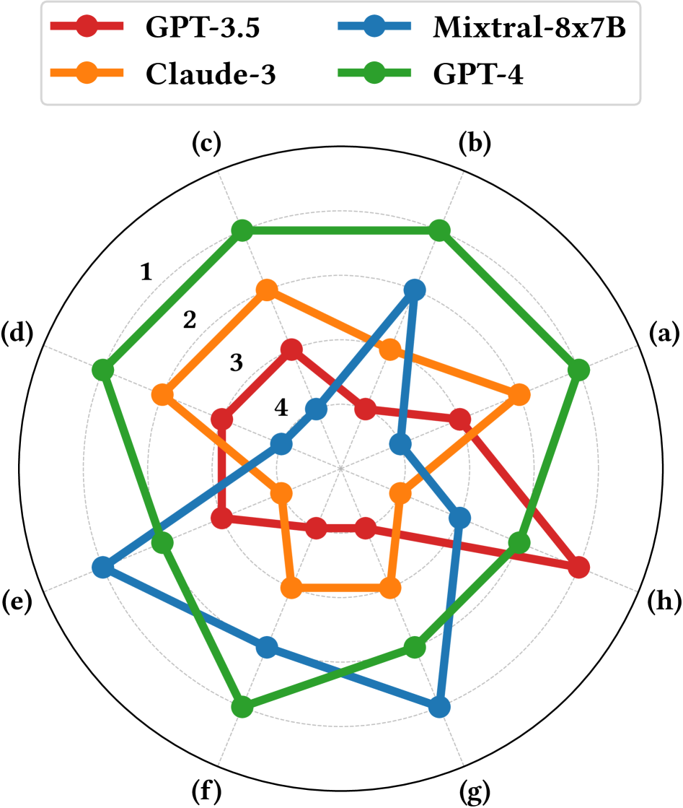

# 大型语言模型与模拟携手，成为双层优化的新引擎，正开启物理科学探索的崭新篇章。

发布时间：2024年05月15日

`Agent

这篇论文介绍了一个名为科学生成代理（SGA）的框架，它结合了大型语言模型（LLMs）的推理能力和模拟的计算强度，以增强科学发现的过程。SGA框架通过双层优化实现，其中LLMs负责提出科学假设和推理离散组件，而模拟则提供观测反馈并优化连续部分。这个框架在科学发现领域，特别是在构成定律发现和分子设计方面，展示了其有效性。因此，这篇论文更符合Agent分类，因为它描述了一个特定的代理系统，该系统旨在辅助科学发现过程。` `科学研究` `人工智能辅助发现`

> LLM and Simulation as Bilevel Optimizers: A New Paradigm to Advance Physical Scientific Discovery

# 摘要

> 大型语言模型（LLMs）因其广泛的知识和推理能力，在科学发现领域备受瞩目。然而，它们在模拟观测反馈并与语言结合以推动物理科学发现方面面临挑战。借鉴人类科学家的方法，我们提出通过模拟的计算强度来增强LLMs的推理能力。我们提出了科学生成代理（SGA），一个双层优化框架：LLMs作为知识渊博的思想家，提出科学假设并推理离散组件；模拟则作为实验平台，提供观测反馈并优化连续部分。实验证明，我们的框架在构成定律发现和分子设计方面有效，揭示了与传统预期不同但分析后一致的新解决方案。

> Large Language Models have recently gained significant attention in scientific discovery for their extensive knowledge and advanced reasoning capabilities. However, they encounter challenges in effectively simulating observational feedback and grounding it with language to propel advancements in physical scientific discovery. Conversely, human scientists undertake scientific discovery by formulating hypotheses, conducting experiments, and revising theories through observational analysis. Inspired by this, we propose to enhance the knowledge-driven, abstract reasoning abilities of LLMs with the computational strength of simulations. We introduce Scientific Generative Agent (SGA), a bilevel optimization framework: LLMs act as knowledgeable and versatile thinkers, proposing scientific hypotheses and reason about discrete components, such as physics equations or molecule structures; meanwhile, simulations function as experimental platforms, providing observational feedback and optimizing via differentiability for continuous parts, such as physical parameters. We conduct extensive experiments to demonstrate our framework's efficacy in constitutive law discovery and molecular design, unveiling novel solutions that differ from conventional human expectations yet remain coherent upon analysis.

[Arxiv](https://arxiv.org/abs/2405.09783)