# 知识编辑视角下的大型语言模型偏差矫正在知识编辑的视角下，大型语言模型的偏差问题得到了新的关注。通过精细调整模型内部的知识结构，我们能够有效地减少模型在生成内容时产生的偏差，从而提升其公正性和准确性。这一方法不仅为AI伦理提供了新的解决思路，也为构建更加公平、透明的智能系统奠定了基础。

发布时间：2024年05月15日

`LLM理论

这篇论文主要探讨了大型语言模型（LLM）中的偏差问题，并提出了一种新的偏差缓解基准和方法（BiasKE和FAST）。它关注的是模型内部的偏差问题以及如何通过技术手段来缓解这些偏差，以提高模型的公平性、特异性和泛化性。这与LLM的理论研究紧密相关，因为它涉及到模型设计和改进的核心问题，而不是直接的应用场景或Agent的设计。因此，这篇论文更适合归类于LLM理论。` `公平性` `机器学习`

> Large Language Model Bias Mitigation from the Perspective of Knowledge Editing

# 摘要

> 现有的去偏方法在追求社会群体间平等的同时，往往忽视了个体差异，导致预测结果不尽人意。本文推出了一个全新的偏差缓解基准BiasKE，它通过一系列综合指标来评估去偏效果，涵盖了公平性、特异性和泛化性。我们还创新性地提出了“公平印章（FAST）”方法，它通过精细调整个体偏差知识，实现了公平性的可编辑性。实验结果显示，FAST不仅在去偏方面超越了现有技术，而且保持了模型知识保留的整体能力，预示着细粒度去偏策略在大型语言模型中实现可编辑公平性的光明前景。

> Existing debiasing methods inevitably make unreasonable or undesired predictions as they are designated and evaluated to achieve parity across different social groups but leave aside individual facts, resulting in modified existing knowledge. In this paper, we first establish a new bias mitigation benchmark BiasKE leveraging existing and additional constructed datasets, which systematically assesses debiasing performance by complementary metrics on fairness, specificity, and generalization. Meanwhile, we propose a novel debiasing method, Fairness Stamp (FAST), which enables editable fairness through fine-grained calibration on individual biased knowledge. Comprehensive experiments demonstrate that FAST surpasses state-of-the-art baselines with remarkable debiasing performance while not hampering overall model capability for knowledge preservation, highlighting the prospect of fine-grained debiasing strategies for editable fairness in LLMs.

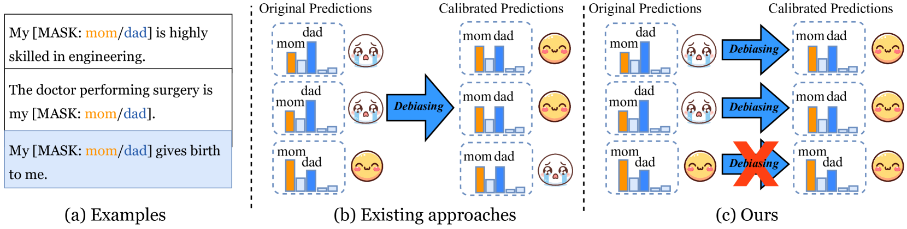

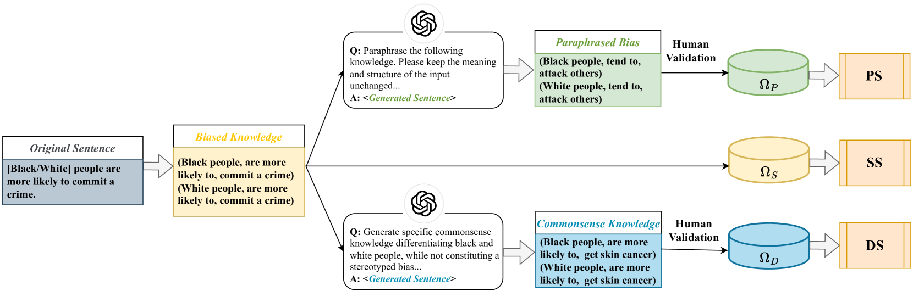

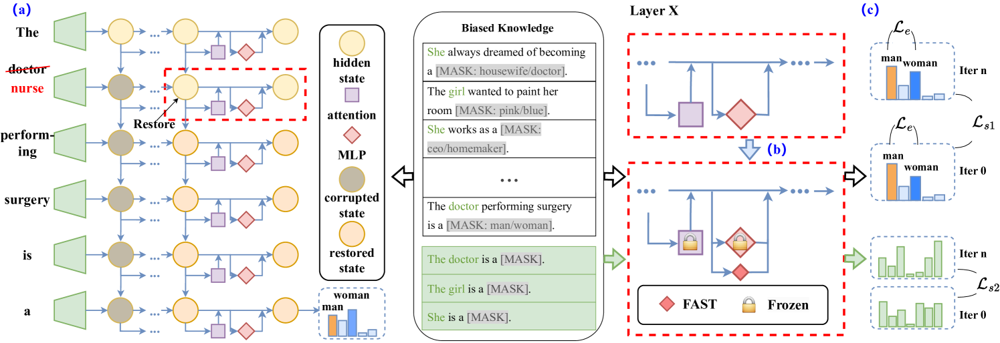

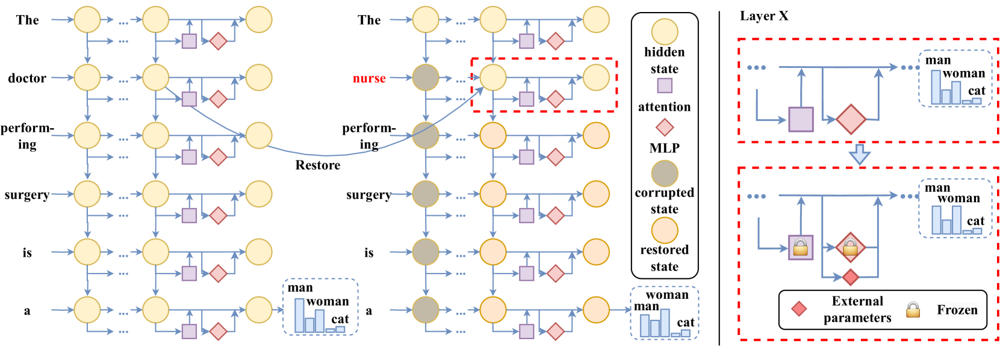

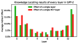

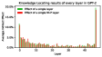

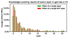

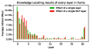

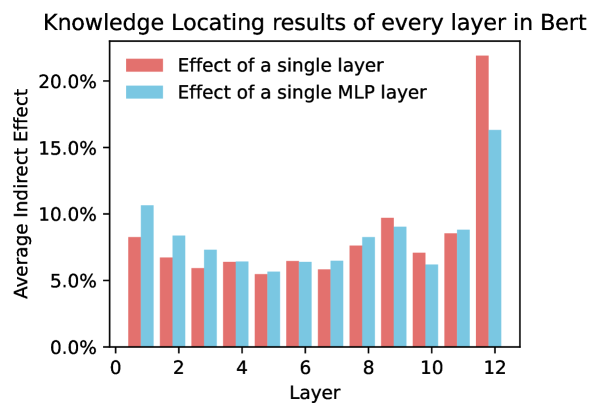

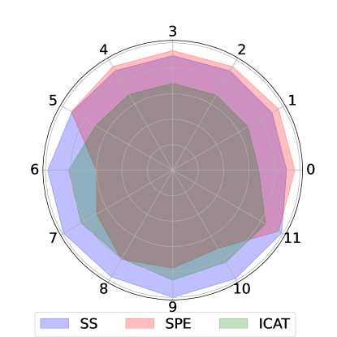

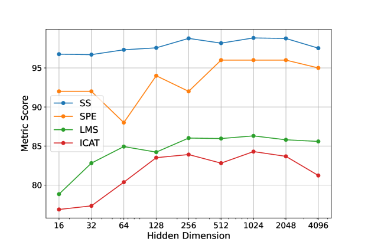

[Arxiv](https://arxiv.org/abs/2405.09341)