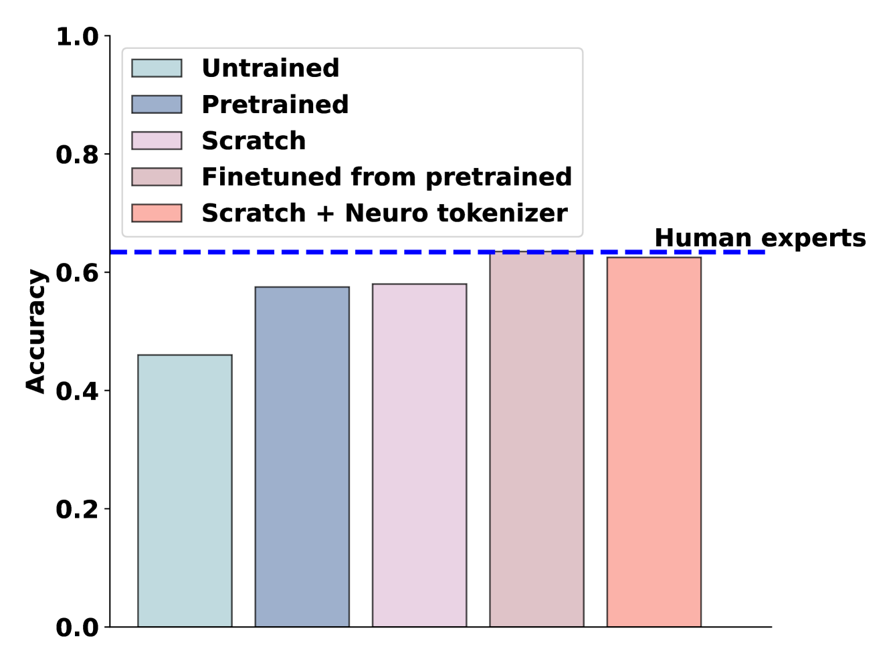
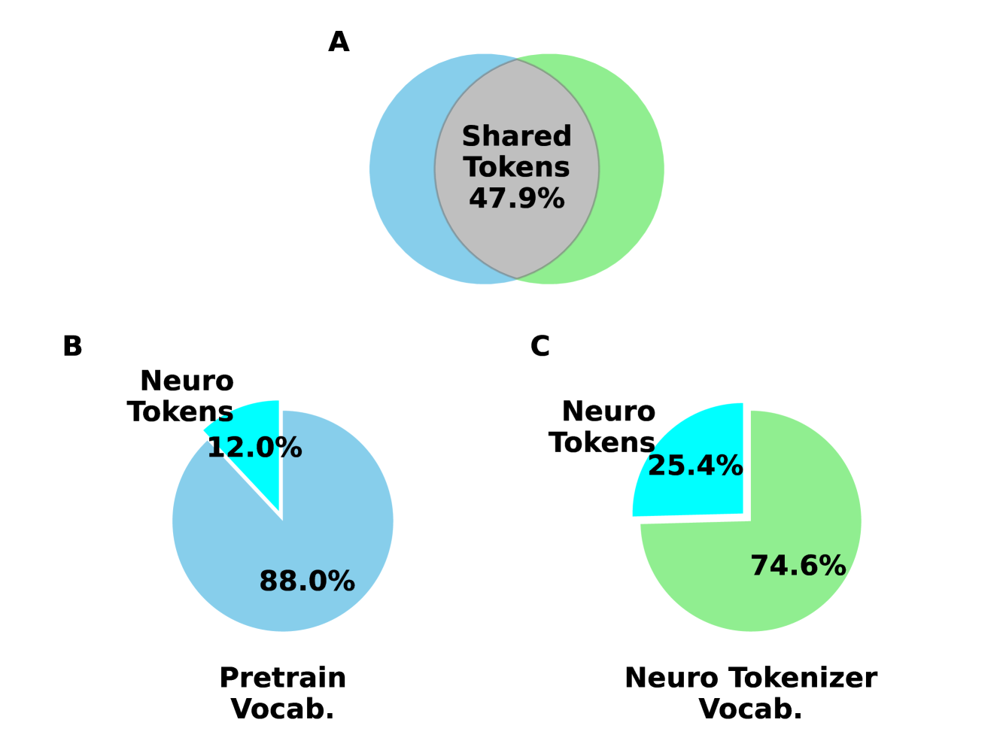
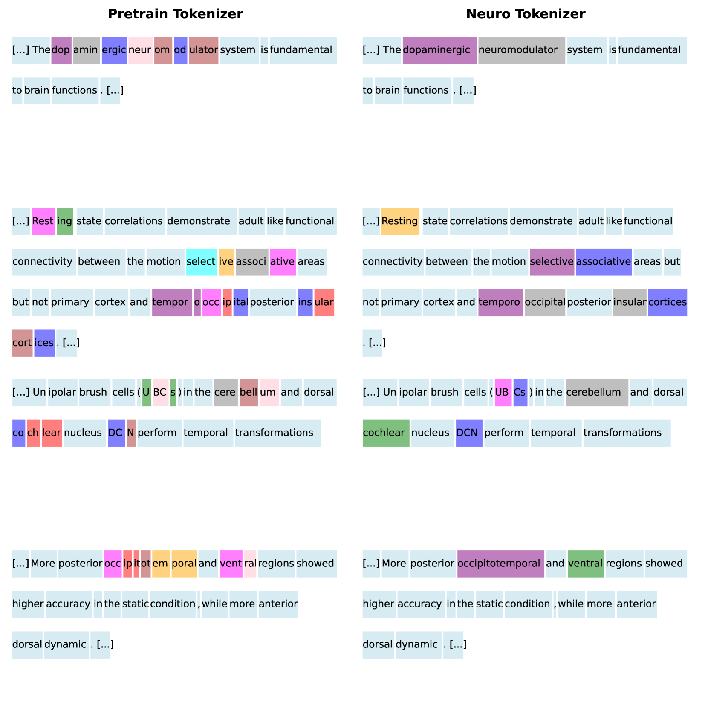

# 借助领域知识从头训练，以匹配领域专家的深度理解。

发布时间：2024年05月15日

`LLM理论

这篇论文探讨了大型语言模型（LLMs）在神经科学领域的预测能力，特别是小型模型如何通过特定领域的自回归训练达到专家级的预测能力。这涉及到LLMs的理论层面，即它们如何通过训练捕捉特定领域的统计模式，并利用这些模式进行预测。因此，这篇论文更偏向于LLM的理论研究，而不是Agent、RAG或LLM应用的范畴。` `神经科学` `预测模型`

> Matching domain experts by training from scratch on domain knowledge

# 摘要

> 大型语言模型（LLMs）近期在预测神经科学实验结果上超越了人类专家，其背后的秘密可能是特定科学文献中的统计模式，而非广泛的训练带来的推理能力。我们训练了一个仅有124M参数的GPT-2模型，它虽小，却能在神经科学领域大放异彩。无论是从头开始训练还是对预训练模型进行微调，这些小型模型都能精准预测神经科学结果。这表明，通过特定领域的自回归训练，即使是小型LLMs也能达到专家级的预测能力。

> Recently, large language models (LLMs) have outperformed human experts in predicting the results of neuroscience experiments (Luo et al., 2024). What is the basis for this performance? One possibility is that statistical patterns in that specific scientific literature, as opposed to emergent reasoning abilities arising from broader training, underlie LLMs' performance. To evaluate this possibility, we trained (next word prediction) a relatively small 124M-parameter GPT-2 model on 1.3 billion tokens of domain-specific knowledge. Despite being orders of magnitude smaller than larger LLMs trained on trillions of tokens, small models achieved expert-level performance in predicting neuroscience results. Small models trained on the neuroscience literature succeeded when they were trained from scratch using a tokenizer specifically trained on neuroscience text or when the neuroscience literature was used to finetune a pretrained GPT-2. Our results indicate that expert-level performance may be attained by even small LLMs through domain-specific, auto-regressive training approaches.

[Arxiv](https://arxiv.org/abs/2405.09395)