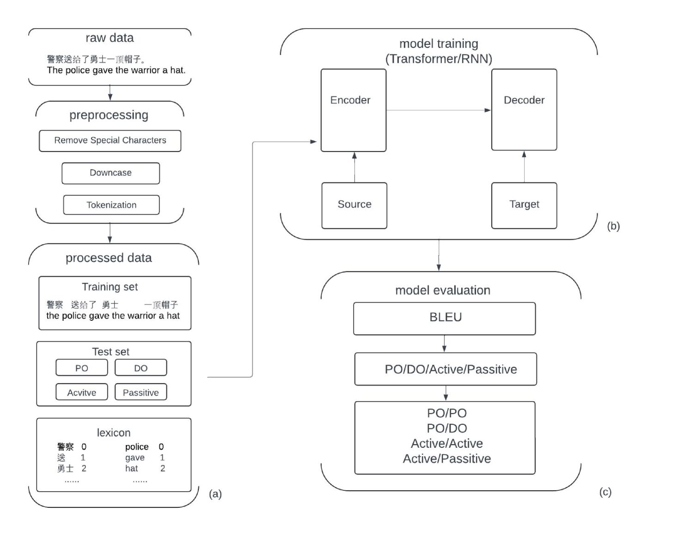
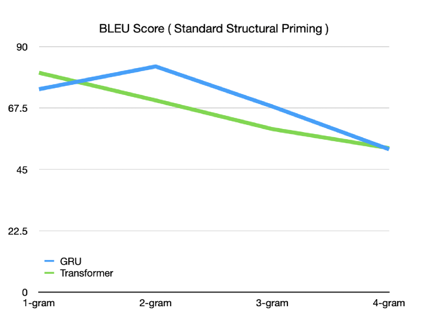
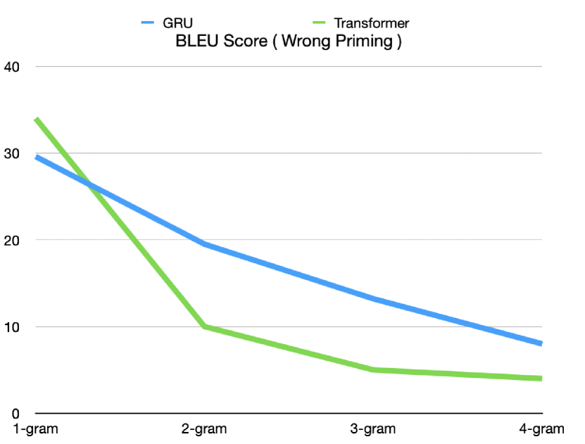
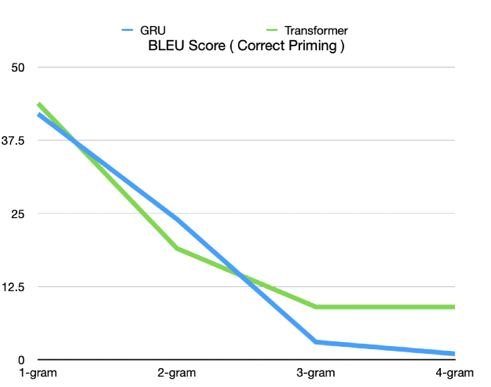
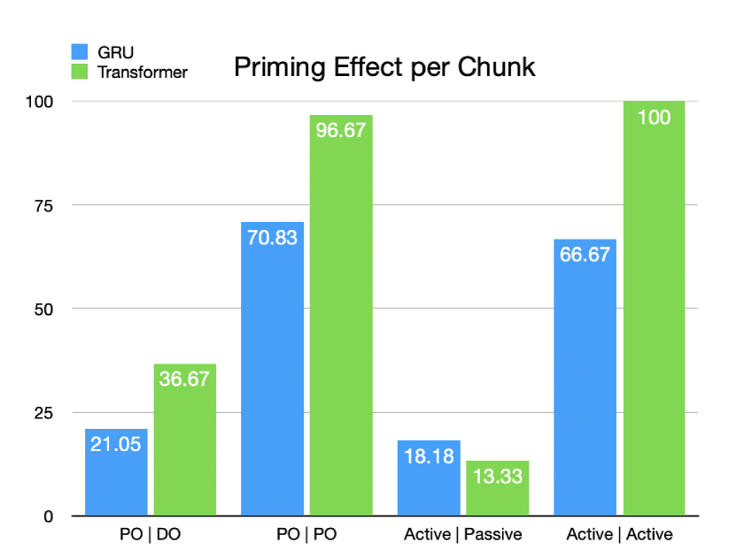
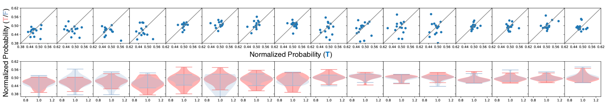

# 双语句式处理模型：探究RNN与Transformer架构在跨语言结构启发下的效能评估

发布时间：2024年05月15日

`LLM理论

这篇论文探讨了RNN和Transformer在模拟中文与英语间的结构启动效应上的表现，并借助大型语言模型（LLM）来量化跨语言的结构启动效应。研究结果对理解计算模型如何在多语言环境中模拟人类认知过程有重要意义。虽然研究中使用了大型语言模型，但重点在于理论层面的探讨和模型性能的比较，因此归类为LLM理论。` `认知科学`

> Modeling Bilingual Sentence Processing: Evaluating RNN and Transformer Architectures for Cross-Language Structural Priming

# 摘要

> 本研究深入探讨了RNN与Transformer在模拟中文与英语间的结构启动效应上的表现，这一效应是揭示人类语言处理中抽象语法结构的关键。我们特别关注了中文与英语这两种截然不同的语言体系，探究了这些模型如何应对结构启动这一现象，即一旦接触某种句子结构，人们更倾向于后续使用相似结构。同时，我们借助大型语言模型（LLM）来量化跨语言的结构启动效应。研究结果显示，Transformer在生成受启动影响的句子结构方面超越了RNN，这挑战了以往认为人类句子处理主要依赖循环即时处理的观念，并提示了基于线索的检索机制可能的作用。总体来说，这项研究增进了我们对计算模型如何在多语言环境中模拟人类认知过程的理解。

> This study evaluates the performance of Recurrent Neural Network (RNN) and Transformer in replicating cross-language structural priming: a key indicator of abstract grammatical representations in human language processing. Focusing on Chinese-English priming, which involves two typologically distinct languages, we examine how these models handle the robust phenomenon of structural priming, where exposure to a particular sentence structure increases the likelihood of selecting a similar structure subsequently. Additionally, we utilize large language models (LLM) to measure the cross-lingual structural priming effect. Our findings indicate that Transformer outperform RNN in generating primed sentence structures, challenging the conventional belief that human sentence processing primarily involves recurrent and immediate processing and suggesting a role for cue-based retrieval mechanisms. Overall, this work contributes to our understanding of how computational models may reflect human cognitive processes in multilingual contexts.

[Arxiv](https://arxiv.org/abs/2405.09508)