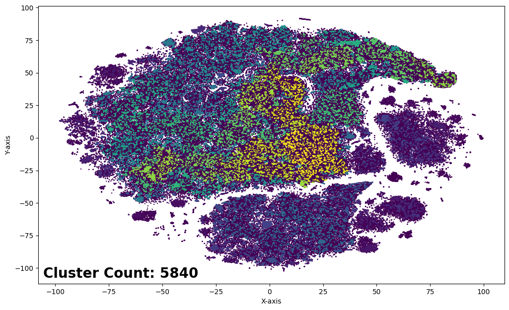

# NIFTY财经新闻头条数据集解释：在

发布时间：2024年05月15日

`LLM应用

这篇论文介绍了NIFTY金融新闻标题数据集，旨在推动大型语言模型（LLMs）在金融市场预测领域的研究。它专注于数据集的设计和应用，以及如何通过监督微调和强化学习对齐方法来优化LLMs。这些内容与LLM的实际应用紧密相关，因此归类为LLM应用。`

> NIFTY Financial News Headlines Dataset

# 摘要

> 我们推出了NIFTY金融新闻标题数据集，旨在推动LLMs在金融市场预测领域的研究。该数据集分为两个版本，分别适用于不同的建模策略：NIFTY-LM专为LLMs的监督微调设计，采用自回归因果语言建模；NIFTY-RL则针对对齐方法，如RLHF，通过拒绝采样和奖励建模来优化LLMs。每个版本都提供了精心筛选的高质量数据，包括详尽的元数据、市场指数和去重的新闻标题，以适应现代LLM框架。我们还展示了数据集在股票价格预测等任务中的应用，并探讨了LLM嵌入在信息获取方面的潜力。NIFTY数据集及相关工具已上线Hugging Face，网址为https://huggingface.co/datasets/raeidsaqur/NIFTY。

> We introduce and make publicly available the NIFTY Financial News Headlines dataset, designed to facilitate and advance research in financial market forecasting using large language models (LLMs). This dataset comprises two distinct versions tailored for different modeling approaches: (i) NIFTY-LM, which targets supervised fine-tuning (SFT) of LLMs with an auto-regressive, causal language-modeling objective, and (ii) NIFTY-RL, formatted specifically for alignment methods (like reinforcement learning from human feedback (RLHF)) to align LLMs via rejection sampling and reward modeling. Each dataset version provides curated, high-quality data incorporating comprehensive metadata, market indices, and deduplicated financial news headlines systematically filtered and ranked to suit modern LLM frameworks. We also include experiments demonstrating some applications of the dataset in tasks like stock price movement and the role of LLM embeddings in information acquisition/richness. The NIFTY dataset along with utilities (like truncating prompt's context length systematically) are available on Hugging Face at https://huggingface.co/datasets/raeidsaqur/NIFTY.

[Arxiv](https://arxiv.org/abs/2405.09747)