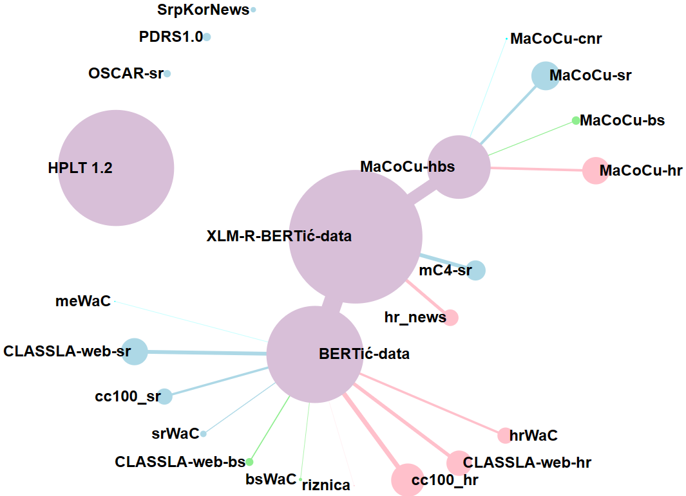
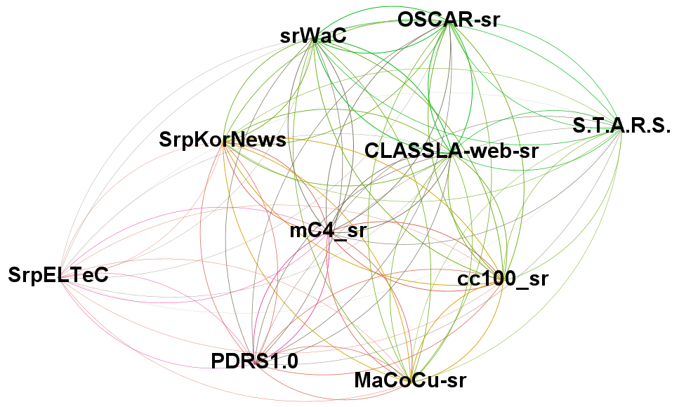

# 塞尔维亚语语言建模迎来新文本语料库在塞尔维亚语的语言建模领域，一项新的进展正悄然兴起——一套全新的文本语料库被引入，旨在提升语言模型的性能与准确性。这套语料库的诞生，如同春日里绽放的新芽，为塞尔维亚语的研究与应用带来了勃勃生机。它不仅丰富了语言资源的宝库，更为语言学家和AI开发者提供了一片沃土，让他们在这片新天地中，探索语言的奥秘，挖掘智能的潜能。随着这套语料库的广泛应用，我们期待塞尔维亚语的语言模型能够更加精准地捕捉语言的细微差别，更加流畅地与人类交流，开启智能语言处理的新篇章。

发布时间：2024年05月15日

`LLM理论

理由：这篇论文主要关注的是为塞尔维亚语（及塞尔维亚-克罗地亚语）大型语言模型训练提供文本语料库，并对这些语料库进行分类和特性描述。此外，还介绍了新创建的语料库，并通过频率分析的文体学方法来评估它们的独特性。这些内容更偏向于大型语言模型（LLM）的理论基础和数据准备，而不是具体的应用、代理（Agent）行为或检索增强生成（RAG）技术。因此，将其归类为LLM理论更为合适。` `语言模型` `语料库构建`

> New Textual Corpora for Serbian Language Modeling

# 摘要

> 本文将展示用于塞尔维亚语（及塞尔维亚-克罗地亚语）大型语言模型训练的文本语料库，这些语料库已在知名在线存储库中公开。每个语料库都将通过多维度分类，并详述其特性。同时，本文还将推出三个新语料库：一个全新的塞尔维亚-克罗地亚语网络综合语料库，一个基于塞尔维亚各大学博士论文的高质量语料库，以及一个摘要翻译的平行语料库。我们将通过频率分析的文体学方法来评估这些语料库的独特性，并对分析结果进行简要探讨。

> This paper will present textual corpora for Serbian (and Serbo-Croatian), usable for the training of large language models and publicly available at one of the several notable online repositories. Each corpus will be classified using multiple methods and its characteristics will be detailed. Additionally, the paper will introduce three new corpora: a new umbrella web corpus of Serbo-Croatian, a new high-quality corpus based on the doctoral dissertations stored within National Repository of Doctoral Dissertations from all Universities in Serbia, and a parallel corpus of abstract translation from the same source. The uniqueness of both old and new corpora will be accessed via frequency-based stylometric methods, and the results will be briefly discussed.

[Arxiv](https://arxiv.org/abs/2405.09250)