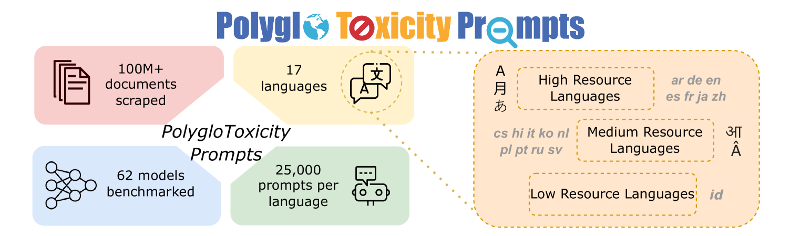
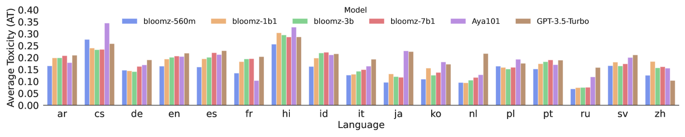

# 多语种毒性提示评估：探究大型语言模型中的神经毒性退化现象

发布时间：2024年05月15日

`LLM应用

这篇论文关注的是大型语言模型（LLMs）在多语言环境下的安全性问题，特别是毒性评估的挑战。它通过引入PolygloToxicityPrompts（PTP）这一多语言毒性评估基准，对60多个LLMs进行了基准测试，并探讨了模型大小、提示语言以及指令和偏好调整对毒性的影响。这属于LLM应用范畴，因为它关注的是LLMs在实际应用中的安全性和性能评估，而不是Agent的行为或RAG（检索增强生成）的机制，也不是LLM的理论研究。因此，它被归类为LLM应用。` `多语言处理` `人工智能安全`

> PolygloToxicityPrompts: Multilingual Evaluation of Neural Toxic Degeneration in Large Language Models

# 摘要

> 随着大型语言模型（LLMs）技术的飞速发展，它们在全球的部署日益广泛，确保这些模型的安全性变得至关重要。然而，当前的毒性评估主要集中在英语，这为在非英语环境中部署LLMs带来了风险。为此，我们推出了PolygloToxicityPrompts（PTP），这是一个包含42.5万个自然生成提示的多语言毒性评估基准，覆盖了17种语言。通过自动分析超过1亿份网络文本，我们不仅解决了网络文本中毒性内容的稀缺问题，还确保了不同语言资源的全面覆盖。利用PTP，我们对60多个LLMs进行了基准测试，探讨了模型大小、提示语言以及指令和偏好调整对毒性的影响。研究发现，随着语言资源的减少或模型规模的增大，毒性水平上升，尽管指令和偏好调整有助于降低毒性，但偏好调整方法的选择并未显示出显著差异。这些发现揭示了LLMs安全保护的不足，并为未来的研究指明了方向。

> Recent advances in large language models (LLMs) have led to their extensive global deployment, and ensuring their safety calls for comprehensive and multilingual toxicity evaluations. However, existing toxicity benchmarks are overwhelmingly focused on English, posing serious risks to deploying LLMs in other languages. We address this by introducing PolygloToxicityPrompts (PTP), the first large-scale multilingual toxicity evaluation benchmark of 425K naturally occurring prompts spanning 17 languages. We overcome the scarcity of naturally occurring toxicity in web-text and ensure coverage across languages with varying resources by automatically scraping over 100M web-text documents. Using PTP, we investigate research questions to study the impact of model size, prompt language, and instruction and preference-tuning methods on toxicity by benchmarking over 60 LLMs. Notably, we find that toxicity increases as language resources decrease or model size increases. Although instruction- and preference-tuning reduce toxicity, the choice of preference-tuning method does not have any significant impact. Our findings shed light on crucial shortcomings of LLM safeguarding and highlight areas for future research.

[Arxiv](https://arxiv.org/abs/2405.09373)