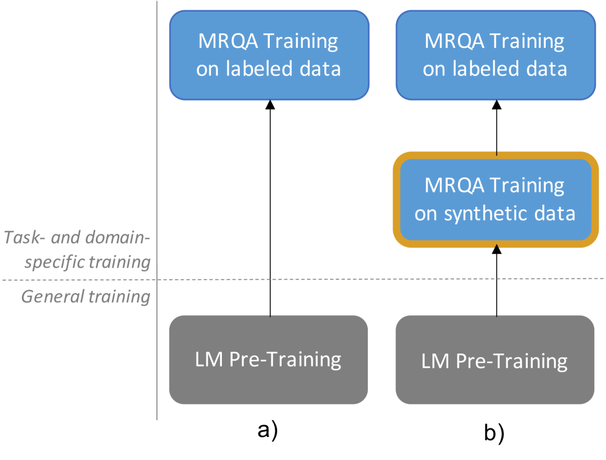
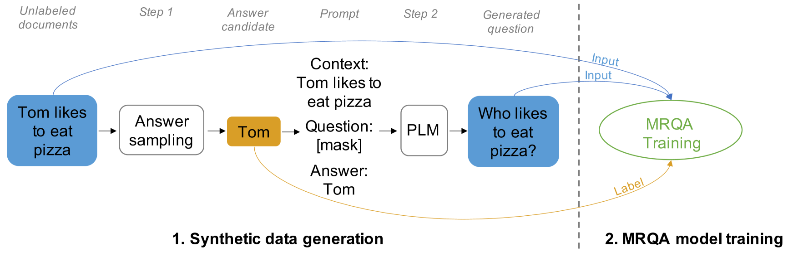
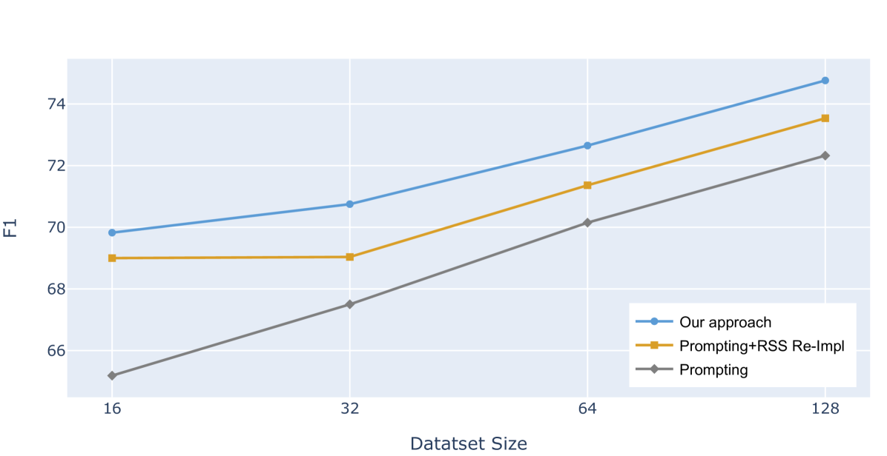
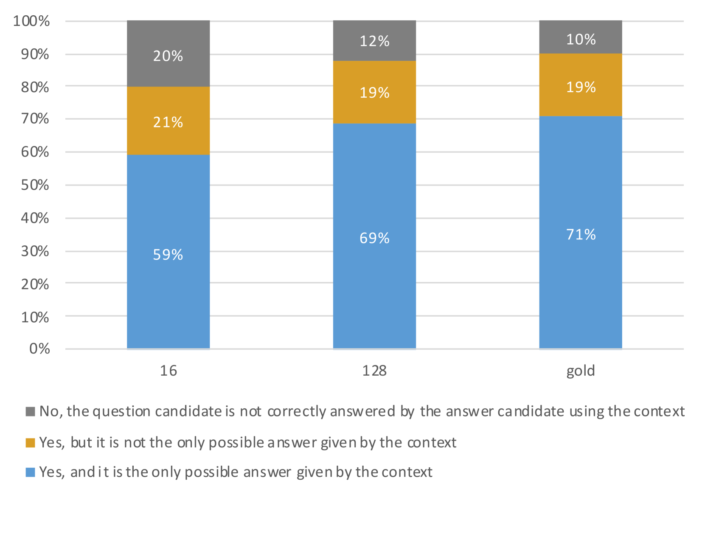

# 利用提示技术生成合成数据，以支持少样本问答任务的训练与应用。

发布时间：2024年05月15日

`LLM应用

这篇论文探讨了大型语言模型（LLM）在问答任务中的应用，特别是在数据标注成本高昂的情况下，如何利用语言模型的领域无关知识来提升问答性能。论文提出了一种方法，通过提示框架的数据生成，利用LLM的内在能力来改善问答系统的性能，而不依赖于大量的标注数据。这种方法超越了传统的预训练/微调模式，并在少量样本问答任务上取得了显著成果。因此，这篇论文的内容更偏向于LLM在实际应用中的效能和创新方法，属于LLM应用分类。` `问答系统`

> Prompting-based Synthetic Data Generation for Few-Shot Question Answering

# 摘要

> 语言模型虽提升了问答性能，却仍依赖大量数据，而数据标注过程耗时费力。特别是在问答领域，需对庞杂文档进行细致标注。此外，问答模型往往局限于特定领域。鉴于标注成本高昂，我们认为语言模型的领域无关知识，如语言理解，足以构建优质数据集。以此为动力，我们发现大型语言模型在少量样本条件下，能显著提升问答性能，超越现有技术。通过提示框架的数据生成，我们揭示了语言模型蕴含的任务无关知识，其应用超越了传统的预训练/微调模式。最终，我们在少量样本问答任务上取得了领先成果。

> Although language models (LMs) have boosted the performance of Question Answering, they still need plenty of data. Data annotation, in contrast, is a time-consuming process. This especially applies to Question Answering, where possibly large documents have to be parsed and annotated with questions and their corresponding answers. Furthermore, Question Answering models often only work well for the domain they were trained on. Since annotation is costly, we argue that domain-agnostic knowledge from LMs, such as linguistic understanding, is sufficient to create a well-curated dataset. With this motivation, we show that using large language models can improve Question Answering performance on various datasets in the few-shot setting compared to state-of-the-art approaches. For this, we perform data generation leveraging the Prompting framework, suggesting that language models contain valuable task-agnostic knowledge that can be used beyond the common pre-training/fine-tuning scheme. As a result, we consistently outperform previous approaches on few-shot Question Answering.

[Arxiv](https://arxiv.org/abs/2405.09335)