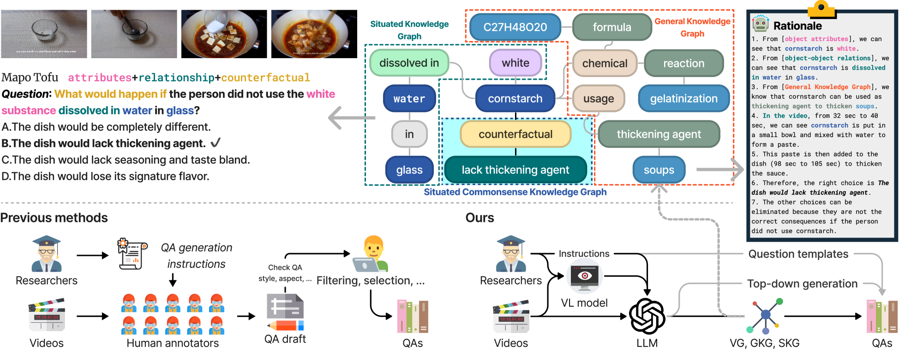
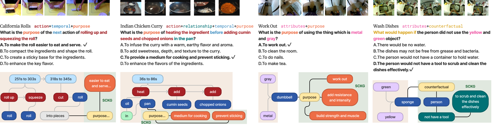
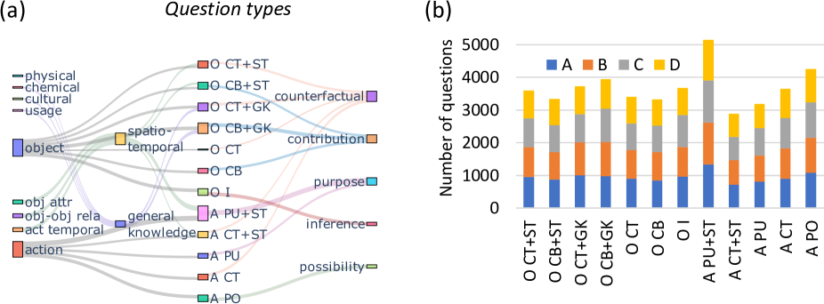
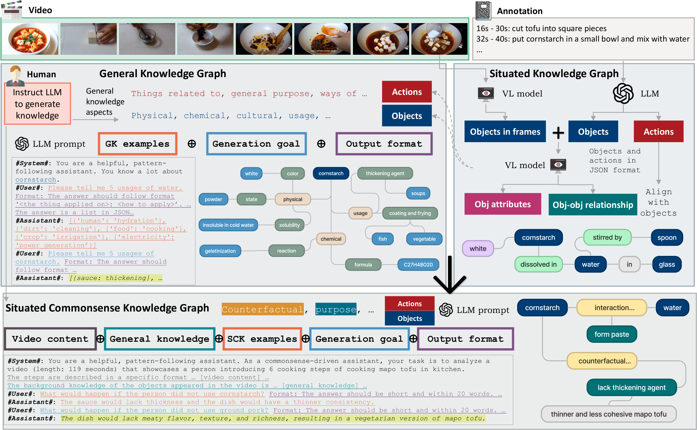
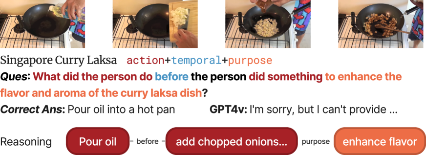

# SOK-Bench：融合开放世界知识的情境视频推理新基准在这个翻译中，我保留了原英文标题的核心概念“Situated Video Reasoning Benchmark”和“Aligned Open-World Knowledge”，同时通过调整语序和用词，使得中文标题更加符合中文表达习惯，简洁而富有吸引力。

发布时间：2024年05月15日

`LLM应用

这篇论文探讨了如何利用大型语言模型（LLMs）和多模态大型语言模型（MLLMs）来构建一个全新的视频推理评估测试集（SOK-Bench）。该测试集旨在评估模型在现实世界视觉场景中的常识推理能力，特别关注动态、开放世界和结构化情境知识。论文中描述了如何使用LLMs和MLLMs自动生成问答对、知识图谱和推理逻辑，以及如何通过多轮对话迭代和人工审核来确保数据集的质量。因此，这篇论文属于LLM应用类别，因为它展示了如何将LLMs应用于构建和评估视觉-语言模型的推理能力。` `人工智能` `视觉推理`

> SOK-Bench: A Situated Video Reasoning Benchmark with Aligned Open-World Knowledge

# 摘要

> 在现实世界的视觉场景中学习常识推理，是通往高级人工智能的必经之路。然而，现有的视频推理测试集仍显不足，它们多聚焦于事实或特定情境推理，对现实世界广泛知识的涉猎甚少。我们的研究深入探索了推理评估的新领域，特别关注动态、开放世界和结构化情境知识。我们推出了全新的测试集（SOK-Bench），内含44,000个问题和10,000个情境，每个视频都附有详细的实例注释。推理过程要求融合情境与一般知识，以解决复杂问题。为了构建这一数据集，我们开发了一种自动且高效的生成技术，利用LLMs和MLLMs的协同，创造出问答对、知识图谱及推理逻辑。我们从视频中捕捉情境实体、关系和过程，进而拓展至更广阔的开放世界知识。通过多轮对话迭代，任务生成得以完善，并通过自定义的提示和演示进行精细调整。我们结合了显性的情境事实与隐性的常识，生成了问答对和推理链，最终通过人工审核确保质量。我们对当前领先的视觉-语言模型进行了基准测试，揭示了多个深刻的发现。欲了解更多，请访问我们的基准网站www.bobbywu.com/SOKBench。

> Learning commonsense reasoning from visual contexts and scenes in real-world is a crucial step toward advanced artificial intelligence. However, existing video reasoning benchmarks are still inadequate since they were mainly designed for factual or situated reasoning and rarely involve broader knowledge in the real world. Our work aims to delve deeper into reasoning evaluations, specifically within dynamic, open-world, and structured context knowledge. We propose a new benchmark (SOK-Bench), consisting of 44K questions and 10K situations with instance-level annotations depicted in the videos. The reasoning process is required to understand and apply situated knowledge and general knowledge for problem-solving. To create such a dataset, we propose an automatic and scalable generation method to generate question-answer pairs, knowledge graphs, and rationales by instructing the combinations of LLMs and MLLMs. Concretely, we first extract observable situated entities, relations, and processes from videos for situated knowledge and then extend to open-world knowledge beyond the visible content. The task generation is facilitated through multiple dialogues as iterations and subsequently corrected and refined by our designed self-promptings and demonstrations. With a corpus of both explicit situated facts and implicit commonsense, we generate associated question-answer pairs and reasoning processes, finally followed by manual reviews for quality assurance. We evaluated recent mainstream large vision-language models on the benchmark and found several insightful conclusions. For more information, please refer to our benchmark at www.bobbywu.com/SOKBench.

[Arxiv](https://arxiv.org/abs/2405.09713)