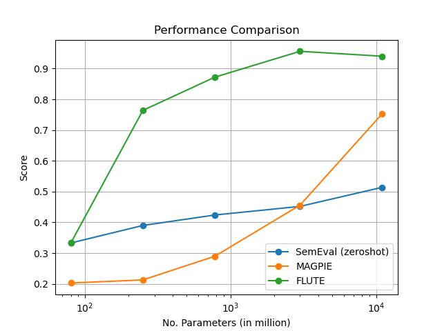

# 时代印记：探究大型语言模型在习语识别领域的应用价值

发布时间：2024年05月15日

`LLM理论

这篇论文关注的是大型语言模型（LLM）在处理成语性语言任务上的性能，并将其与专门为这些任务微调的编码器模型进行比较。研究分析了LLM在特定数据集上的表现，并探讨了模型规模对性能的影响，以及通过提示方法提升性能的可能性。这些内容主要涉及LLM的理论性能分析和应用策略，因此属于LLM理论分类。` `语言模型评估`

> Sign of the Times: Evaluating the use of Large Language Models for Idiomaticity Detection

# 摘要

> 大型语言模型在零-shot提示性能上表现卓越，但在处理成语性语言的任务上，它们的表现仍是个谜。我们特别关注了这些模型与专为成语性任务微调的编码器模型相比的表现。通过分析一系列LLM在三个成语性数据集上的表现，我们发现，尽管它们提供了竞争性的性能，但仍不及微调后的任务特定模型，即便是在如GPT-4这样的大规模模型上。然而，我们确实观察到了随着模型规模的增加，性能有所提升。我们还探索了通过提示方法来提升性能，并讨论了在这些任务中应用LLM的实际考量。

> Despite the recent ubiquity of large language models and their high zero-shot prompted performance across a wide range of tasks, it is still not known how well they perform on tasks which require processing of potentially idiomatic language. In particular, how well do such models perform in comparison to encoder-only models fine-tuned specifically for idiomaticity tasks? In this work, we attempt to answer this question by looking at the performance of a range of LLMs (both local and software-as-a-service models) on three idiomaticity datasets: SemEval 2022 Task 2a, FLUTE, and MAGPIE. Overall, we find that whilst these models do give competitive performance, they do not match the results of fine-tuned task-specific models, even at the largest scales (e.g. for GPT-4). Nevertheless, we do see consistent performance improvements across model scale. Additionally, we investigate prompting approaches to improve performance, and discuss the practicalities of using LLMs for these tasks.

[Arxiv](https://arxiv.org/abs/2405.09279)