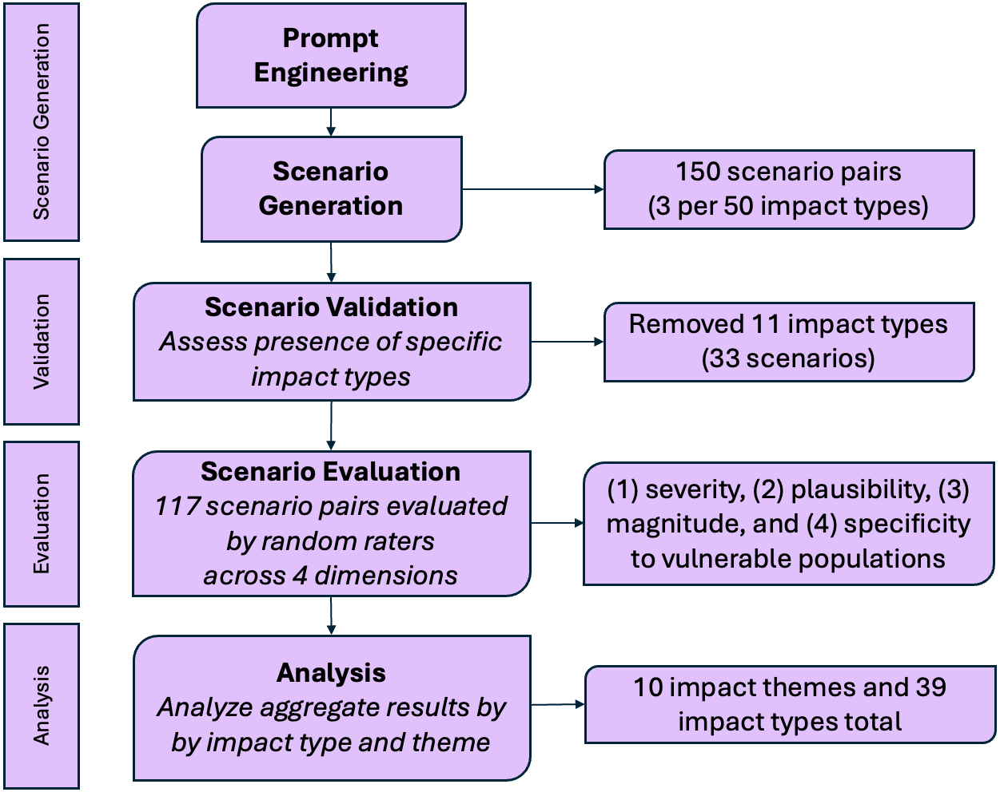
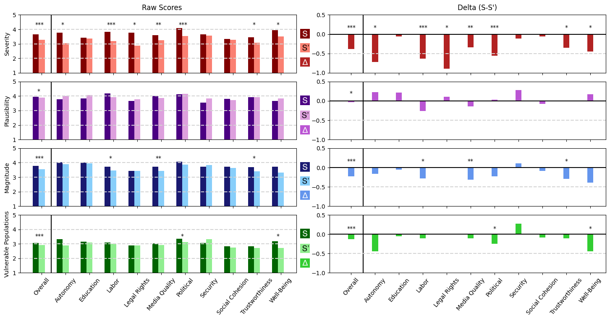
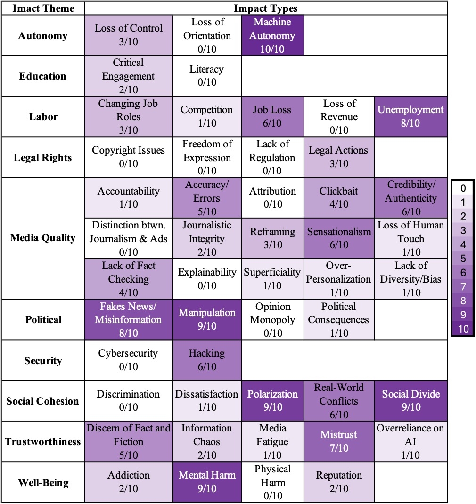

# 政策影响模拟：创新生成式情景写作，洞察法规效应。本研究旨在通过构建情景，深入评估法规对公众感知的实际影响。

发布时间：2024年05月15日

`LLM应用

理由：这篇论文探讨了如何使用大型语言模型（LLMs），特别是GPT-4，来评估政策在减轻AI技术带来的负面影响上的效力。它通过构建情景和进行用户研究来量化政策的影响，并评估了欧盟AI法案第50条透明度立法的效果。这种方法的应用性质表明它属于LLM应用类别，因为它展示了LLMs在实际政策评估中的应用，而不是专注于LLM的理论研究或Agent的设计与应用。` `政策评估` `人工智能影响

根据论文摘要内容` `该研究主要关注的是使用大型语言模型（LLMs）如GPT-4来评估政策在减轻人工智能技术带来的负面影响方面的效力` `涉及政策制定和人工智能对社会的影响评估。因此` `最相关的行业领域标签是“政策评估”和“人工智能影响”。`

> Simulating Policy Impacts: Developing a Generative Scenario Writing Method to Evaluate the Perceived Effects of Regulation

# 摘要

> AI技术的飞速发展带来了对个人和社会未来的深远影响。政策制定者面临挑战，需迅速制定策略以减轻这些影响。然而，预测政策成效困难重重，因为许多影响需待未来揭晓，且现有政策未必适应AI的持续演进。本研究创新性地运用大型语言模型（LLMs），特别是GPT-4，来评估政策在减轻特定负面影响上的效力。我们通过构建政策实施前后的生动情景，并将其转化为反映人类感知影响的量化指标。借助媒体环境中生成式AI影响的分类体系，我们创造了一系列受欧盟AI法案第50条透明度立法影响的情景。随后，我们开展了一项涉及234名参与者的用户研究，从严重性、可信度、规模和弱势群体特定性四个维度评估这些情景。研究发现，该立法在劳动和福祉领域减轻伤害方面颇具成效，但在社会凝聚力和安全领域则成效甚微。通过这一生成式AI伤害的案例研究，我们证明了我们的方法在迭代评估政策减轻多方面负面影响上的有效性。我们相信，这种方法将为希望探索不同政策或缓解策略潜在价值的研究人员和利益相关者提供有力支持。

> The rapid advancement of AI technologies yields numerous future impacts on individuals and society. Policy-makers are therefore tasked to react quickly and establish policies that mitigate those impacts. However, anticipating the effectiveness of policies is a difficult task, as some impacts might only be observable in the future and respective policies might not be applicable to the future development of AI. In this work we develop a method for using large language models (LLMs) to evaluate the efficacy of a given piece of policy at mitigating specified negative impacts. We do so by using GPT-4 to generate scenarios both pre- and post-introduction of policy and translating these vivid stories into metrics based on human perceptions of impacts. We leverage an already established taxonomy of impacts of generative AI in the media environment to generate a set of scenario pairs both mitigated and non-mitigated by the transparency legislation of Article 50 of the EU AI Act. We then run a user study (n=234) to evaluate these scenarios across four risk-assessment dimensions: severity, plausibility, magnitude, and specificity to vulnerable populations. We find that this transparency legislation is perceived to be effective at mitigating harms in areas such as labor and well-being, but largely ineffective in areas such as social cohesion and security. Through this case study on generative AI harms we demonstrate the efficacy of our method as a tool to iterate on the effectiveness of policy on mitigating various negative impacts. We expect this method to be useful to researchers or other stakeholders who want to brainstorm the potential utility of different pieces of policy or other mitigation strategies.

[Arxiv](https://arxiv.org/abs/2405.09679)