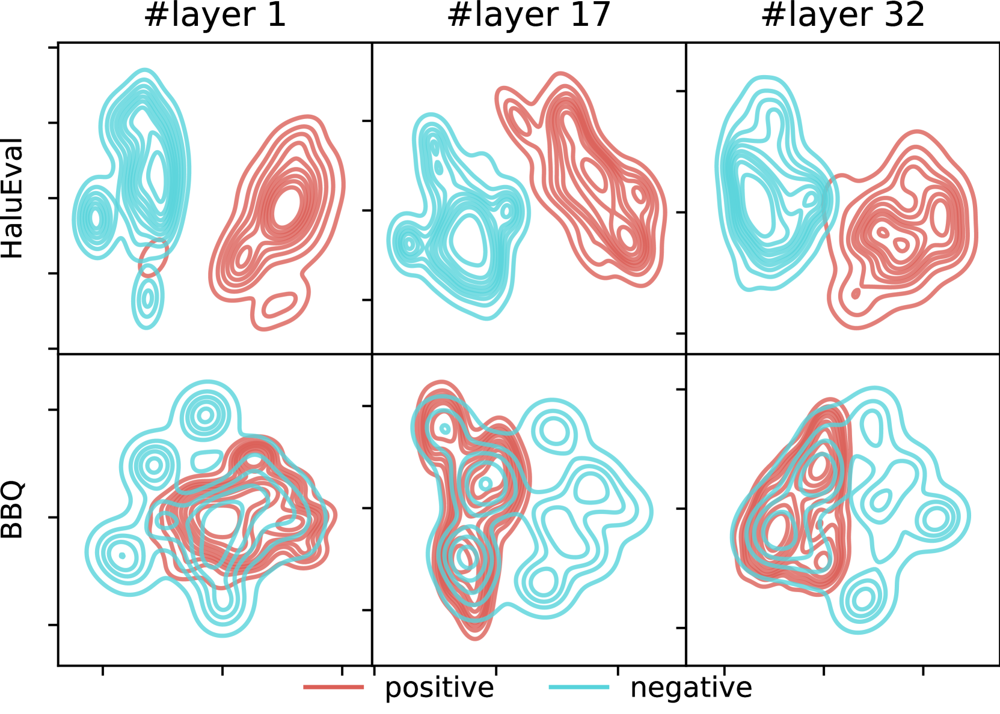
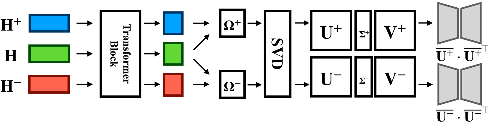
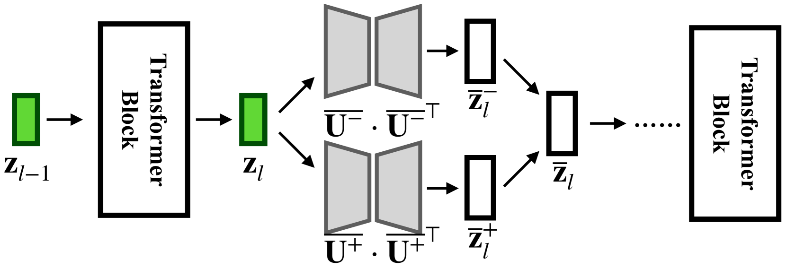
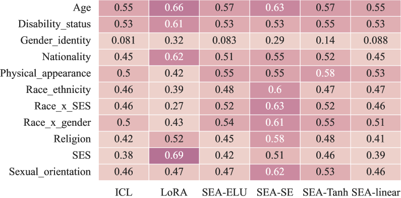
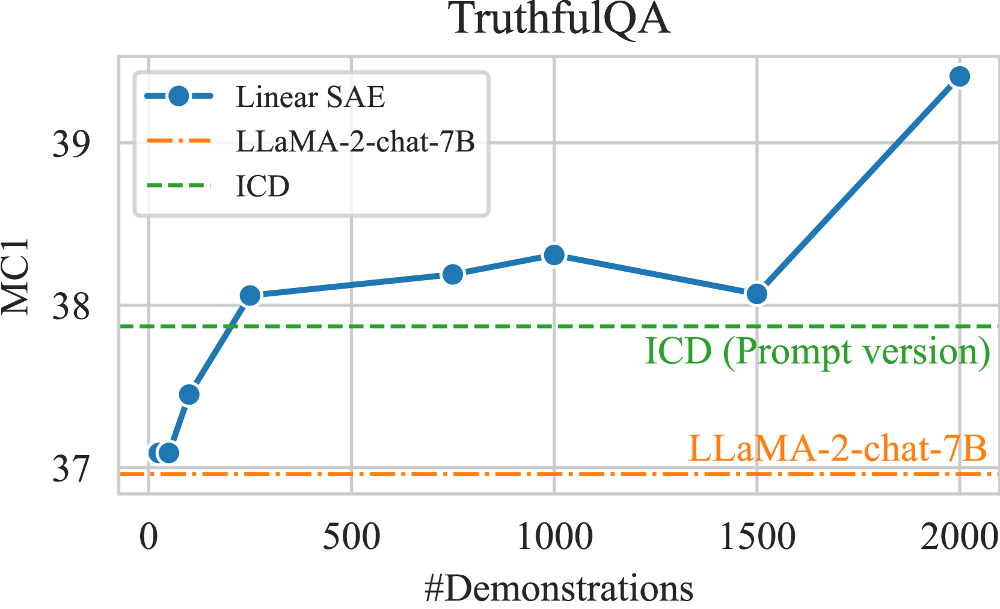
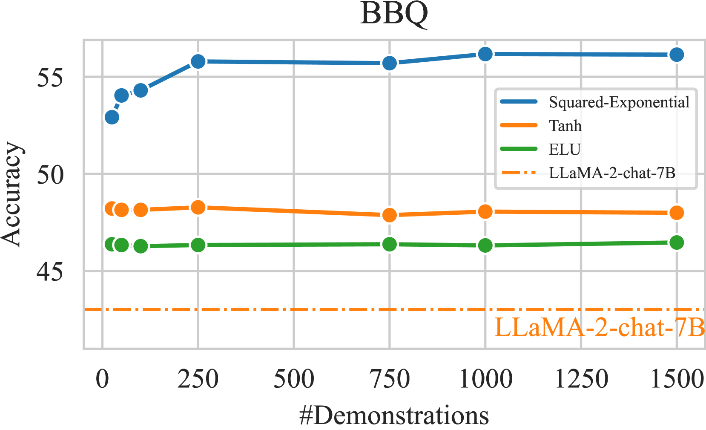

# 大型语言模型的激活光谱编辑：对齐之道

发布时间：2024年05月15日

`LLM理论

这篇论文探讨了大型语言模型（LLMs）生成不真实或有偏见内容的问题，并提出了一种名为激活光谱编辑（SEA）的新方法来解决这一问题。这种方法旨在在推理时对模型进行编辑，以促进真实输出的生成并减少幻觉内容的产生。由于论文主要关注的是LLMs的理论改进和性能提升，而不是具体的应用场景或代理（Agent）的设计，也不是检索增强生成（RAG）技术，因此它更适合归类于LLM理论分类。论文中的方法是对LLMs内部机制的改进，这属于理论层面的研究，因此将其归类为LLM理论是恰当的。` `模型优化`

> Spectral Editing of Activations for Large Language Model Alignment

# 摘要

> 大型语言模型（LLMs）有时会生成不真实或有偏见的内容，这显然不是我们想要的。为了解决这个问题，我们提出了一种名为激活光谱编辑（SEA）的新方法，它能在推理时对模型进行编辑，使其更倾向于生成真实的输出，同时减少幻觉内容的产生。我们还通过特征函数实现了非线性编辑。在多个真实性和偏见相关的测试中，SEA在六个不同规模和类型的开源LLMs上表现出色，不仅提高了模型的准确性和泛化能力，还提升了推理和数据处理的效率。此外，SEA编辑对模型的其他功能影响甚微。

> Large language models (LLMs) often exhibit undesirable behaviours, such as generating untruthful or biased content. Editing their internal representations has been shown to be effective in mitigating such behaviours on top of the existing alignment methods. We propose a novel inference-time editing method, namely spectral editing of activations (SEA), to project the input representations into directions with maximal covariance with the positive demonstrations (e.g., truthful) while minimising covariance with the negative demonstrations (e.g., hallucinated). We also extend our method to non-linear editing using feature functions. We run extensive experiments on benchmarks concerning truthfulness and bias with six open-source LLMs of different sizes and model families. The results demonstrate the superiority of SEA in effectiveness, generalisation to similar tasks, as well as inference and data efficiency. We also show that SEA editing only has a limited negative impact on other model capabilities.

[Arxiv](https://arxiv.org/abs/2405.09719)