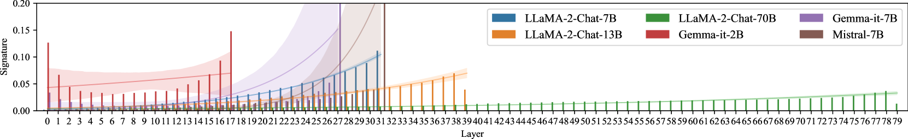

# 大型语言模型的激活光谱编辑对齐技术

发布时间：2024年05月15日

`LLM理论

这篇论文探讨了大型语言模型（LLMs）生成不真实或有偏见内容的问题，并提出了一种名为激活的频谱编辑（SEA）的推理时编辑技术来优化模型输出。这种技术旨在提高模型输出的真实性并减少幻觉内容的影响。论文通过实验验证了SEA在不同规模和类型的开源LLMs上的性能、泛化能力和效率，同时指出SEA对模型的其他功能影响有限。由于这项工作专注于LLMs的理论改进和性能优化，因此它属于LLM理论分类。` `模型优化`

> Spectral Editing of Activations for Large Language Model Alignment

# 摘要

> 大型语言模型（LLMs）有时会生成不真实或有偏见的内容，这是一个不受欢迎的行为。我们提出了一种创新的推理时编辑技术——激活的频谱编辑（SEA），它能够优化模型输出，使其更接近真实信息，同时减少幻觉内容的影响。通过使用特征函数，我们还实现了非线性编辑。在多个真实性和偏见相关的测试中，我们对六种不同规模和类型的开源LLMs进行了深入实验，SEA展现出了卓越的性能、泛化能力和效率。此外，SEA对模型的其他功能影响甚微。

> Large language models (LLMs) often exhibit undesirable behaviours, such as generating untruthful or biased content. Editing their internal representations has been shown to be effective in mitigating such behaviours on top of the existing alignment methods. We propose a novel inference-time editing method, namely spectral editing of activations (SEA), to project the input representations into directions with maximal covariance with the positive demonstrations (e.g., truthful) while minimising covariance with the negative demonstrations (e.g., hallucinated). We also extend our method to non-linear editing using feature functions. We run extensive experiments on benchmarks concerning truthfulness and bias with six open-source LLMs of different sizes and model families. The results demonstrate the superiority of SEA in effectiveness, generalisation to similar tasks, as well as inference and data efficiency. We also show that SEA editing only has a limited negative impact on other model capabilities.

[Arxiv](https://arxiv.org/abs/2405.09719)