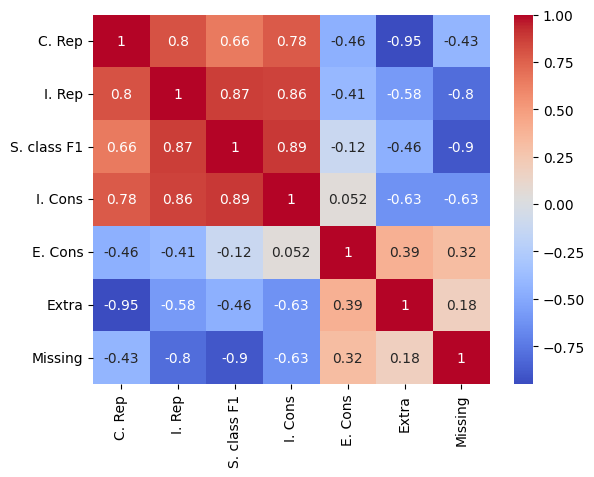

# 揭秘真相：大型语言模型助力公共卫生事实核查的可解释之旅

发布时间：2024年05月15日

`LLM应用

这篇论文探讨了大型语言模型（LLM）在验证公共卫生声明和提供真实性评估解释方面的应用。它通过实验评估了不同模型在真实性预测与解释生成任务中的表现，包括零/少样本提示和参数高效微调。虽然GPT-4在零样本场景中表现出色，但开源模型在微调后能够追赶甚至超越GPT-4。这表明LLM在特定应用场景下的潜力和局限性，属于LLM应用的范畴。` `公共卫生` `语言模型`

> Tell Me Why: Explainable Public Health Fact-Checking with Large Language Models

# 摘要

> 本文深入探讨了大型语言模型在验证公共卫生声明并提供真实性评估解释方面的能力。通过零/少样本提示和参数高效微调的实验，我们评估了开源和闭源模型在真实性预测与解释生成任务中的表现。我们采用自动与人工双重评估，发现GPT-4在零样本场景中表现卓越，而开源模型在微调后不仅能追赶，甚至有时超越GPT-4。然而，人类评估揭示了更复杂的细节，并指出了标准解释可能存在的局限性。

> This paper presents a comprehensive analysis of explainable fact-checking through a series of experiments, focusing on the ability of large language models to verify public health claims and provide explanations or justifications for their veracity assessments. We examine the effectiveness of zero/few-shot prompting and parameter-efficient fine-tuning across various open and closed-source models, examining their performance in both isolated and joint tasks of veracity prediction and explanation generation. Importantly, we employ a dual evaluation approach comprising previously established automatic metrics and a novel set of criteria through human evaluation. Our automatic evaluation indicates that, within the zero-shot scenario, GPT-4 emerges as the standout performer, but in few-shot and parameter-efficient fine-tuning contexts, open-source models demonstrate their capacity to not only bridge the performance gap but, in some instances, surpass GPT-4. Human evaluation reveals yet more nuance as well as indicating potential problems with the gold explanations.

[Arxiv](https://arxiv.org/abs/2405.09454)