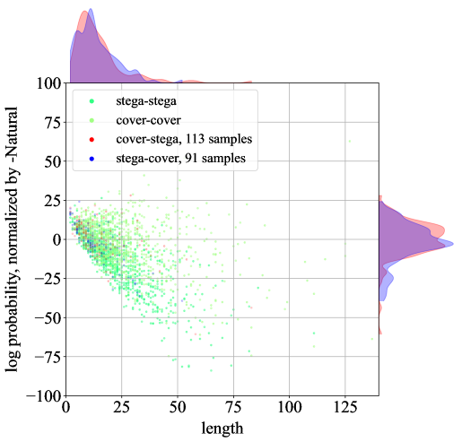

# 迈向新一代隐写分析：大型语言模型揭示检测隐写术的潜能

发布时间：2024年05月15日

`LLM应用

这篇论文探讨了利用大型语言模型（LLMs）进行语言隐写分析的新方法，旨在识别携带隐写信息的文本。它提出了不同于传统基于符号统计的方法，而是利用LLMs的人类感知能力来识别差异。实验结果表明，LLMs在语言隐写分析中表现出色，并且性能优于现有基准。因此，这篇论文属于LLM应用类别，因为它展示了LLMs在实际应用中的效能，特别是在安全领域的应用。` `信息安全` `人工智能

根据论文摘要内容` `该研究聚焦于利用大型语言模型（LLMs）进行语言隐写分析` `旨在识别携带隐写信息的文本` `以应对信息安全领域的挑战。同时` `该技术利用了人工智能的发展` `因此标签为“信息安全”和“人工智能”。`

> Towards Next-Generation Steganalysis: LLMs Unleash the Power of Detecting Steganography

# 摘要

> 随着AI生成技术的发展，语言隐写术成为隐藏信息的便捷手段，但其潜在的滥用风险也引发了社会安全担忧。因此，我们需要强大的语言隐写分析技术来识别携带隐写信息的文本。传统方法依赖于符号统计来区分隐写文本与正常文本，但这种方法在实际应用中效果不佳。本文提出了一种新思路，即利用大型语言模型（LLMs）的人类感知能力来识别差异，而不仅仅是依赖统计数据。我们通过将任务设定为生成而非分类，系统地测试了LLMs的性能。实验结果显示，LLMs在语言隐写分析中表现出色，且其性能趋势与传统方法截然不同。此外，LLMs在性能上大幅领先现有基准，其领域无关性使得开发通用隐写分析模型成为可能。所有代码和训练模型均已公开，供研究者使用。

> Linguistic steganography provides convenient implementation to hide messages, particularly with the emergence of AI generation technology. The potential abuse of this technology raises security concerns within societies, calling for powerful linguistic steganalysis to detect carrier containing steganographic messages. Existing methods are limited to finding distribution differences between steganographic texts and normal texts from the aspect of symbolic statistics. However, the distribution differences of both kinds of texts are hard to build precisely, which heavily hurts the detection ability of the existing methods in realistic scenarios. To seek a feasible way to construct practical steganalysis in real world, this paper propose to employ human-like text processing abilities of large language models (LLMs) to realize the difference from the aspect of human perception, addition to traditional statistic aspect. Specifically, we systematically investigate the performance of LLMs in this task by modeling it as a generative paradigm, instead of traditional classification paradigm. Extensive experiment results reveal that generative LLMs exhibit significant advantages in linguistic steganalysis and demonstrate performance trends distinct from traditional approaches. Results also reveal that LLMs outperform existing baselines by a wide margin, and the domain-agnostic ability of LLMs makes it possible to train a generic steganalysis model (Both codes and trained models are openly available in https://github.com/ba0z1/Linguistic-Steganalysis-with-LLMs).

[Arxiv](https://arxiv.org/abs/2405.09090)