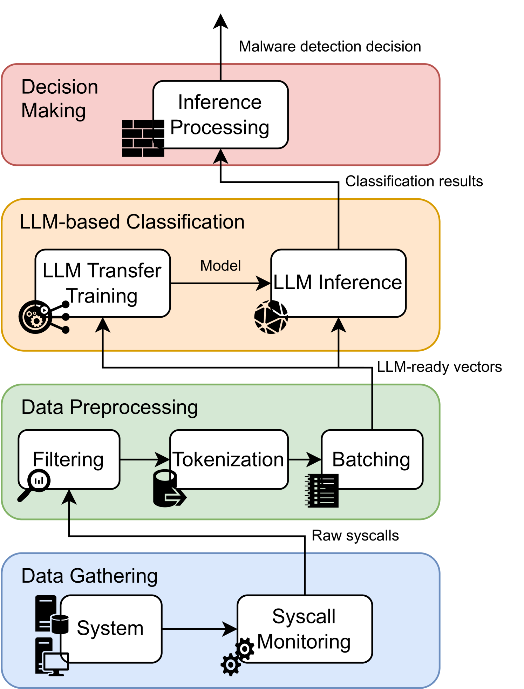

# 利用预训练大型语言模型的迁移学习技术，本研究探索了基于系统调用的恶意软件检测新途径。通过深入分析系统调用序列，我们旨在揭示恶意软件的隐蔽行为，从而提升检测的准确性与效率。

发布时间：2024年05月15日

`Agent

这篇论文探讨了如何结合大型语言模型（LLMs）与系统调用分析来提升恶意软件检测能力，特别是在军事通信和战场管理系统中的应用。它提出了一种新的框架，并通过实验验证了其有效性。这种方法可以被视为一种智能代理（Agent），因为它旨在自动化地识别和应对网络威胁，特别是在高风险环境中。因此，这篇论文更适合归类于Agent分类，因为它关注的是将LLM应用于特定的安全任务，而不是LLM的理论研究或应用案例。` `网络安全` `军事通信

解释：根据论文摘要` `该研究关注的是网络安全领域中保护军事通信和战场管理系统免受网络攻击的问题。因此` `标签“网络安全”和“军事通信”直接反映了论文的应用行业领域。`

> Transfer Learning in Pre-Trained Large Language Models for Malware Detection Based on System Calls

# 摘要

> 在网络安全领域，保护军事通信和战场管理系统免受精密网络攻击至关重要。恶意软件利用隐蔽手段规避传统检测，如软件签名。尽管ML/DL在漏洞检测方面已有广泛研究，但它们在理解复杂攻击的上下文和意图上仍显不足。本研究提出了一种结合大型语言模型（LLMs）与系统调用分析的新方法，以提升恶意软件检测能力。我们开发了一个框架，利用LLMs分析系统调用数据来识别恶意软件。通过迁移学习，我们调整了预训练的LLMs以适应恶意软件检测任务。实验结果显示，具有更大上下文容量的模型，如BigBird和Longformer，在准确率和F1分数上达到了约0.86的高水平。这表明，增加上下文大小能有效提高检测率，同时也揭示了计算复杂性与性能之间的平衡。我们的方法在高风险环境中实时检测恶意软件方面展现出巨大潜力，为应对不断变化的网络威胁提供了一个强有力的解决方案。

> In the current cybersecurity landscape, protecting military devices such as communication and battlefield management systems against sophisticated cyber attacks is crucial. Malware exploits vulnerabilities through stealth methods, often evading traditional detection mechanisms such as software signatures. The application of ML/DL in vulnerability detection has been extensively explored in the literature. However, current ML/DL vulnerability detection methods struggle with understanding the context and intent behind complex attacks. Integrating large language models (LLMs) with system call analysis offers a promising approach to enhance malware detection. This work presents a novel framework leveraging LLMs to classify malware based on system call data. The framework uses transfer learning to adapt pre-trained LLMs for malware detection. By retraining LLMs on a dataset of benign and malicious system calls, the models are refined to detect signs of malware activity. Experiments with a dataset of over 1TB of system calls demonstrate that models with larger context sizes, such as BigBird and Longformer, achieve superior accuracy and F1-Score of approximately 0.86. The results highlight the importance of context size in improving detection rates and underscore the trade-offs between computational complexity and performance. This approach shows significant potential for real-time detection in high-stakes environments, offering a robust solution to evolving cyber threats.

[Arxiv](https://arxiv.org/abs/2405.09318)