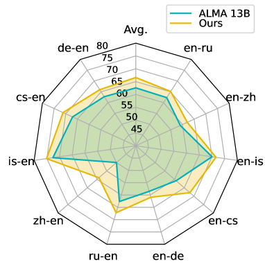

# 词对齐：机器翻译的偏好之选在机器翻译领域，词对齐被视为一种偏好，它帮助翻译系统更准确地理解源语言与目标语言之间的对应关系。通过精确的词对齐，机器翻译系统能够更好地捕捉语言间的细微差别，从而提升翻译质量。

发布时间：2024年05月15日

`LLM应用

这篇论文探讨了大型语言模型（LLM）在机器翻译领域的应用，特别是在解决幻觉和遗漏问题方面。通过优化词对齐来改善基于LLM的机器翻译模型的性能，这篇论文展示了LLM在特定应用场景下的改进策略和效果评估。因此，它属于LLM应用分类。` `机器翻译`

> Word Alignment as Preference for Machine Translation

# 摘要

> 在机器翻译领域，幻觉和遗漏问题一直是个难题，而大型语言模型的介入使得这一问题更加突出。本研究通过优化词对齐来缓解基于大型语言模型的机器翻译模型中的幻觉和遗漏问题。首先，我们探究了词对齐与幻觉、遗漏现象之间的关联，并提出利用词对齐作为优化依据。我们收集了多个翻译工具的翻译结果，构建了偏好数据集，并采用直接偏好优化方法来调整模型。由于缺乏专门针对幻觉和遗漏的评估工具，我们选择了一些具有挑战性的实例，并借助GPT-4来评估模型在解决这些问题上的表现。实验结果证实了我们评估方法的合理性，并展示了基于词对齐的优化策略在减少幻觉和遗漏方面的显著效果。

> The problem of hallucination and omission, a long-standing problem in machine translation (MT), is more pronounced when a large language model (LLM) is used in MT because an LLM itself is susceptible to these phenomena. In this work, we mitigate the problem in an LLM-based MT model by guiding it to better word alignment. We first study the correlation between word alignment and the phenomena of hallucination and omission in MT. Then we propose to utilize word alignment as preference to optimize the LLM-based MT model. The preference data are constructed by selecting chosen and rejected translations from multiple MT tools. Subsequently, direct preference optimization is used to optimize the LLM-based model towards the preference signal. Given the absence of evaluators specifically designed for hallucination and omission in MT, we further propose selecting hard instances and utilizing GPT-4 to directly evaluate the performance of the models in mitigating these issues. We verify the rationality of these designed evaluation methods by experiments, followed by extensive results demonstrating the effectiveness of word alignment-based preference optimization to mitigate hallucination and omission.

[Arxiv](https://arxiv.org/abs/2405.09223)