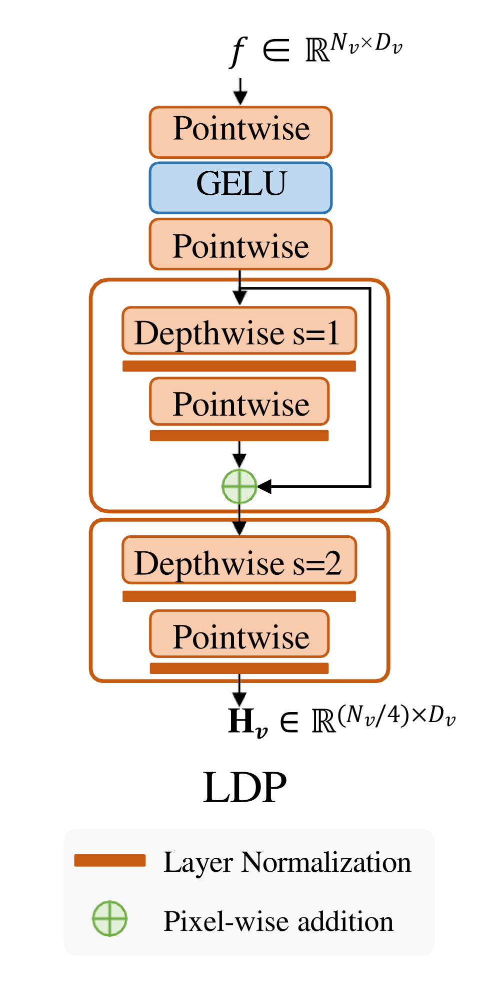
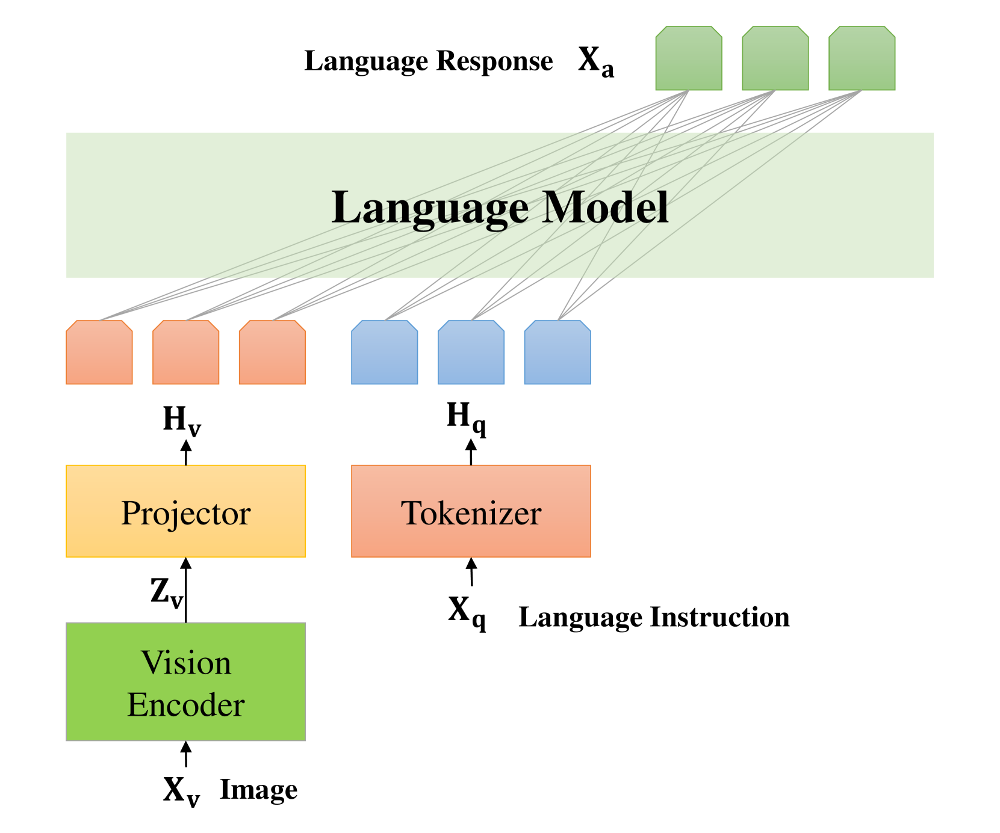
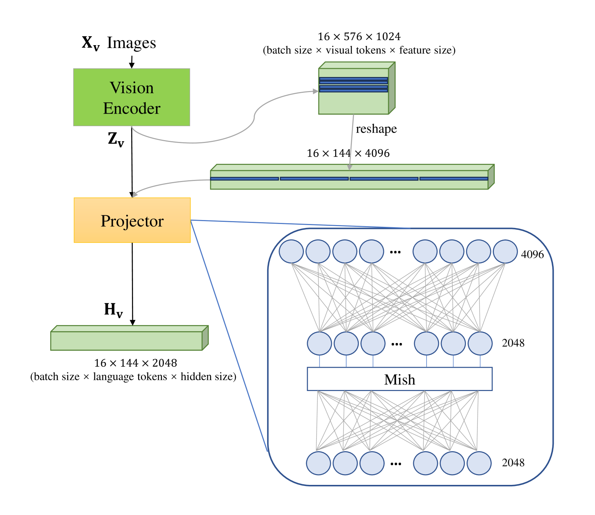
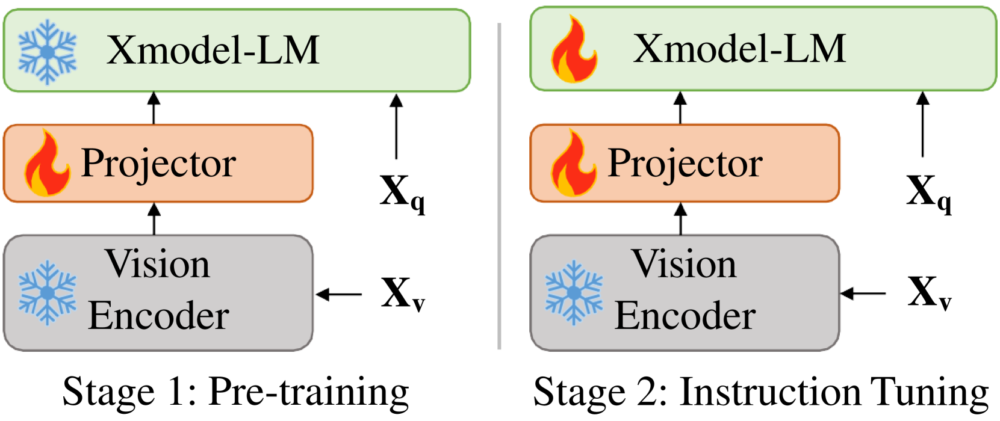

# Xmodel-VLM：多模态视觉语言模型的简洁基线

发布时间：2024年05月15日

`LLM应用

这篇论文介绍了一个名为Xmodel-VLM的跨模态视觉语言模型，它专为在消费级GPU服务器上高效部署而设计。该模型通过LLaVA范式实现了模态间的精准对齐，并在多个跨模态基准测试中展现了与大型模型相当的性能，同时具有更小的体积和更快的速度。由于论文主要关注的是一个具体的语言模型应用实例，即跨模态视觉语言模型的开发和部署，因此它被归类为LLM应用。` `视觉语言模型` `人工智能部署`

> Xmodel-VLM: A Simple Baseline for Multimodal Vision Language Model

# 摘要

> 我们推出了Xmodel-VLM，一款前沿的跨模态视觉语言模型，专为消费级GPU服务器的高效部署量身打造。面对大规模跨模态系统普及的障碍——高昂的服务成本，我们迎难而上。通过精心训练，我们构建了一个10亿参数的语言模型，采用LLaVA范式实现模态间的精准对齐。Xmodel-VLM虽轻巧，却展现出强大的性能。在多个跨模态基准测试中，它以更小的体积和更快的速度，与大型模型媲美。我们的模型和代码已在GitHub公开，供大家探索：https://github.com/XiaoduoAILab/XmodelVLM。

> We introduce Xmodel-VLM, a cutting-edge multimodal vision language model. It is designed for efficient deployment on consumer GPU servers. Our work directly confronts a pivotal industry issue by grappling with the prohibitive service costs that hinder the broad adoption of large-scale multimodal systems. Through rigorous training, we have developed a 1B-scale language model from the ground up, employing the LLaVA paradigm for modal alignment. The result, which we call Xmodel-VLM, is a lightweight yet powerful multimodal vision language model. Extensive testing across numerous classic multimodal benchmarks has revealed that despite its smaller size and faster execution, Xmodel-VLM delivers performance comparable to that of larger models. Our model checkpoints and code are publicly available on GitHub at https://github.com/XiaoduoAILab/XmodelVLM.

[Arxiv](https://arxiv.org/abs/2405.09215)