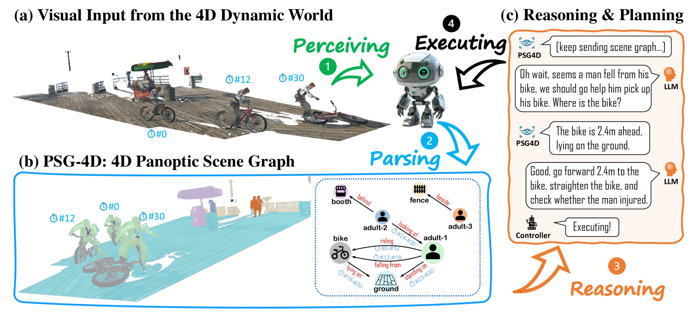
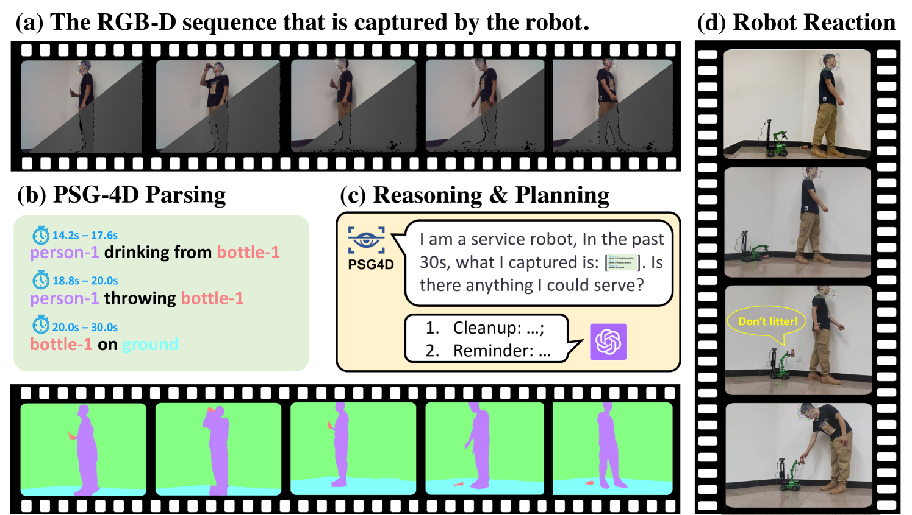

# 四维全景场景图构建

发布时间：2024年05月16日

`LLM应用

这篇论文探讨了如何将大型语言模型（LLM）应用于4D全景场景图（PSG-4D）的构建和理解中，以增强AI对动态四维世界的认知能力。论文提出了一个新的数据集和模型（PSG4DFormer），并展示了LLM如何与PSG-4D结合，以实现对动态场景的深刻理解。这与LLM的应用相关，因为它展示了LLM在特定任务（即理解和处理四维动态场景）中的实际应用。虽然论文中可能涉及一些理论基础，但其主要焦点在于应用层面，因此被归类为LLM应用。` `计算机视觉` `人工智能`

> 4D Panoptic Scene Graph Generation

# 摘要

> 我们身处三维空间，穿梭于时间的第四维度。为了让AI深入理解这四维世界，我们创新性地提出了4D全景场景图（PSG-4D），它将动态世界的视觉数据与高级认知紧密相连。PSG-4D将复杂的四维信息精炼为节点和边，前者代表实体及其精确状态，后者描绘时间联系。为了推动这一前沿研究，我们精心打造了一个包含3000个RGB-D视频、百万帧的PSG-4D数据集，每一帧都细致标注了全景分割和动态场景图。我们开发的PSG4DFormer模型，基于Transformer架构，能够精准预测分割、追踪时间轨迹并构建场景图。实验证明，我们的模型为PSG-4D研究奠定了坚实基础。最后，我们通过一个实际案例展示了如何将大型语言模型融入PSG-4D，实现对动态场景的深刻理解。

> We are living in a three-dimensional space while moving forward through a fourth dimension: time. To allow artificial intelligence to develop a comprehensive understanding of such a 4D environment, we introduce 4D Panoptic Scene Graph (PSG-4D), a new representation that bridges the raw visual data perceived in a dynamic 4D world and high-level visual understanding. Specifically, PSG-4D abstracts rich 4D sensory data into nodes, which represent entities with precise location and status information, and edges, which capture the temporal relations. To facilitate research in this new area, we build a richly annotated PSG-4D dataset consisting of 3K RGB-D videos with a total of 1M frames, each of which is labeled with 4D panoptic segmentation masks as well as fine-grained, dynamic scene graphs. To solve PSG-4D, we propose PSG4DFormer, a Transformer-based model that can predict panoptic segmentation masks, track masks along the time axis, and generate the corresponding scene graphs via a relation component. Extensive experiments on the new dataset show that our method can serve as a strong baseline for future research on PSG-4D. In the end, we provide a real-world application example to demonstrate how we can achieve dynamic scene understanding by integrating a large language model into our PSG-4D system.

[Arxiv](https://arxiv.org/abs/2405.10305)