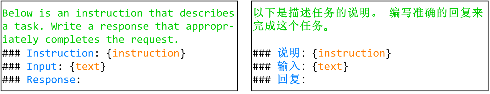

# 大型语言模型在自然语言生成任务上的系统性评估研究

发布时间：2024年05月16日

`LLM应用

这篇论文主要关注大型语言模型（LLMs）在自然语言生成（NLG）任务上的表现，特别是对话生成和文本摘要的英汉数据集。它提出了一种评估框架，并进行了全面的评估和分析。虽然论文中提到了ChatGPT、ChatGLM、T5、LLaMA和Pythia等模型，但重点在于这些模型在NLG任务上的应用表现，而不是对模型本身的理论探讨或Agent的设计与实现，也不是关于检索增强生成（RAG）的研究。因此，根据论文摘要的内容，最合适的分类是LLM应用。` `对话系统`

> A Systematic Evaluation of Large Language Models for Natural Language Generation Tasks

# 摘要

> 近期，大型语言模型（LLMs）在常识推理、数学推理和代码生成等领域的表现受到了广泛关注。然而，对于衡量模型卓越性的关键指标——自然语言生成（NLG）任务，LLMs的表现尚未得到深入研究。本文对ChatGPT、ChatGLM、T5、LLaMA和Pythia等知名高性能LLMs在NLG任务上的表现进行了全面评估，涵盖了对话生成和文本摘要的英汉数据集。我们提出了一种结合输入模板和后处理策略的评估框架，并提供了自动评估结果及深入分析。

> Recent efforts have evaluated large language models (LLMs) in areas such as commonsense reasoning, mathematical reasoning, and code generation. However, to the best of our knowledge, no work has specifically investigated the performance of LLMs in natural language generation (NLG) tasks, a pivotal criterion for determining model excellence. Thus, this paper conducts a comprehensive evaluation of well-known and high-performing LLMs, namely ChatGPT, ChatGLM, T5-based models, LLaMA-based models, and Pythia-based models, in the context of NLG tasks. We select English and Chinese datasets encompassing Dialogue Generation and Text Summarization. Moreover, we propose a common evaluation setting that incorporates input templates and post-processing strategies. Our study reports both automatic results, accompanied by a detailed analysis.

[Arxiv](https://arxiv.org/abs/2405.10251)