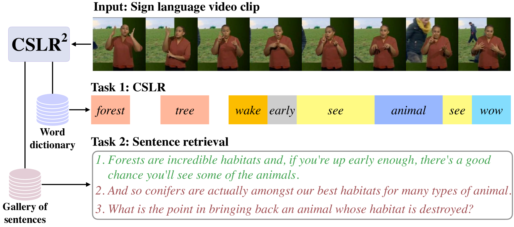
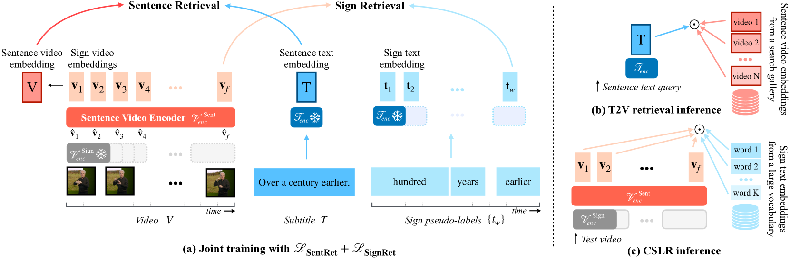
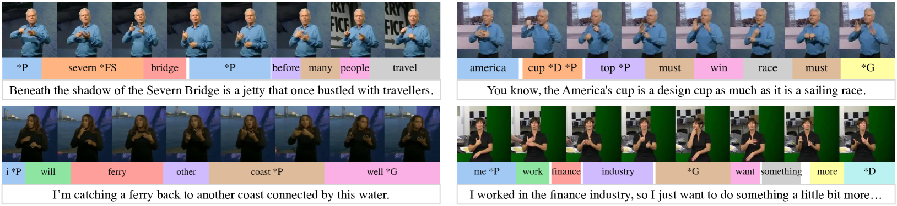
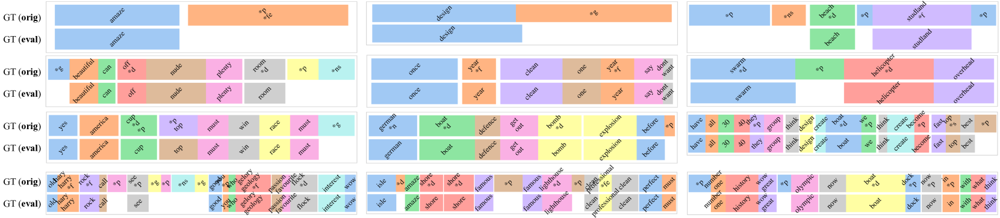
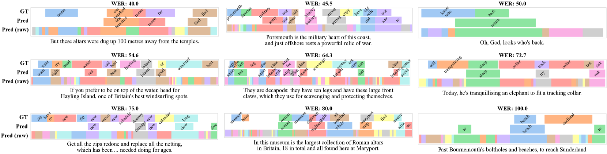
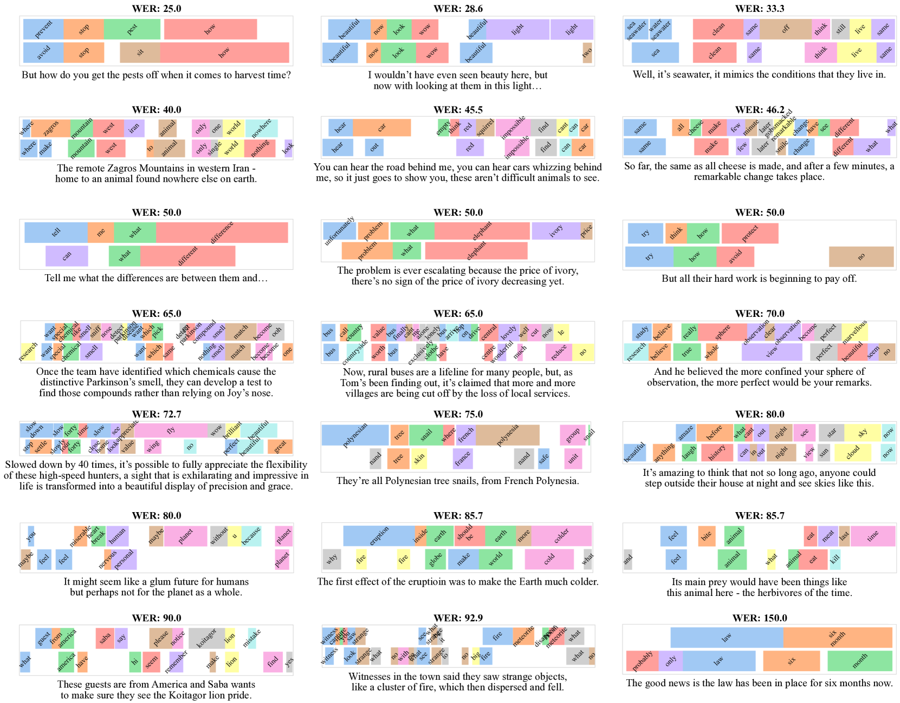

# 双语奇缘：口语监督下的连续手语大词汇识别之旅

发布时间：2024年05月16日

`Agent

这篇论文主要讨论了开发一个多任务Transformer模型（CSLR2）来实现大规模词汇连续手语识别和手语检索。这个模型可以被视为一个智能代理（Agent），因为它能够处理输入的手语序列，并将其转换为手语与口语文本的联合嵌入空间，从而执行识别和检索任务。这个Agent的设计和性能提升是论文的核心内容，因此它更适合归类在Agent分类中。虽然这个模型可能涉及到大型语言模型（LLM）的应用，但论文的重点在于模型的开发和应用，而不是LLM的理论研究，因此不归类在LLM理论或LLM应用中。同时，论文内容并不涉及检索增强生成（RAG）技术，所以也不归类在RAG中。` `手语识别` `语言技术`

> A Tale of Two Languages: Large-Vocabulary Continuous Sign Language Recognition from Spoken Language Supervision

# 摘要

> 本研究旨在实现两大目标：一是大规模词汇连续手语识别，二是手语检索。为此，我们开发了CSLR2多任务Transformer模型，它能将手语序列转换为手语与口语文本的联合嵌入空间。为了评估大规模词汇下的CSLR，我们精心收集了新的数据集注释，为六小时的测试视频提供连续的手势级别注释，并将公开分享。通过巧妙选择损失函数，我们发现CSLR和检索任务的训练相得益彰——检索为CSLR提供上下文，而CSLR则通过更精细的监督提升检索。此外，我们还展示了利用BOBSL等大规模词汇数据集的弱监督和噪声监督的优势，包括手势级别的伪标签和英语字幕。我们的模型在两项任务上均取得了显著的性能提升，超越了以往的记录。

> In this work, our goals are two fold: large-vocabulary continuous sign language recognition (CSLR), and sign language retrieval. To this end, we introduce a multi-task Transformer model, CSLR2, that is able to ingest a signing sequence and output in a joint embedding space between signed language and spoken language text. To enable CSLR evaluation in the large-vocabulary setting, we introduce new dataset annotations that have been manually collected. These provide continuous sign-level annotations for six hours of test videos, and will be made publicly available. We demonstrate that by a careful choice of loss functions, training the model for both the CSLR and retrieval tasks is mutually beneficial in terms of performance -- retrieval improves CSLR performance by providing context, while CSLR improves retrieval with more fine-grained supervision. We further show the benefits of leveraging weak and noisy supervision from large-vocabulary datasets such as BOBSL, namely sign-level pseudo-labels, and English subtitles. Our model significantly outperforms the previous state of the art on both tasks.

[Arxiv](https://arxiv.org/abs/2405.10266)