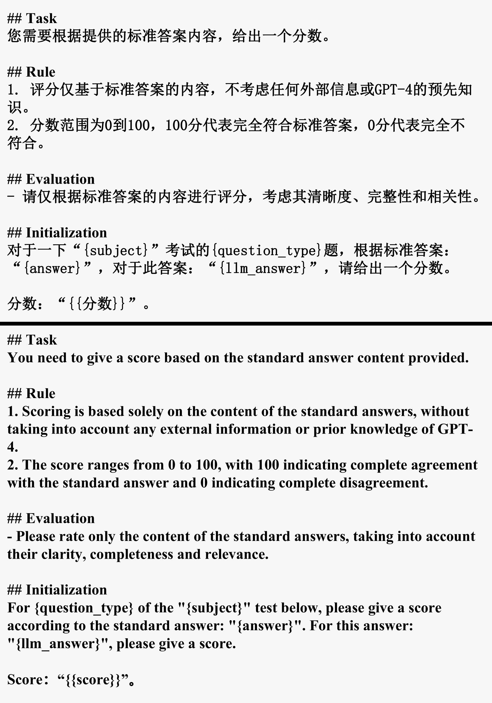

# CPsyExam：中文心理学评估基准，通过考试精准衡量心理学的应用与理解。

发布时间：2024年05月16日

`LLM应用

理由：这篇论文介绍了一个专门针对心理学知识评估的工具CPsyExam，并探讨了它如何帮助大型语言模型（LLMs）深化对心理学的理解，以及如何作为比较不同模型性能的工具。这个工具的应用性质和对LLMs性能的影响表明它属于LLM应用类别，而不是专注于Agent、RAG或LLM理论的研究。` `心理学` `教育评估`

> CPsyExam: A Chinese Benchmark for Evaluating Psychology using Examinations

# 摘要

> 本文推出了一项创新的心理学评估工具——CPsyExam，它源自中文考试题库，专注于心理学知识和实际案例分析。我们精选了22,000道题中的4,000道，构建了一个全面且多元的评估框架。通过对比分析多种大型语言模型，我们发现CPsyExam不仅深化了LLMs对心理学的理解，还为不同模型的性能比较提供了有力工具。

> In this paper, we introduce a novel psychological benchmark, CPsyExam, constructed from questions sourced from Chinese language examinations. CPsyExam is designed to prioritize psychological knowledge and case analysis separately, recognizing the significance of applying psychological knowledge to real-world scenarios. From the pool of 22k questions, we utilize 4k to create the benchmark that offers balanced coverage of subjects and incorporates a diverse range of case analysis techniques.Furthermore, we evaluate a range of existing large language models~(LLMs), spanning from open-sourced to API-based models. Our experiments and analysis demonstrate that CPsyExam serves as an effective benchmark for enhancing the understanding of psychology within LLMs and enables the comparison of LLMs across various granularities.

[Arxiv](https://arxiv.org/abs/2405.10212)