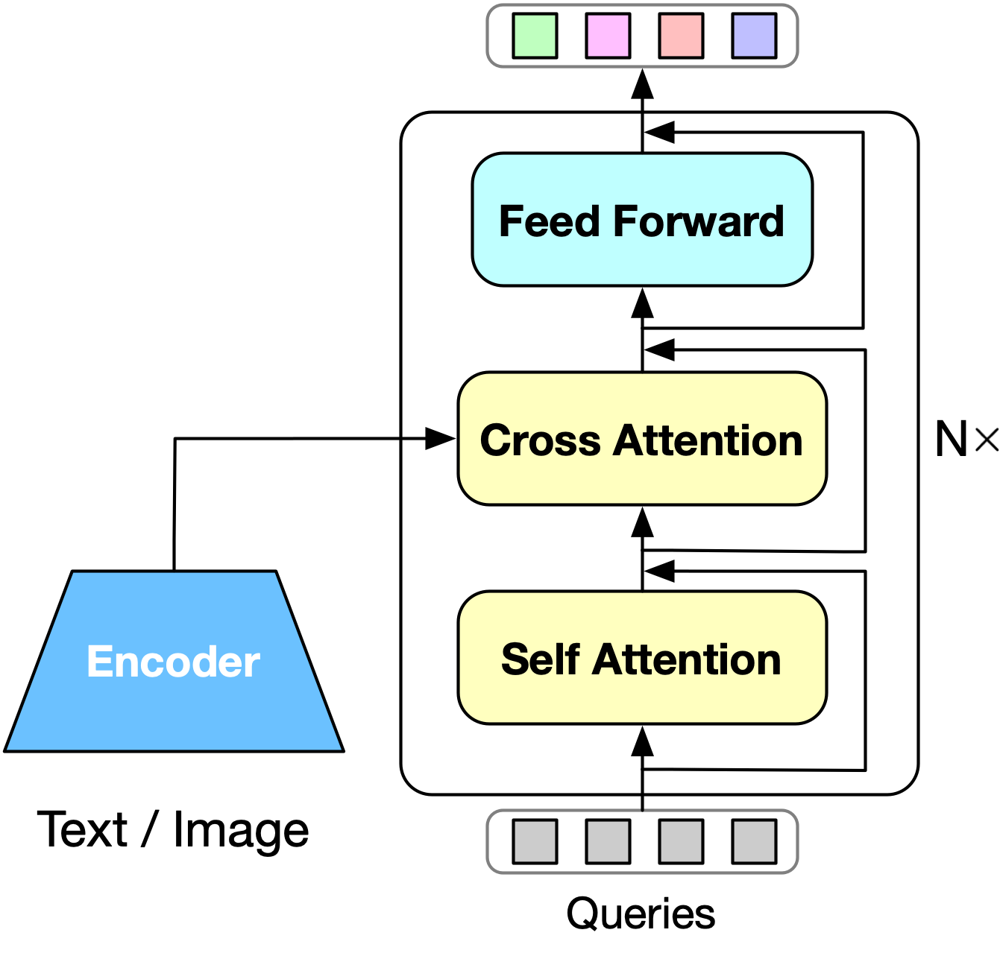
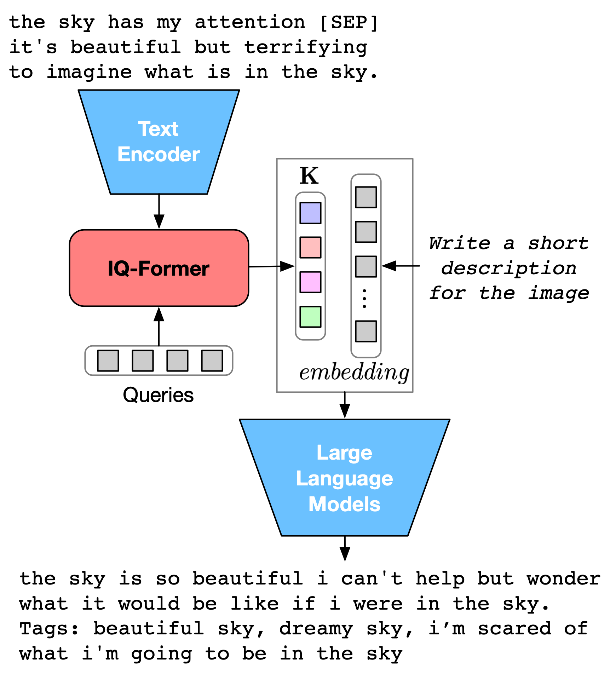

# 提炼隐式多模态智慧，赋能大型语言模型零资源对话生成之旅

发布时间：2024年05月16日

`RAG

这篇论文介绍了一种名为视觉隐式知识蒸馏框架（VIKDF）的新方法，用于在零资源环境下提升大型语言模型（LLMs）的对话生成能力。该框架通过隐式多模态知识来增强LLMs，具体包括从图像-文本对中提取视觉隐式知识和采用双向变分信息融合技术将这些知识融入LLMs。这种方法旨在解决高质量对话数据集稀缺的问题，并展示了在生成高质量对话方面的优越性能。因此，这篇论文属于RAG（Retrieval-Augmented Generation）分类，因为它涉及通过检索增强生成过程，特别是在多模态知识的背景下。` `对话系统` `多模态学习`

> Distilling Implicit Multimodal Knowledge into LLMs for Zero-Resource Dialogue Generation

# 摘要

> 将多模态知识融入大型语言模型，极大地提升了对话生成的潜能。但在零资源环境下，如何有效利用这些知识仍是一大难题，主要因高质量对话数据集的稀缺。为此，我们创新性地提出了视觉隐式知识蒸馏框架（VIKDF），旨在通过隐式多模态知识，增强LLMs在零资源环境下的对话生成能力。VIKDF分为两个关键步骤：首先，通过隐式查询变换器从图像-文本对中提取并编码视觉隐式知识，形成知识向量；其次，采用双向变分信息融合技术，将这些向量无缝融入LLMs。如此一来，LLMs生成的对话不仅连贯且引人入胜，更能通过隐式多模态线索深入理解上下文，有效突破零资源环境的限制。我们的实验在两个对话数据集上均显示，VIKDF在生成高质量对话方面超越了现有顶尖模型。代码将在接受后公开。

> Integrating multimodal knowledge into large language models (LLMs) represents a significant advancement in dialogue generation capabilities. However, the effective incorporation of such knowledge in zero-resource scenarios remains a substantial challenge due to the scarcity of diverse, high-quality dialogue datasets. To address this, we propose the Visual Implicit Knowledge Distillation Framework (VIKDF), an innovative approach aimed at enhancing LLMs for enriched dialogue generation in zero-resource contexts by leveraging implicit multimodal knowledge. VIKDF comprises two main stages: knowledge distillation, using an Implicit Query Transformer to extract and encode visual implicit knowledge from image-text pairs into knowledge vectors; and knowledge integration, employing a novel Bidirectional Variational Information Fusion technique to seamlessly integrate these distilled vectors into LLMs. This enables the LLMs to generate dialogues that are not only coherent and engaging but also exhibit a deep understanding of the context through implicit multimodal cues, effectively overcoming the limitations of zero-resource scenarios. Our extensive experimentation across two dialogue datasets shows that VIKDF outperforms existing state-of-the-art models in generating high-quality dialogues. The code will be publicly available following acceptance.

[Arxiv](https://arxiv.org/abs/2405.10121)