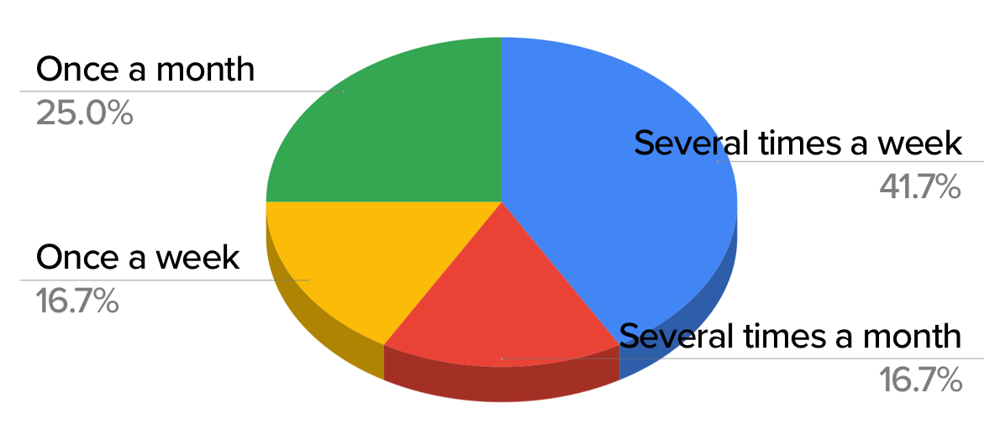
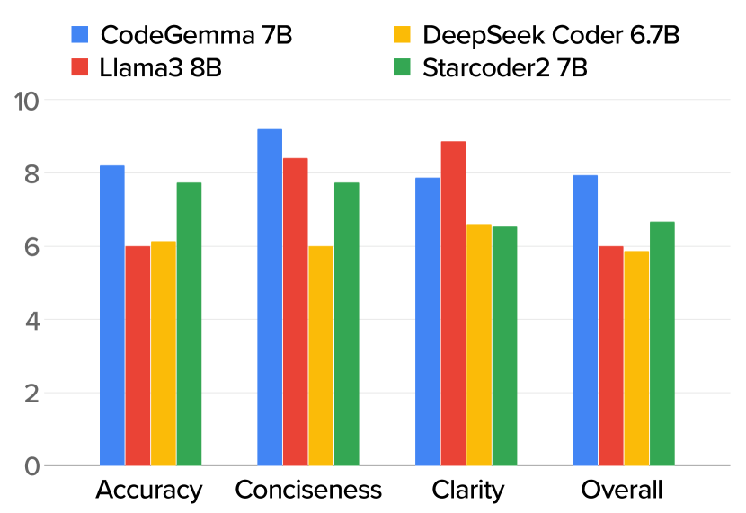
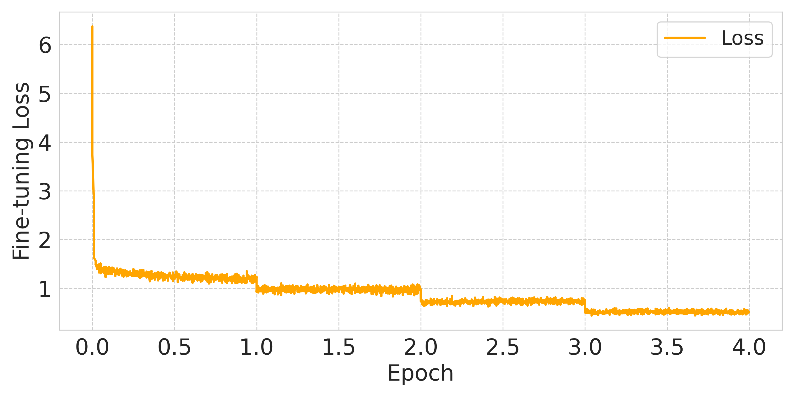

# DocuMint：小型语言模型助力Python文档字符串生成在这项研究中，我们介绍了DocuMint，一种利用小型语言模型为Python代码生成文档字符串的工具。尽管大型语言模型在自然语言处理任务中表现出色，但小型模型在资源受限的环境中具有显著优势。DocuMint通过精心设计的提示和上下文信息，能够生成准确且信息丰富的文档字符串，从而提高代码的可读性和可维护性。我们的实验结果表明，DocuMint在生成文档字符串方面具有很高的准确性和效率，为Python开发者提供了一个实用的辅助工具。

发布时间：2024年05月16日

`LLM应用

这篇论文探讨了小型语言模型（SLMs）在生成高质量代码注释方面的应用，通过构建数据集DocuMint并进行微调，评估了不同模型在准确性、简洁性和清晰性等指标上的表现。这与大型语言模型（LLM）的理论研究不同，因为它关注的是模型的实际应用和改进，而不是模型本身的理论基础或机制。同时，它也不属于Agent或RAG的分类，因为Agent通常指的是能够自主执行任务的智能体，而RAG（Retrieval-Augmented Generation）通常指的是一种结合了检索和生成能力的模型架构，这篇论文并未提及这些概念。因此，最合适的分类是LLM应用。` `软件开发`

> DocuMint: Docstring Generation for Python using Small Language Models

# 摘要

> 在软件开发中，文档是协作的灵魂，而语言模型的进步是这一领域的革新力量。我们的研究聚焦于小型语言模型（SLMs）在生成高质量代码注释方面的能力，通过准确性、简洁性和清晰性的多维度评估，以及数学公式和人类评估的双重验证。我们推出了DocuMint，一个包含十万样本的监督学习数据集，旨在提升模型的微调效果。实验结果显示，Llama 3 8B在各项指标上表现卓越，而CodeGemma 7B在人类评估中以8.3分的平均分脱颖而出。特别地，CodeGemma 2B模型经过DocuMint数据集的微调后，简洁性提升了惊人的22.5%。这些成果已在HuggingFace上公开，相关代码亦可在仓库中查阅。

> Effective communication, specifically through documentation, is the beating heart of collaboration among contributors in software development. Recent advancements in language models (LMs) have enabled the introduction of a new type of actor in that ecosystem: LM-powered assistants capable of code generation, optimization, and maintenance. Our study investigates the efficacy of small language models (SLMs) for generating high-quality docstrings by assessing accuracy, conciseness, and clarity, benchmarking performance quantitatively through mathematical formulas and qualitatively through human evaluation using Likert scale. Further, we introduce DocuMint, as a large-scale supervised fine-tuning dataset with 100,000 samples. In quantitative experiments, Llama 3 8B achieved the best performance across all metrics, with conciseness and clarity scores of 0.605 and 64.88, respectively. However, under human evaluation, CodeGemma 7B achieved the highest overall score with an average of 8.3 out of 10 across all metrics. Fine-tuning the CodeGemma 2B model using the DocuMint dataset led to significant improvements in performance across all metrics, with gains of up to 22.5% in conciseness. The fine-tuned model and the dataset can be found in HuggingFace and the code can be found in the repository.

[Arxiv](https://arxiv.org/abs/2405.10243)