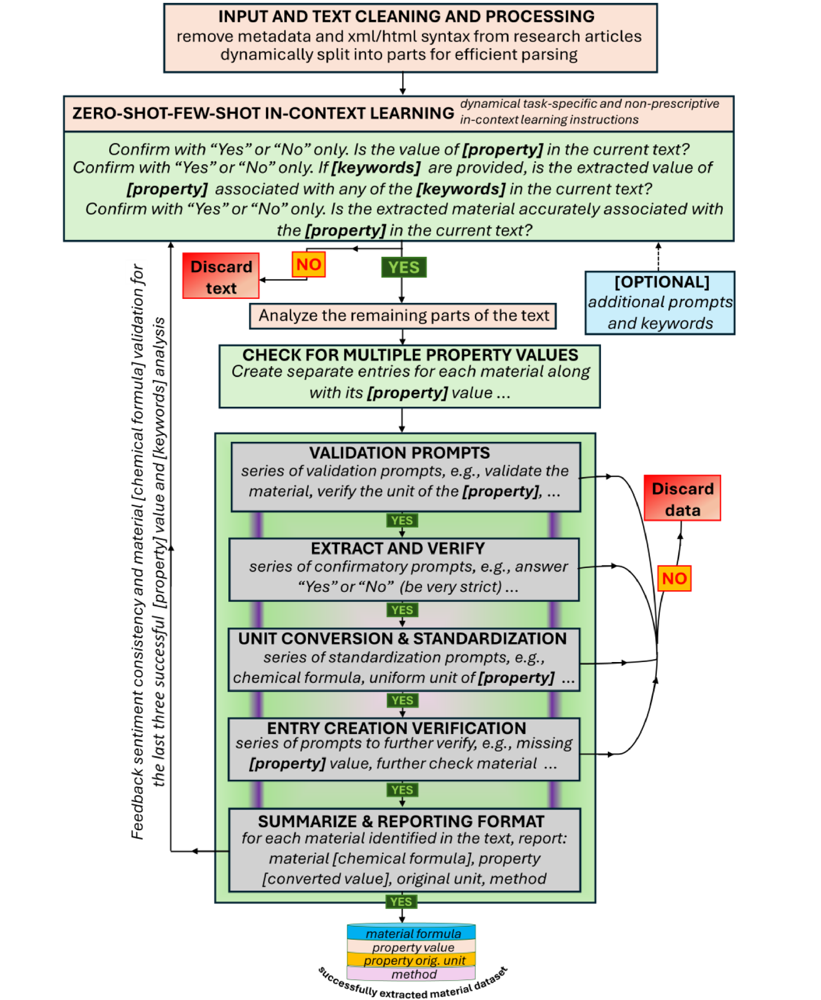
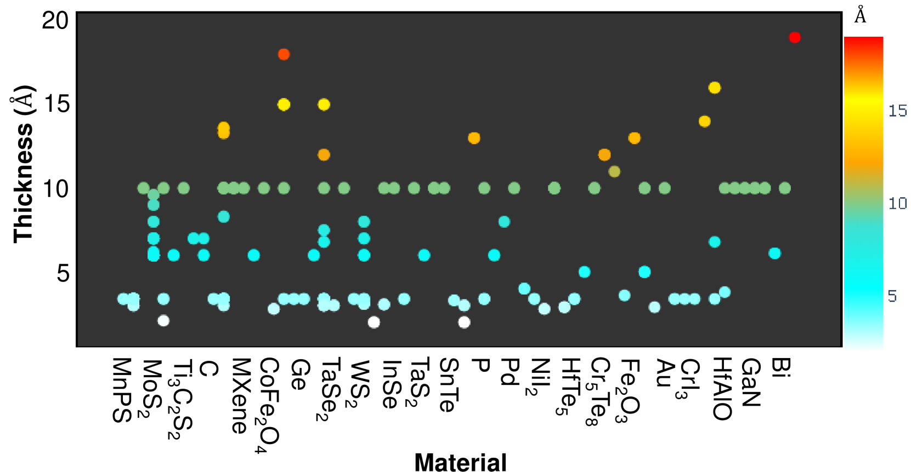
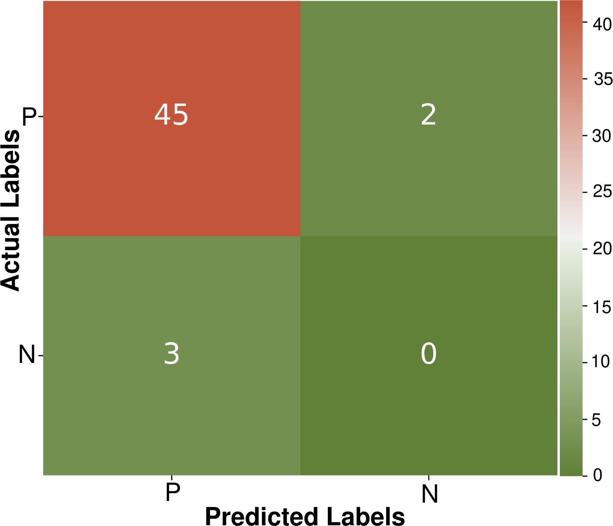

# 对话模型中的动态上下文学习：数据提取与材料属性预测的新途径

发布时间：2024年05月16日

`Agent

这篇论文介绍了一款名为PropertyExtractor的开源工具，它利用先进的对话型大型语言模型（如Google Gemini-Pro和OpenAI GPT-4）进行零-shot和少量-shot上下文学习，以自主、高效地识别、提取和验证材料属性数据。该工具展示了高精确度和召回率，并成功应用于构建二维材料厚度数据库。这种工具的自主性和高效性使其符合Agent分类，因为它代表了一种能够自主执行任务的智能系统。` `材料科学` `数据提取`

> Dynamic In-context Learning with Conversational Models for Data Extraction and Materials Property Prediction

# 摘要

> 自然语言处理与大型语言模型（LLMs）的兴起，极大地革新了从非结构化学术论文中提取数据的方法。但确保数据的可信度仍是一大挑战。本文推出的PropertyExtractor，是一款开源工具，它巧妙融合了Google Gemini-Pro和OpenAI GPT-4等先进对话LLMs的零-shot与少量-shot上下文学习，并通过精心设计的提示动态优化信息结构，实现了对材料属性数据的高效、自主、可扩展且精确的识别、提取与验证。测试表明，其精确度和召回率均超93%，错误率约10%，彰显了工具的卓越效能与灵活性。我们应用PropertyExtractor构建了二维材料厚度数据库，这对设备集成至关重要。领域的高速发展已超越了实验与计算方法，形成了数据鸿沟。我们的成果填补了这一空白，并证明了PropertyExtractor在自主生成多样化材料属性数据库方面的可靠与高效，为领域进步贡献力量。

> The advent of natural language processing and large language models (LLMs) has revolutionized the extraction of data from unstructured scholarly papers. However, ensuring data trustworthiness remains a significant challenge. In this paper, we introduce PropertyExtractor, an open-source tool that leverages advanced conversational LLMs like Google Gemini-Pro and OpenAI GPT-4, blends zero-shot with few-shot in-context learning, and employs engineered prompts for the dynamic refinement of structured information hierarchies, enabling autonomous, efficient, scalable, and accurate identification, extraction, and verification of material property data. Our tests on material data demonstrate precision and recall exceeding 93% with an error rate of approximately 10%, highlighting the effectiveness and versatility of the toolkit. We apply PropertyExtractor to generate a database of 2D material thicknesses, a critical parameter for device integration. The rapid evolution of the field has outpaced both experimental measurements and computational methods, creating a significant data gap. Our work addresses this gap and showcases the potential of PropertyExtractor as a reliable and efficient tool for the autonomous generation of diverse material property databases, advancing the field.

[Arxiv](https://arxiv.org/abs/2405.10448)