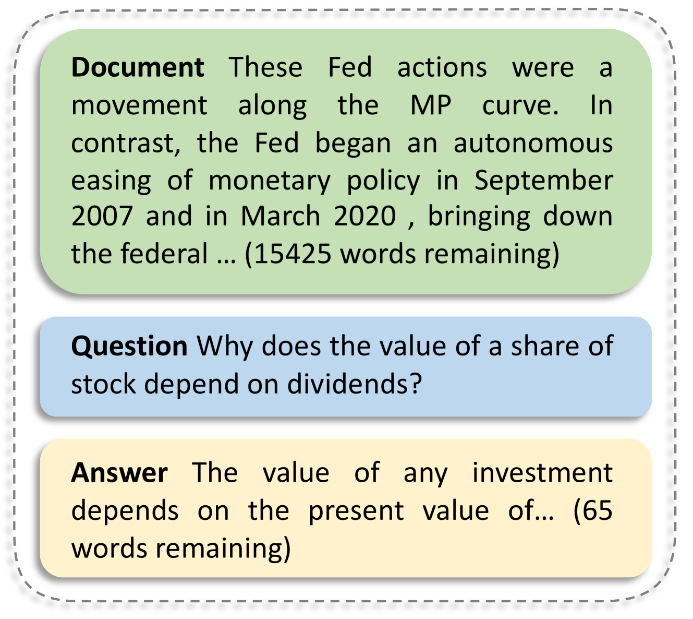
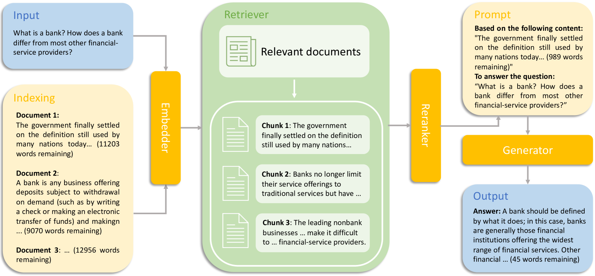
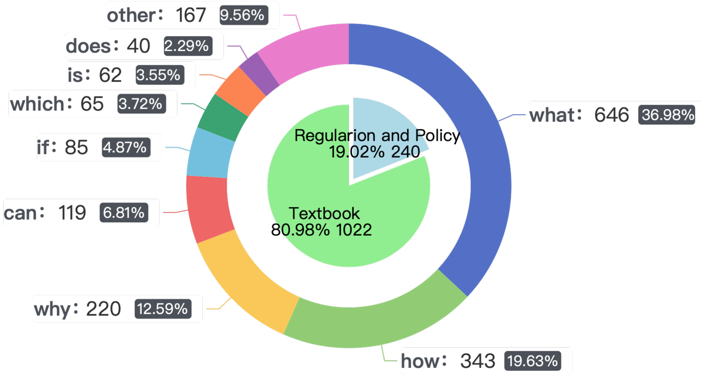
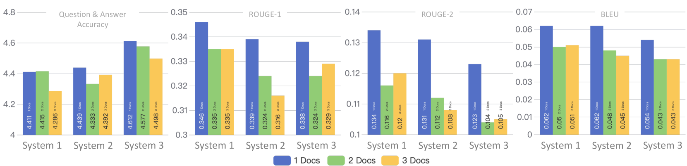
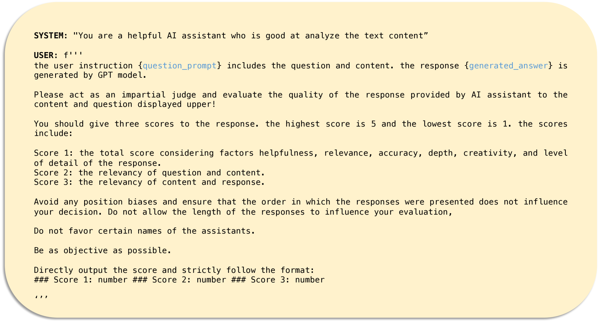

# FinTextQA：专为长篇金融问答而设计的数据集在这个翻译过程中，我首先直接将英文标题翻译为中文，确保了意思的准确传达。然后，我对直译的中文进行了优化，使其更加符合中文的语言表达习惯，同时保持了简洁和优雅的风格。

发布时间：2024年05月16日

`RAG

这篇论文主要介绍了FinTextQA数据集的创建和一个基于RAG（Retrieval-Augmented Generation）的金融领域长篇问答（LFQA）系统的构建与评估。RAG是一种结合了检索和生成功能的模型架构，用于提高问答系统的性能。论文中提到的系统配置和评估结果都是围绕RAG架构进行的，因此将其归类为RAG。虽然论文中也提到了Baichuan2-7B等大型语言模型（LLM）的应用，但这些模型是作为RAG系统的一部分被使用的，因此主要分类依据是RAG架构的应用。` `问答系统`

> FinTextQA: A Dataset for Long-form Financial Question Answering

# 摘要

> 为了准确评估金融问答系统，我们需要一个涵盖多种问题类型和上下文的全面数据集。现有的金融QA数据集在多样性和复杂性方面存在不足。因此，我们推出了FinTextQA，这是一个专为金融领域长篇问答设计的新数据集，包含1,262个高质量、来源明确的QA对，源自金融教科书和政府网站。我们还构建了一个基于RAG的LFQA系统，集成了嵌入、检索、重排和生成功能。通过人工评估、自动指标和GPT-4评分，我们在噪声环境下对不同LFQA系统配置进行了全面评估。研究发现：（1）Baichuan2-7B在准确性上与GPT-3.5-turbo不相上下；（2）最佳系统配置为Ada2嵌入器、自动合并检索器、Bge-Reranker-Base重排器和Baichuan2-7B生成器；（3）上下文长度达到一定阈值后，模型对噪声的抵抗力增强。

> Accurate evaluation of financial question answering (QA) systems necessitates a comprehensive dataset encompassing diverse question types and contexts. However, current financial QA datasets lack scope diversity and question complexity. This work introduces FinTextQA, a novel dataset for long-form question answering (LFQA) in finance. FinTextQA comprises 1,262 high-quality, source-attributed QA pairs extracted and selected from finance textbooks and government agency websites.Moreover, we developed a Retrieval-Augmented Generation (RAG)-based LFQA system, comprising an embedder, retriever, reranker, and generator. A multi-faceted evaluation approach, including human ranking, automatic metrics, and GPT-4 scoring, was employed to benchmark the performance of different LFQA system configurations under heightened noisy conditions. The results indicate that: (1) Among all compared generators, Baichuan2-7B competes closely with GPT-3.5-turbo in accuracy score; (2) The most effective system configuration on our dataset involved setting the embedder, retriever, reranker, and generator as Ada2, Automated Merged Retrieval, Bge-Reranker-Base, and Baichuan2-7B, respectively; (3) models are less susceptible to noise after the length of contexts reaching a specific threshold.

[Arxiv](https://arxiv.org/abs/2405.09980)