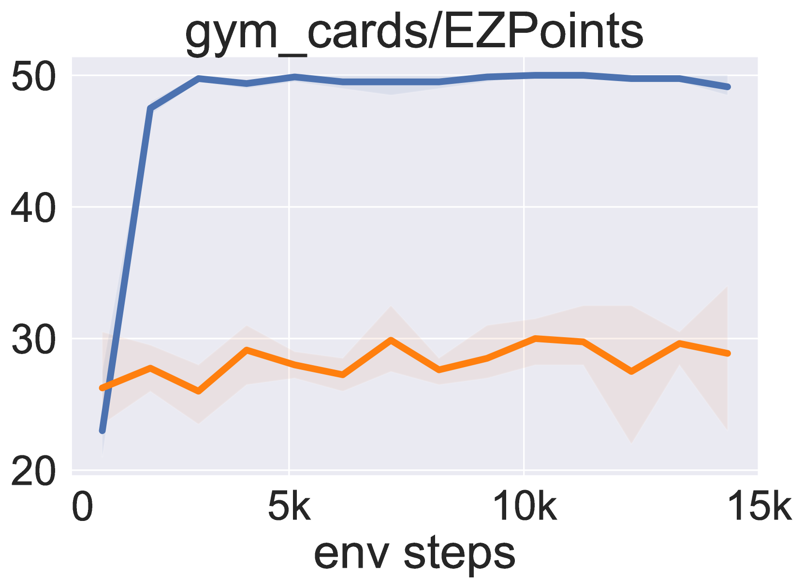
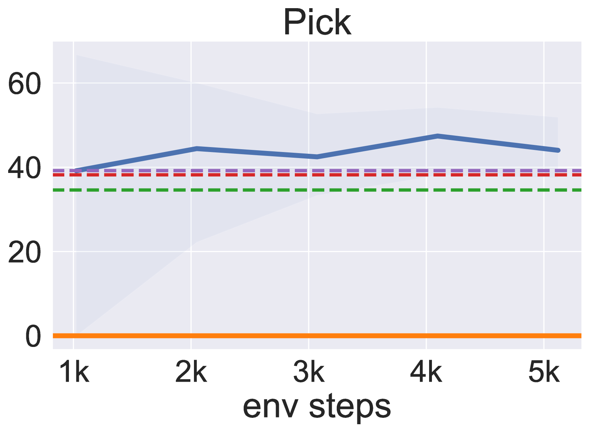

# 借助强化学习，微调大型视觉-语言模型，使其化身为智能决策代理

发布时间：2024年05月16日

`Agent

这篇论文探讨了如何通过结合强化学习（RL）的算法框架来微调大型视觉-语言模型（VLMs），以提高其在多步骤目标导向任务中的决策能力。这种方法涉及使用思维链（CoT）推理生成中间步骤，并将文本行动转化为可执行指令，然后通过与环境的互动获取任务奖励，并利用这些奖励对VLM进行微调。这种研究方向更接近于创建能够进行高效决策的智能代理（Agent），因为它关注的是模型在复杂任务中的自主决策和行动能力，而不是单纯的语言模型应用或理论研究。因此，这篇论文应归类于Agent分类。` `人工智能`

> Fine-Tuning Large Vision-Language Models as Decision-Making Agents via Reinforcement Learning

# 摘要

> 经过专门视觉指令数据微调的大型视觉-语言模型（VLMs）在多种情境下展现了卓越的语言推理能力。然而，这种微调方法在多步骤目标导向任务中培养高效决策代理方面可能并不高效。为此，我们提出了一种结合强化学习（RL）的算法框架，用以微调VLMs。该框架首先提供任务背景，引导VLM通过思维链（CoT）推理生成中间步骤，直至得出最终的文本行动。随后，这些文本行动被转化为可执行指令，与环境互动以获取任务奖励。最终，利用这些奖励，我们通过RL对VLM进行全面微调。实证结果显示，我们的框架显著提升了VLM在多任务中的决策能力，甚至超越了商业模型如GPT4-V和Gemini。此外，我们发现CoT推理对于提升性能至关重要，一旦移除，整体性能将大幅下降。

> Large vision-language models (VLMs) fine-tuned on specialized visual instruction-following data have exhibited impressive language reasoning capabilities across various scenarios. However, this fine-tuning paradigm may not be able to efficiently learn optimal decision-making agents in multi-step goal-directed tasks from interactive environments. To address this challenge, we propose an algorithmic framework that fine-tunes VLMs with reinforcement learning (RL). Specifically, our framework provides a task description and then prompts the VLM to generate chain-of-thought (CoT) reasoning, enabling the VLM to efficiently explore intermediate reasoning steps that lead to the final text-based action. Next, the open-ended text output is parsed into an executable action to interact with the environment to obtain goal-directed task rewards. Finally, our framework uses these task rewards to fine-tune the entire VLM with RL. Empirically, we demonstrate that our proposed framework enhances the decision-making capabilities of VLM agents across various tasks, enabling 7b models to outperform commercial models such as GPT4-V or Gemini. Furthermore, we find that CoT reasoning is a crucial component for performance improvement, as removing the CoT reasoning results in a significant decrease in the overall performance of our method.

[Arxiv](https://arxiv.org/abs/2405.10292)