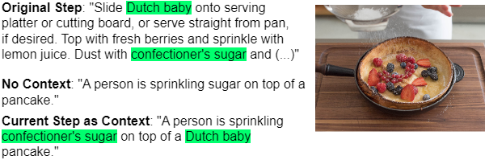
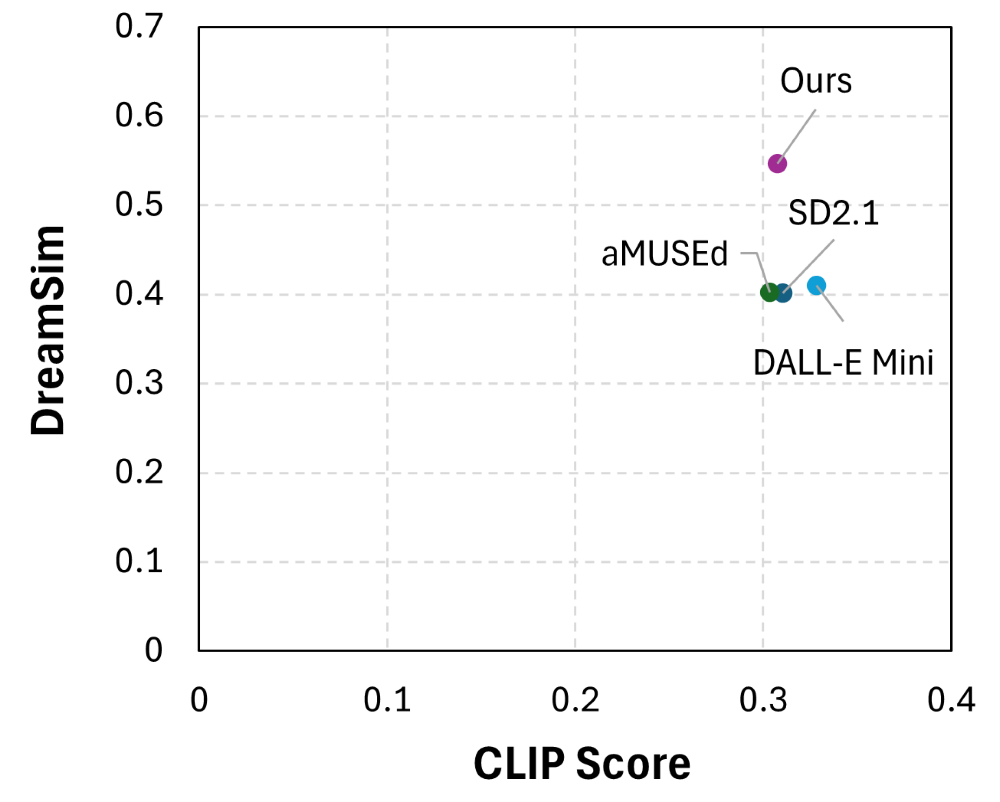

# 绘制现实世界任务手册的连贯视觉插图序列

发布时间：2024年05月16日

`LLM应用

这篇论文探讨了大型语言模型（LLMs）在生成多步骤指令时的应用，特别是在结合视觉辅助（如图像序列）方面的挑战。它提出了一种集成潜在扩散模型（LDMs）与LLMs的方法，以提高生成图像序列的质量，确保语义和视觉上的连贯性。这种方法的应用性质和对LLMs的实际应用改进使其适合归类为“LLM应用”。` `图像生成` `指导系统`

> Generating Coherent Sequences of Visual Illustrations for Real-World Manual Tasks

# 摘要

> 多步骤指令，如食谱和操作指南，得益于视觉辅助，如伴随步骤的一系列图像。尽管LLMs在生成文本步骤方面表现出色，但LVLMs在生成图像序列方面尚显不足。每个生成的图像需与文本指令相符，并与序列中的先前图像保持视觉一致，这是最大的挑战。为此，我们提出了一种集成LDM与LLM的方法，通过将序列转换为标题来保持语义连贯性，并引入复制机制以先前图像的潜在向量迭代来初始化反向扩散过程，从而保持视觉一致性。实验结果显示，人类偏好我们的方法高达46.6%，远超第二好的方法的26.6%。自动评估也证实了我们的方法在保持语义和视觉一致性方面的有效性。

> Multistep instructions, such as recipes and how-to guides, greatly benefit from visual aids, such as a series of images that accompany the instruction steps. While Large Language Models (LLMs) have become adept at generating coherent textual steps, Large Vision/Language Models (LVLMs) are less capable of generating accompanying image sequences. The most challenging aspect is that each generated image needs to adhere to the relevant textual step instruction, as well as be visually consistent with earlier images in the sequence. To address this problem, we propose an approach for generating consistent image sequences, which integrates a Latent Diffusion Model (LDM) with an LLM to transform the sequence into a caption to maintain the semantic coherence of the sequence. In addition, to maintain the visual coherence of the image sequence, we introduce a copy mechanism to initialise reverse diffusion processes with a latent vector iteration from a previously generated image from a relevant step. Both strategies will condition the reverse diffusion process on the sequence of instruction steps and tie the contents of the current image to previous instruction steps and corresponding images. Experiments show that the proposed approach is preferred by humans in 46.6% of the cases against 26.6% for the second best method. In addition, automatic metrics showed that the proposed method maintains semantic coherence and visual consistency across steps in both domains.

[Arxiv](https://arxiv.org/abs/2405.10122)