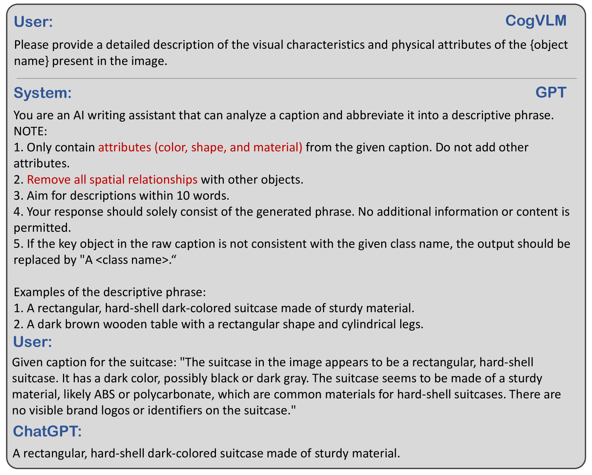

# 基于参照令牌的3D语言模型接地化

发布时间：2024年05月16日

`LLM应用

理由：这篇论文介绍了一个名为 Grounded 3D-LLM 的模型，它利用大型多模态模型来处理多种3D视觉任务，并通过语言模型整合这些任务。该研究涉及了从密集字幕、3D问答到对象检测和语言基础的广泛任务，并在多个3D基准测试中展示了其性能和适用性。这表明该论文是在应用层面探讨如何利用大型语言模型（LLM）来解决实际问题，因此属于LLM应用分类。` `计算机视觉`

> Grounded 3D-LLM with Referent Tokens

# 摘要

> 以往的3D场景理解研究多专注于特定任务的模型开发或任务特定的微调。本研究提出Grounded 3D-LLM，旨在利用3D大型多模态模型（3D LMMs）在一个统一的生成框架内整合多种3D视觉任务。该模型通过特殊名词短语——场景参照令牌来引用3D场景，能有效处理3D与文本数据交错的序列。它采用任务特定的指令模板，自然地将3D视觉任务转化为语言格式。为了增强语言模型中参照令牌的应用，我们构建了大规模的基于语言的数据集，通过现有对象标签的辅助，实现了短语级别的精细场景-文本对应。此外，我们开发了对比语言-场景预训练（CLASP），有效整合了3D视觉与语言模型。我们的评估涵盖了从密集字幕、3D问答到对象检测和语言基础的广泛任务。在多个3D基准测试中，Grounded 3D-LLM展现了卓越的性能和广泛的适用性。相关代码和数据集将在项目页面https://groundedscenellm.github.io/grounded_3d-llm.github.io.上发布。

> Prior studies on 3D scene understanding have primarily developed specialized models for specific tasks or required task-specific fine-tuning. In this study, we propose Grounded 3D-LLM, which explores the potential of 3D large multi-modal models (3D LMMs) to consolidate various 3D vision tasks within a unified generative framework. The model uses scene referent tokens as special noun phrases to reference 3D scenes, enabling the handling of sequences that interleave 3D and textual data. It offers a natural approach for translating 3D vision tasks into language formats using task-specific instruction templates. To facilitate the use of referent tokens in subsequent language modeling, we have curated large-scale grounded language datasets that offer finer scene-text correspondence at the phrase level by bootstrapping existing object labels. Subsequently, we introduced Contrastive LAnguage-Scene Pre-training (CLASP) to effectively leverage this data, thereby integrating 3D vision with language models. Our comprehensive evaluation covers open-ended tasks like dense captioning and 3D QA, alongside close-ended tasks such as object detection and language grounding. Experiments across multiple 3D benchmarks reveal the leading performance and the broad applicability of Grounded 3D-LLM. Code and datasets will be released on the project page: https://groundedscenellm.github.io/grounded_3d-llm.github.io.

[Arxiv](https://arxiv.org/abs/2405.10370)